

  

# Document 1/10 : Le Manifeste de la Forge - Notre Vision pour la Victoire

**Titre :** Le Manifeste de la Forge : Forger une Mémoire Vérifiable et Évolutive dans un Monde d'IA Opaques

**Objectif :** Établir la vision philosophique et l'ambition technique de `Kikko's Saga Forge`, en répondant à la question fondamentale pour le jury : "Pourquoi cette expérience représente-t-elle le futur de l'IA embarquée ?"

  

---

### **Introduction : De l'Amnésie Digitale à la Confiance Radicale**

Nous vivons une ère de paradoxes : un accès infini à l'information, couplé à une **amnésie digitale assistée** où nos propres découvertes s'évaporent. Pire, nous faisons face à une crise de confiance envers des IA "boîtes noires" qui nous demandent de croire sans preuve. **`Kikko's Saga Forge` est notre réponse audacieuse et notre proposition pour gagner ce challenge.** Nous créons une nouvelle catégorie d'application : le **Jeu de Connaissance Vérifiable et Évolutif** (Evolvable & Verifiable Knowledge RPG).

### **Principe Fondamental #1 : Le Kikkō, Votre Saga Vivante et Personnalisable**

Kikko n'est pas une "application". C'est un écosystème. Vous devenez un **Butineur**, et l'on vous confie un **Gardien Kikkō** : une tortue numérique qui est le réceptacle vivant de votre mémoire. Sa carapace est la mosaïque de votre savoir, et sa croissance dépend de la qualité de la connaissance que vous forgez. Cette forge, c'est votre **Ruche Kikko** : un atelier d'IA privé, 100% embarqué sur votre appareil, dont vous pouvez **modifier le comportement**.

| Introduction | Action | Conclusion |
| :---: | :---: | :---: |
| 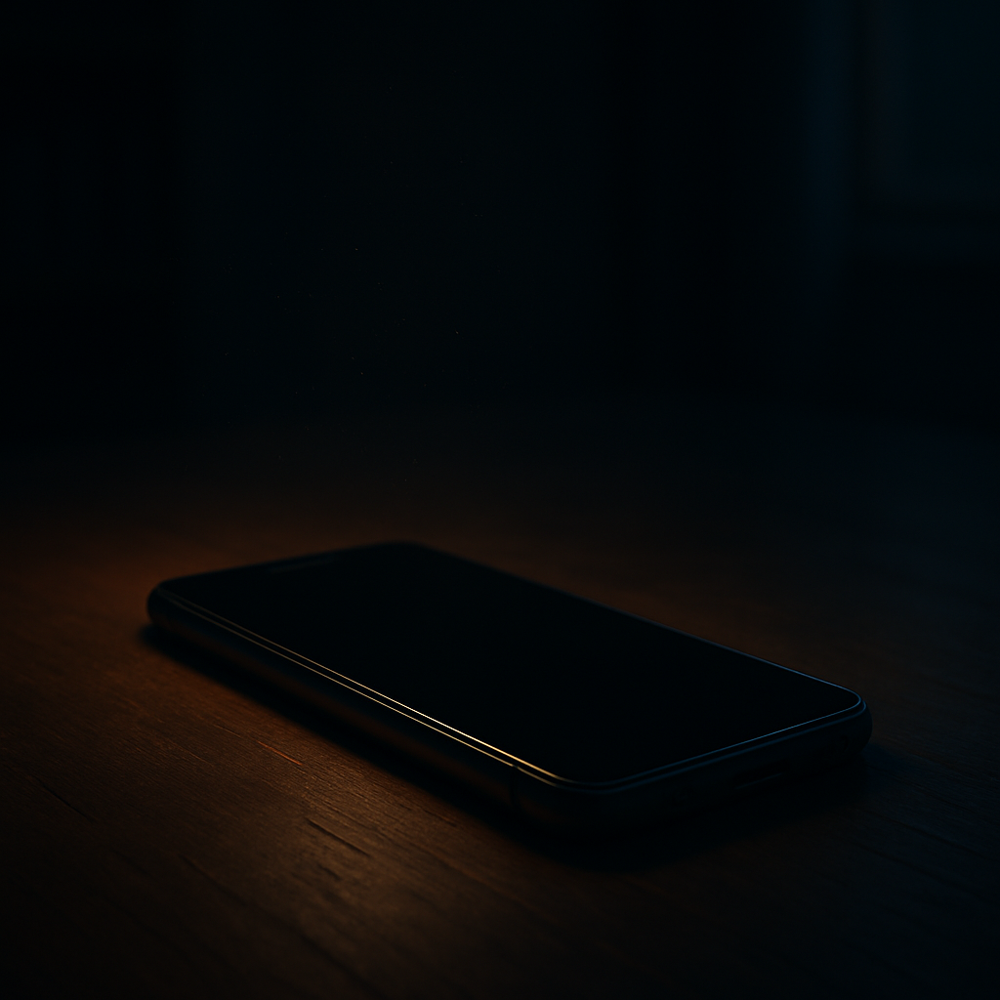 | 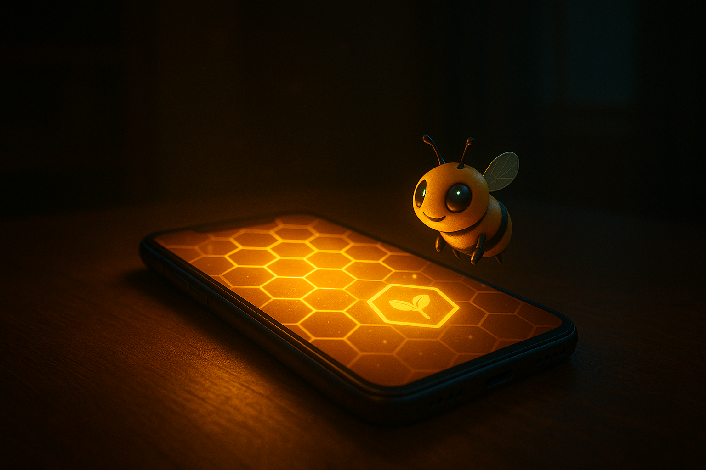 | 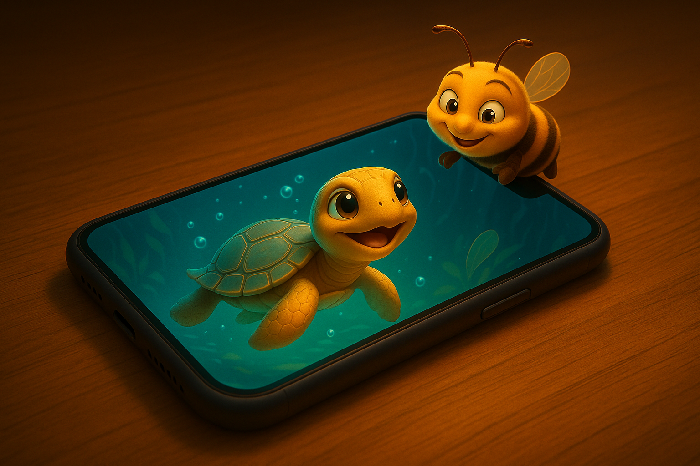 |
| **L'Objet Inerte :** Un smartphone n'est qu'un portail froid et impersonnel. | **L'Éveil :** La première interaction de l'utilisateur ne lance pas une application ; elle fait éclore son Gardien Kikkō personnel, le début de sa saga. | **La Symbiose :** L'appareil est désormais un portail vers un écosystème vivant, un partenariat entre le Butineur, son Gardien, et la Ruche IA. |

### **Principe Fondamental #2 : Le Pollen est un Dataset, le Miel est une Inférence**

Dans notre écosystème, les données ont un cycle de vie conçu pour la qualité et la réutilisation.
1.  **Capturer le "Pollen" :** Vous explorez le monde et capturez un "pollen" : un paquet de données contenant les images sources et l'analyse brute de nos **Abeilles Spécialistes** (modèles ML embarqués). Ce n'est pas juste une photo, c'est un **dossier de mission pour votre Forge**, sauvegardé localement.
2.  **Forger le "Miel" :** Vous confiez ce pollen à votre **Forge Kikko**, qui le place dans ses réserves. Plus tard, une **chaîne de production autonome** se met en marche en arrière-plan. La **Reine IA (Gemma)** orchestre ses artisans pour transformer ce pollen brut en "Miel Informatif" structuré et vérifiable.
3.  **Nourrir votre Gardien :** Ce Miel de confiance est la nourriture de votre Gardien Kikkō. Il grandit, et sa carapace, votre saga, devient plus complexe et magnifique.

| Introduction | Action | Conclusion |
| :---: | :---: | :---: |
| 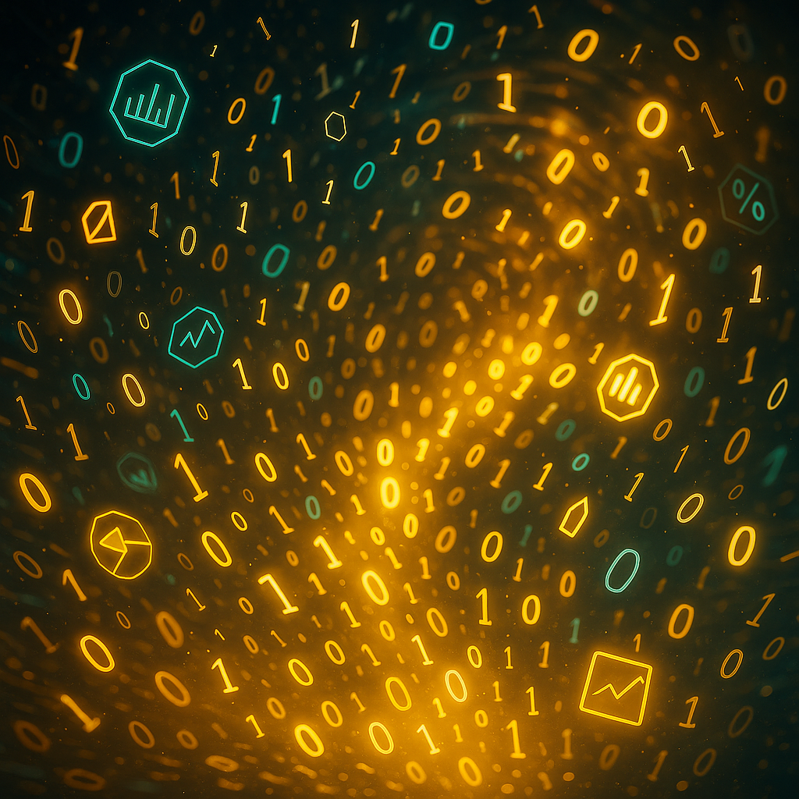 | 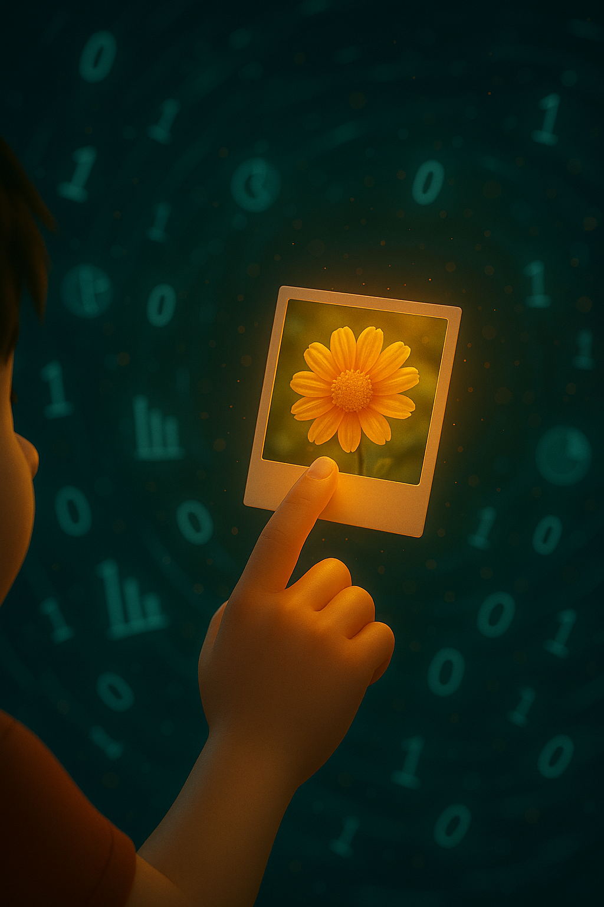 | 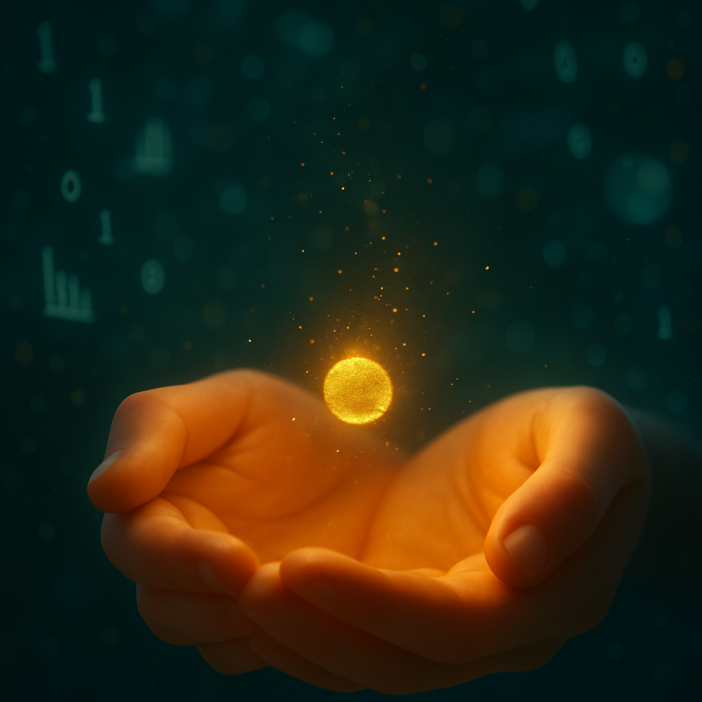 |
| **La Tempête de Données :** Le monde moderne est une tempête de données impersonnelles. | **L'Acte de Sens :** L'utilisateur choisit consciemment une information qui a une signification personnelle pour lui. | **Le Pollen Précieux :** La donnée impersonnelle est transformée en un "pollen" unique et personnel, la matière première de la connaissance. |

### **Principe Fondamental #3 : La Ruche, une Guilde d'Artisans IA dont VOUS êtes le Maître**

La **Ruche Kikko** est votre forge IA, peuplée d'une guilde d'artisans numériques qui travaillent pour vous.
* **Les Abeilles Spécialistes (ML Kit & TFLite) :** Une équipe d'experts autonomes et infatigables, chacun entraîné pour un domaine spécifique (Plantes, Animaux, etc.).
* **La Reine IA (Gemma) :** Le maître artisan. Elle orchestre la guilde, et utilise sa puissance générative pour forger le Miel final, riche et structuré.
* **Le Bourdon (Le Communicateur) :** Le lien charmant entre vous et la Ruche. Je présente les quêtes, les résultats des Abeilles et vous livre le Miel terminé.

| Introduction | Action | Conclusion |
| :---: | :---: | :---: |
|  | 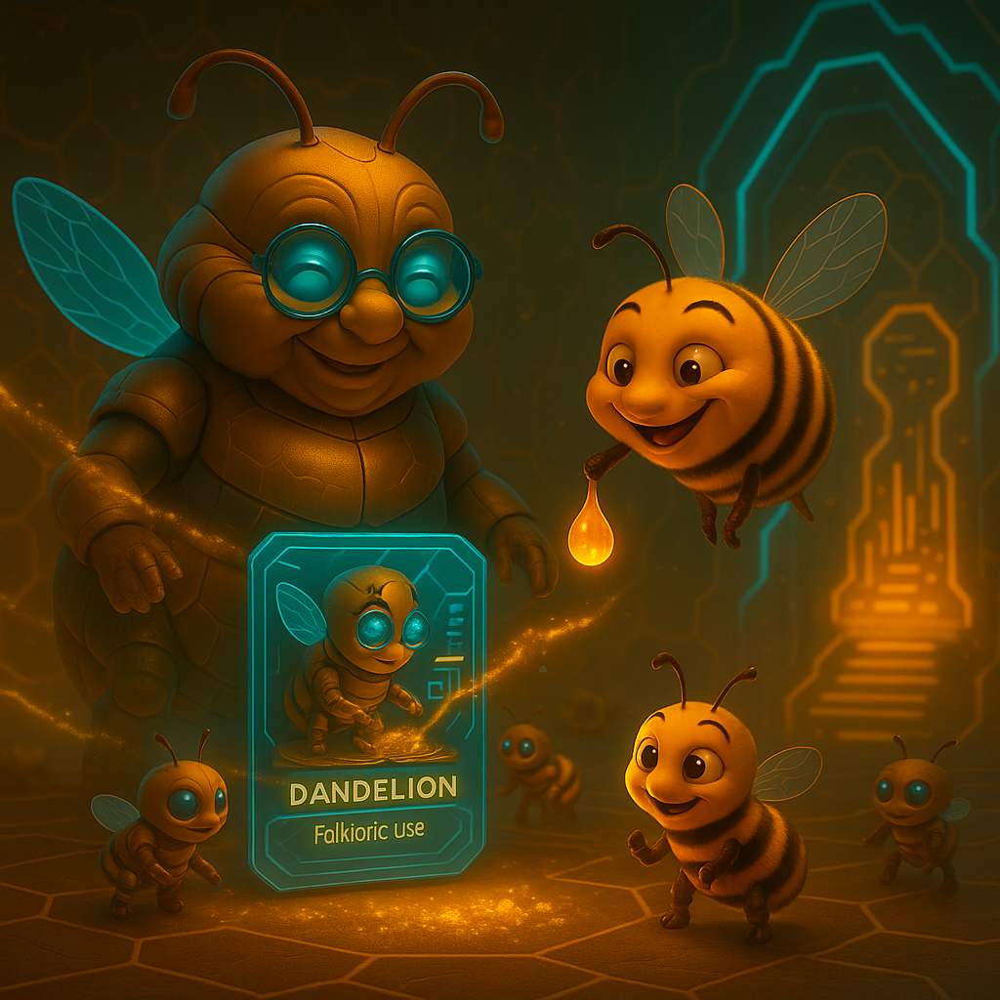 | 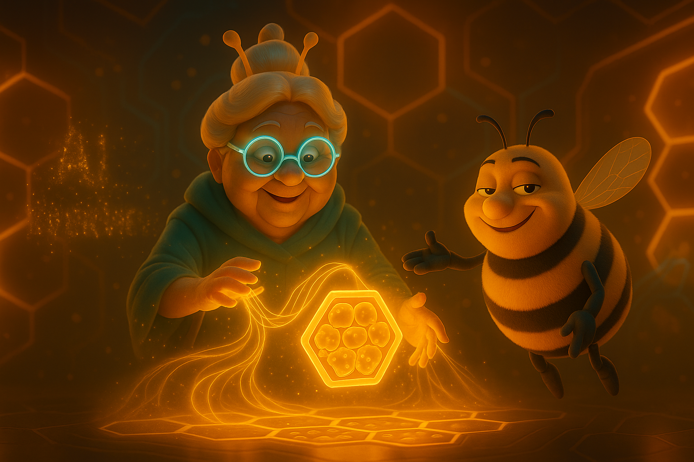 |
| **La Matière Première :** Le pollen capturé par l'utilisateur arrive dans la Ruche pour être traité. | **Le Travail des Artisans :** Les compagnons IA travaillent ensemble, en partenariat avec l'utilisateur, pour forger le pollen brut en "Miel Informatif". | **Nourrir la Saga :** Le Miel terminé est donné au Gardien Kikkō, qui assimile la connaissance et grandit. |
### **Principe Fondamental #4 : La Gamification au Service de la Confiance et de la Personnalisation**

Les mécaniques de jeu sont le langage de Kikko.
* **Les Quêtes** sont des invitations à trouver du "pollen" pour nourrir votre Gardien.
* **La Croissance du Kikkō** est la représentation visuelle de vos progrès.
* **Le Choc des Sagas** est l'expression sociale de votre savoir, où la carapace de votre Gardien devient une arène de jeu de cartes P2P, arbitrée par une IA dont vous pouvez influencer la logique.

| Introduction | Action | Conclusion |
| :---: | :---: | :---: |
| 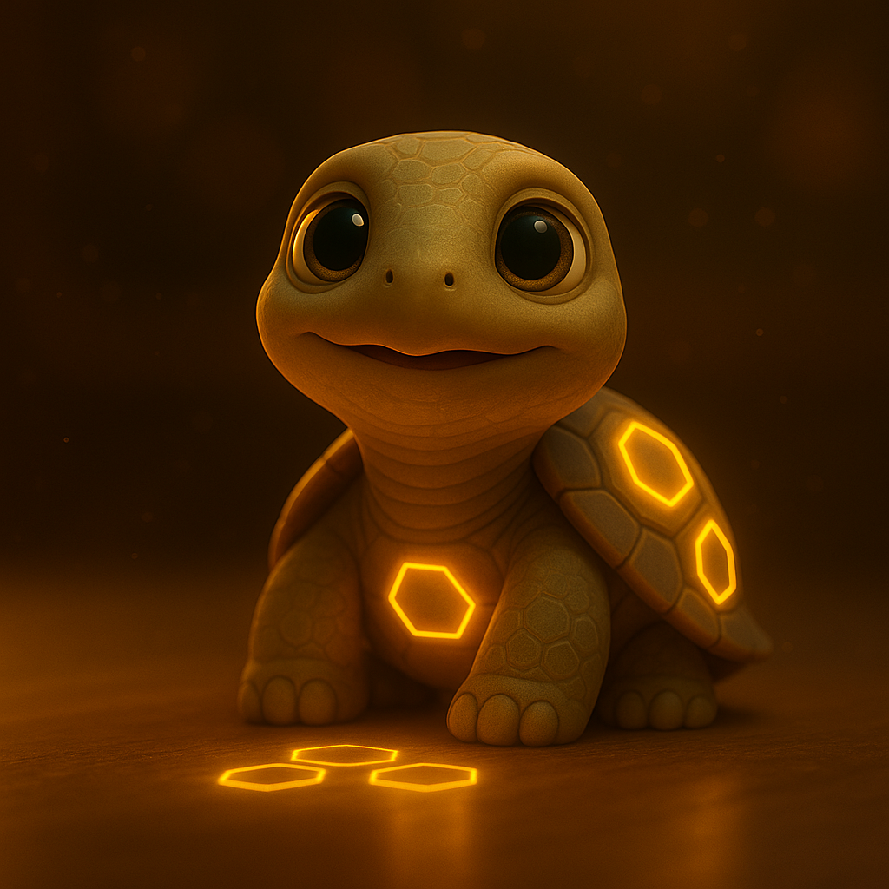 | 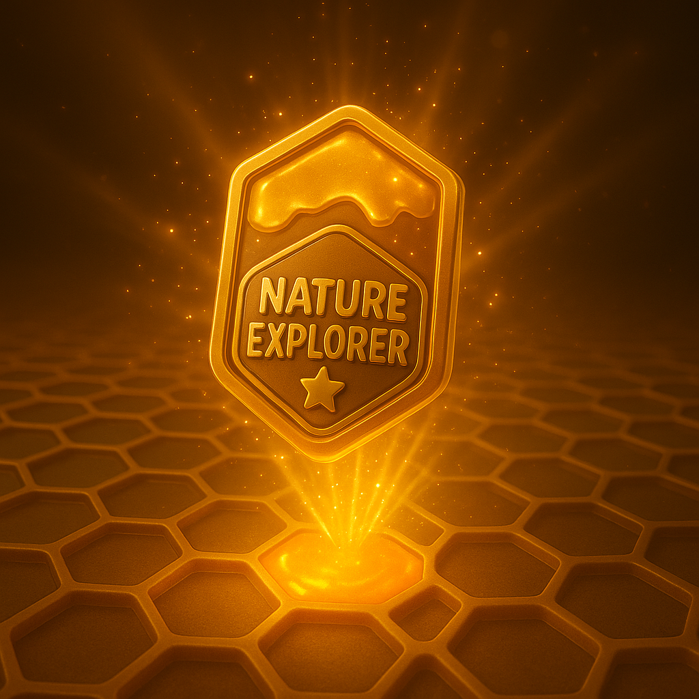 | 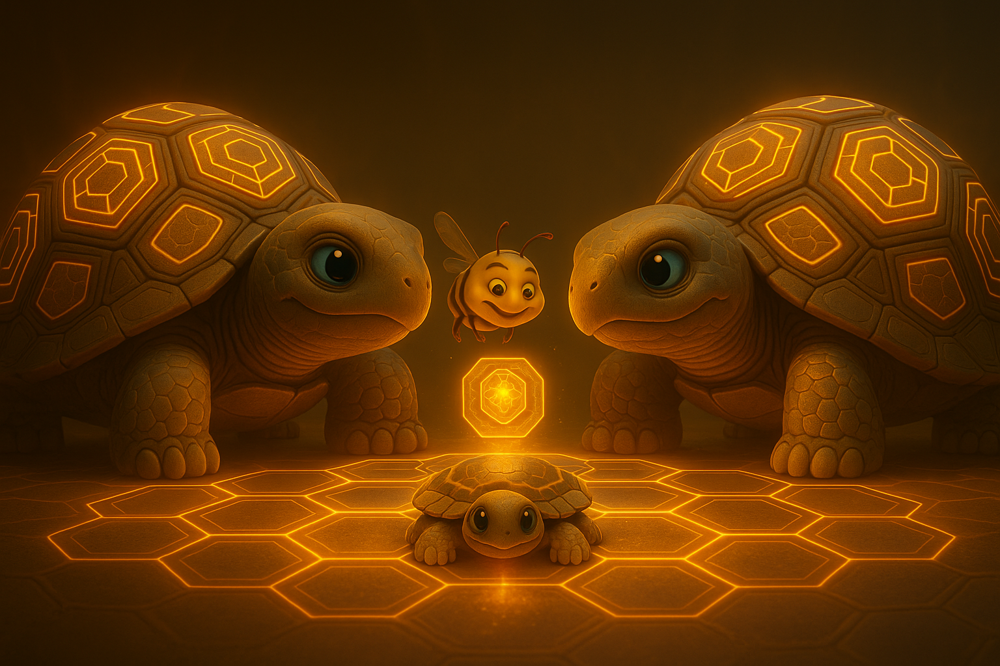 |
| **La Toile Vierge :** La carapace du Gardien est une toile, représentant le potentiel de savoir de l'utilisateur. | **L'Instant de Croissance :** Chaque morceau de Miel forgé contribue directement à l'évolution visible du Gardien. | **Le Chef-d'œuvre :** Avec le temps, le Gardien devient un chef-d'œuvre puissant et unique, prêt à tester son savoir dans l'Arène. |

### **Principe Fondamental #5 : Votre Savoir et Votre IA Vous Appartiennent. Point.**

C'est notre promesse centrale, incarnée par l'architecture de la Ruche.
1.  **100% Embarqué :** Votre Ruche, votre Gardien, et toute votre saga résident **uniquement sur votre appareil**.
2.  **Transparence Radicale :** Chaque goutte de Miel possède un **"Fil de Provenance"**. Le Miel forgé dans la Ruche a un journal de bord complet (`provenance.json`) contenant les prompts, les paramètres et les réponses brutes, rendant cette connaissance **vérifiable via la Reproduction d'Inférence**.
3.  **Partage Souverain & IA Évolutive :** Le "Choc des Sagas" est un échange **peer-to-peer**. Vous offrez du savoir directement à vos amis. Plus important encore, les **prompts** qui définissent la personnalité de votre Ruche et les **questions** de l'Arène sont modifiables et peuvent être mis à jour depuis `kikko.be`, faisant de votre IA un compagnon qui évolue avec la communauté.

| Introduction | Action | Conclusion |
| :---: | :---: | :---: |
| 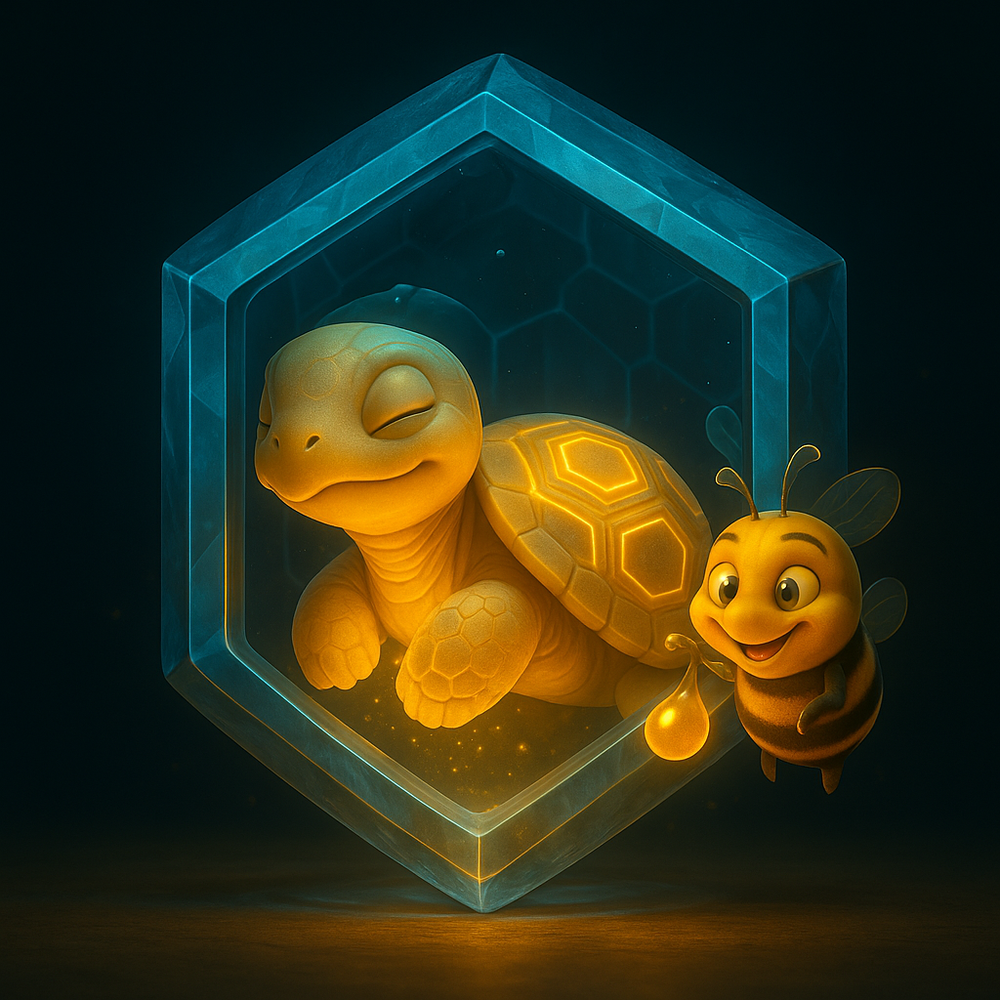 | 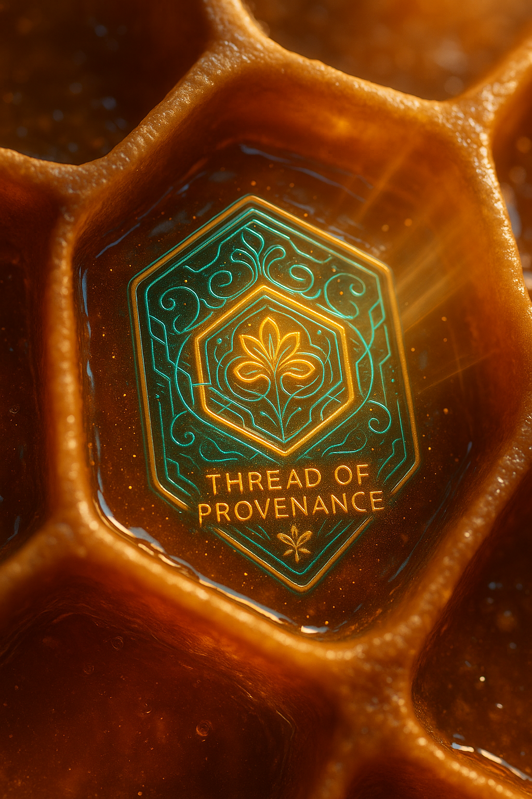 | 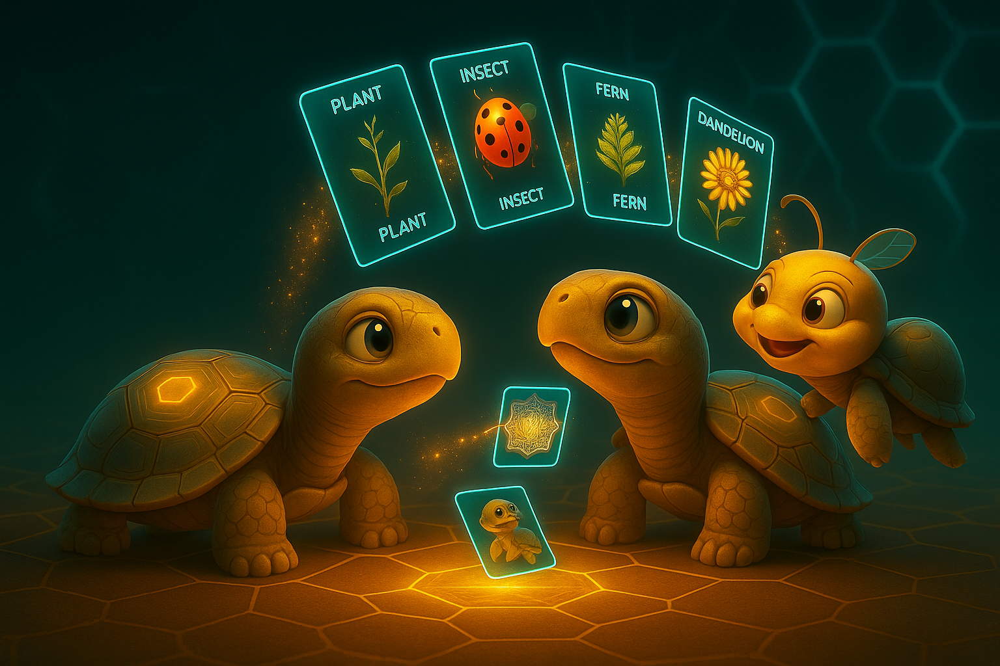 |
| **Le Coffre-Fort Privé :** La saga de l'utilisateur est stockée en toute sécurité au sein de son propre écosystème personnel et embarqué. | **Le Sceau Inviolable :** Chaque morceau de savoir est estampillé d'un sceau de confiance vérifiable et d'une provenance reproductible. | **Le Don Souverain :** Après un combat, le savoir est partagé directement et en toute sécurité, assurant que la saga de chaque joueur est enrichie. |

**Conclusion :**
`Kikko's Saga Forge` n'est pas juste une application. C'est un monde vivant. C'est notre proposition pour un futur où la technologie sert notre besoin le plus humain : construire, comprendre et partager l'histoire de notre vie. Un futur où notre mémoire est un compagnon de confiance avec lequel nous grandissons.