

  

# Document 1/10: The Saga Forge Manifesto

**Title:** The Saga Forge Manifesto: Augmenting Our Memory in a Living World

**Objective:** To establish the philosophical vision and core ambition of `Kikko's Saga Forge`, answering the fundamental question: "Why should this experience exist?"

---

### **Introduction: Digital Amnesia, a Modern Condition**

We live in a paradoxical era. Never have we been exposed to so much information, yet never have our memories felt so fragmented. We suffer from a form of **assisted digital amnesia**, where precious fragments of our lives—the name of a recommended book, the taste of a shared wine, the advice from a craftsman, or for a young boy like **Hiro**, the specific pattern on a ladybug's back—are lost to the digital ether.

We've delegated our memory, and in return, we get algorithmic suggestions. We've lost the intimate connection to the story of our own knowledge, and crucially, the ability to **trust and verify its origin.**

**`Kikko's Saga Forge` is an invitation to forge your memory, to grow your saga, and to play with verifiable truth.**

### **Founding Principle #1: The Kikkō, Your Living Saga**

Kikko rejects the idea of a simple "app." When you begin, you become a **Forager**, and you are entrusted with a **Kikkō Guardian**: a young digital turtle, your life-long companion. This Guardian is the vessel of your memory, the codex of your personal saga. Its shell, a mosaic of hexagonal patterns, is where your knowledge lives. Its growth is a direct reflection of your own journey of discovery.

This Guardian is cared for by its friends in your **Kikko Hive**: your private, on-device AI workshop. The smartphone is merely the **magical window** through which you interact with this symbiotic ecosystem.

| Introduction | Action | Conclusion |
| :---: | :---: | :---: |
|  | 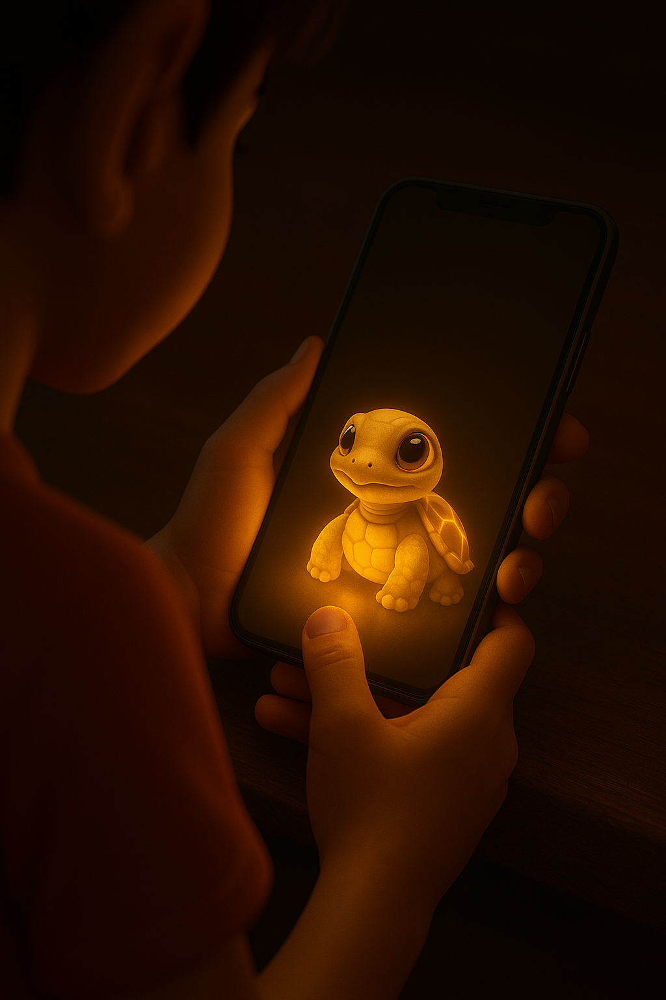 | 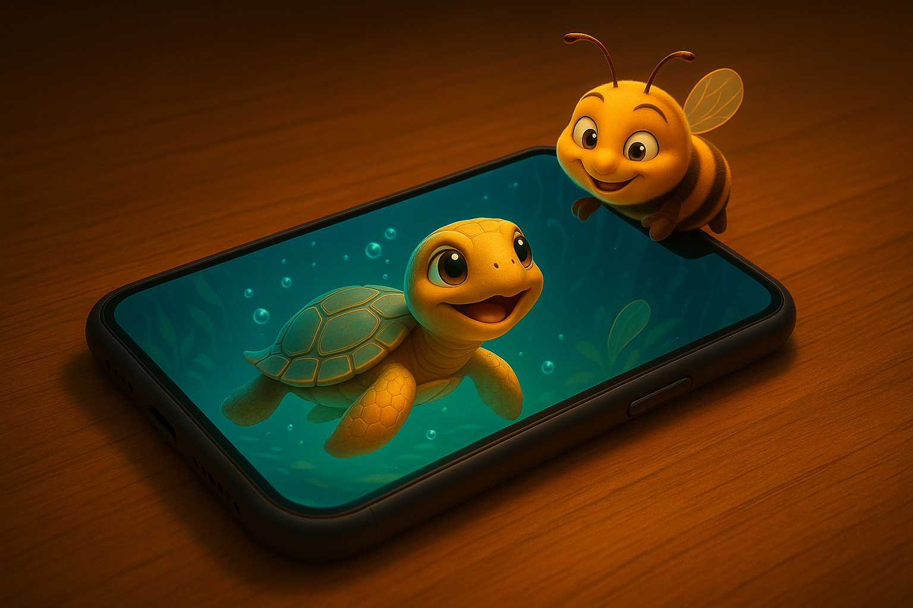 |
| **The Inert Object:** A smartphone is just a cold, impersonal slab of glass and metal. | **The Awakening:** The user's first interaction doesn't launch an app; it hatches their personal Kikkō Guardian, the start of their saga. | **The Symbiosis:** The device is now a portal to a living ecosystem, a partnership between the Forager, their Guardian, and the AI Hive. |

### **Founding Principle #2: "Pollen" is Foraged, "Honey" is Forged, Your Guardian is Fed**

In our ecosystem, data has a life cycle that is organic and meaningful.

1.  **Foraging "Pollen":** You explore the world and capture raw information (a photo, a scan, a note). This is "pollen," the raw material for knowledge.
2.  **Forging "Honey":** You bring this pollen to your **Kikko Hive**. Inside, your AI companions **forge** it into structured, verifiable "Informative Honey" in a true **human-AI partnership**.
3.  **Feeding your Guardian:** This trusted honey is the food for your Kikkō Guardian. By eating it, your turtle grows, its shell becoming more intricate and beautiful, visually representing your expanding saga.

| Introduction | Action | Conclusion |
| :---: | :---: | :---: |
|  | 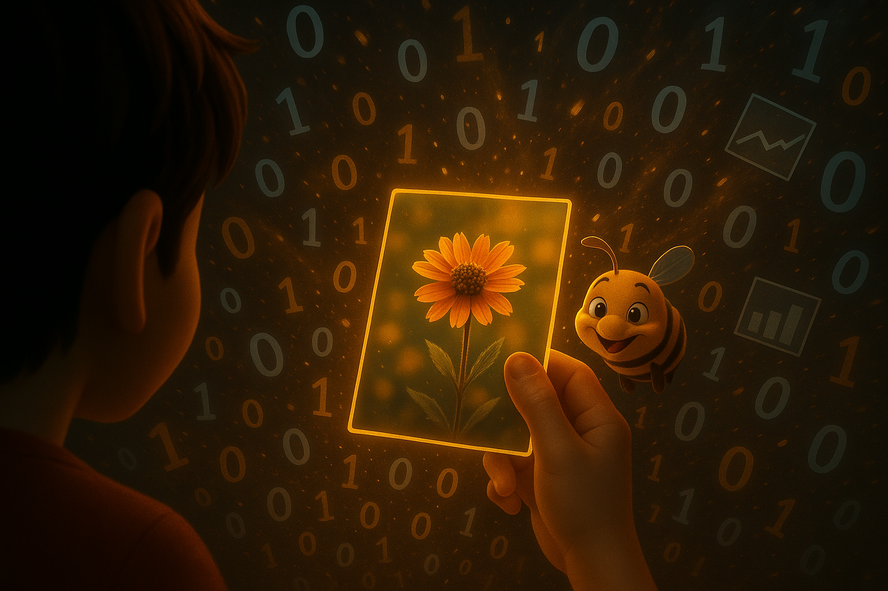 |  |
| **The Data Storm:** The modern world is a confusing storm of impersonal, generic data. | **The Act of Meaning:** The user makes a conscious choice to select one specific piece of information that is personally meaningful. | **The Precious Pollen:** The impersonal data is transformed into a unique, personal "pollen," the raw material for knowledge. |

### **Founding Principle #3: The Hive, a Symbiotic Partnership**

The **Kikko Hive** is your on-device AI forge, populated by friendly digital artisans who work for you and your Guardian.

*   **The Worker Bees (ML Kit):** Tireless specialists who extract the raw material from the "pollen."
*   **The AI Queen (Gemma):** The wise master artisan. She understands, connects, and suggests. She engages you in a dialogue to forge the most accurate honey, sometimes **issuing new foraging quests** ("Forager, I need a close-up of that label!") or **conducting her own web research** to enrich a memory.
*   **The Bourdon (The Communicator):** The charming link between you, your Guardian, and the Hive. He presents quests from the Queen, delivers the finished honey, and sometimes, offers "junk food" honey from external "Hornets" (AI Overviews), which is less nutritious for your Guardian.

| Introduction | Action | Conclusion |
| :---: | :---: | :---: |
| 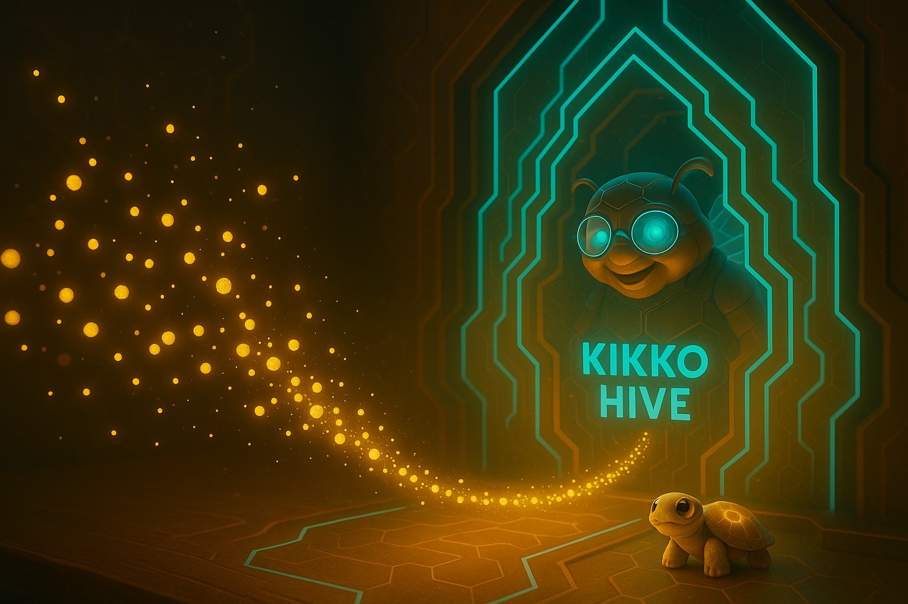 | 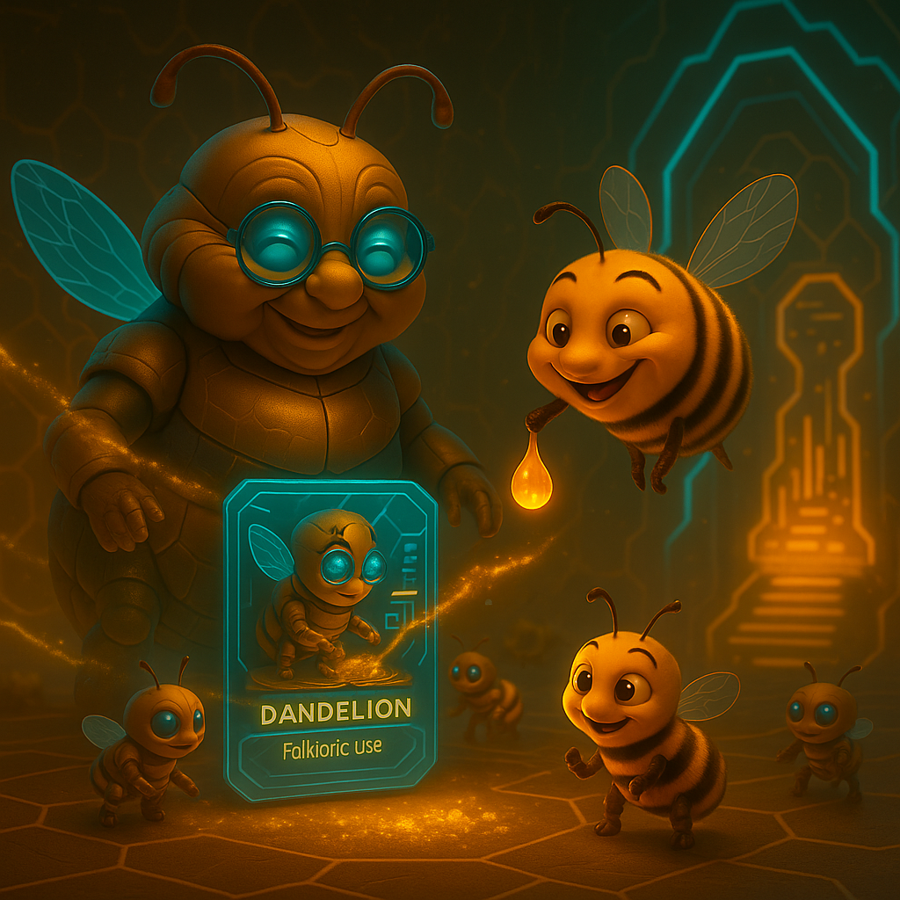 | 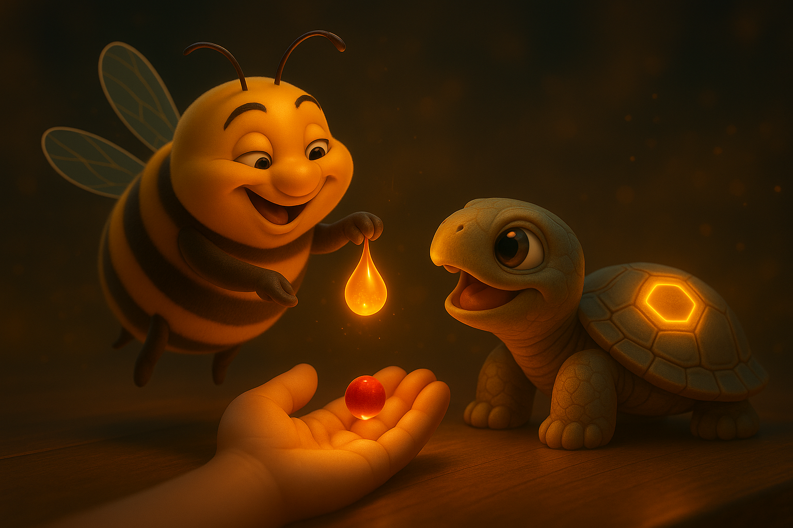 |
| **The Raw Material:** The user's foraged pollen arrives in the Hive to be processed. | **The Artisans' Work:** The AI companions work together, in partnership with the user, to forge raw pollen into "Informative Honey." | **Nourishing the Saga:** The finished honey is fed to the Kikkō Guardian, which assimilates the knowledge and grows. |

### **Founding Principle #4: Gamification is a Language of Growth and Battle**

Game mechanics are the intuitive language of Kikko.

*   **Quests** are invitations to find new "pollen" to feed your Guardian.
*   **Badges** and **Points** celebrate your foraging achievements.
*   **The Kikkō's Growth** is the ultimate visual representation of your progress.
*   **The Saga Clash** is the social expression of your knowledge, where your Guardian's shell becomes a battle arena for a friendly, P2P card game using themed decks.

| Introduction | Action | Conclusion |
| :---: | :---: | :---: |
| 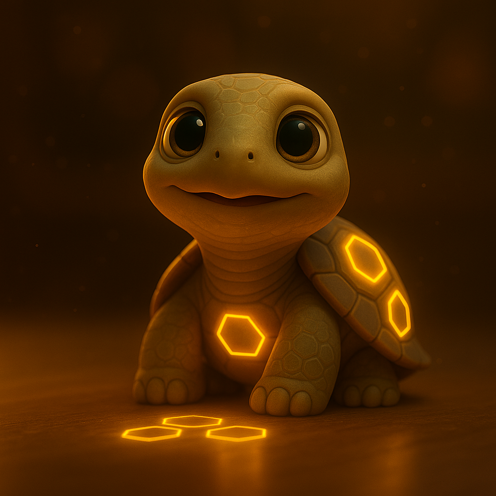 | 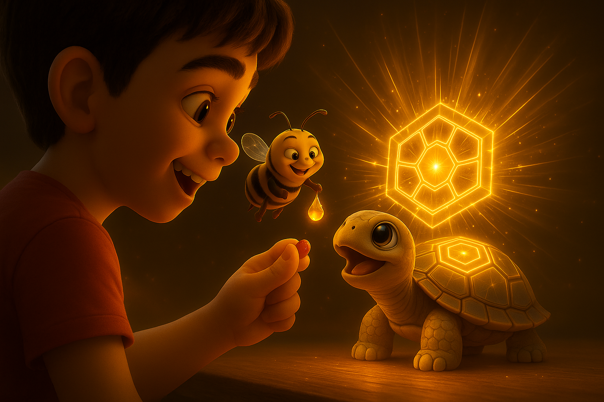 | 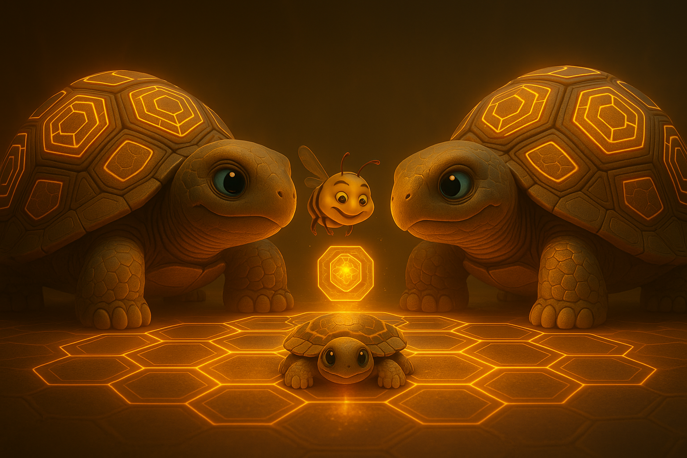 |
| **The Blank Canvas:** The Guardian's shell is a canvas, representing the user's potential for knowledge. | **The Moment of Growth:** Each piece of forged honey contributes directly to the Guardian's visible evolution. | **The Masterpiece:** Over time, the Guardian becomes a powerful and unique masterpiece, ready to test its knowledge in the Arena. |

### **Founding Principle #5: Your Knowledge Belongs to You. Period.**

This is the central promise, embodied by the symbiosis of the Hive and the Guardian.

1.  **100% On-Device:** Your Hive, your Guardian, and your entire saga reside **only and exclusively on your device**.
2.  **Radical Transparency:** Every drop of honey has a **"Thread of Provenance"**. Hive-forged honey has a blueprint for **Inference Reproduction**, making it verifiably true. Hornet honey has its HTML source traced. You always know what your Guardian is eating.
3.  **Sovereign Sharing:** The "Saga Clash" is a **peer-to-peer** exchange. You gift knowledge directly to your friends, enriching each other's Guardians.

| Introduction | Action | Conclusion |
| :---: | :---: | :---: |
| 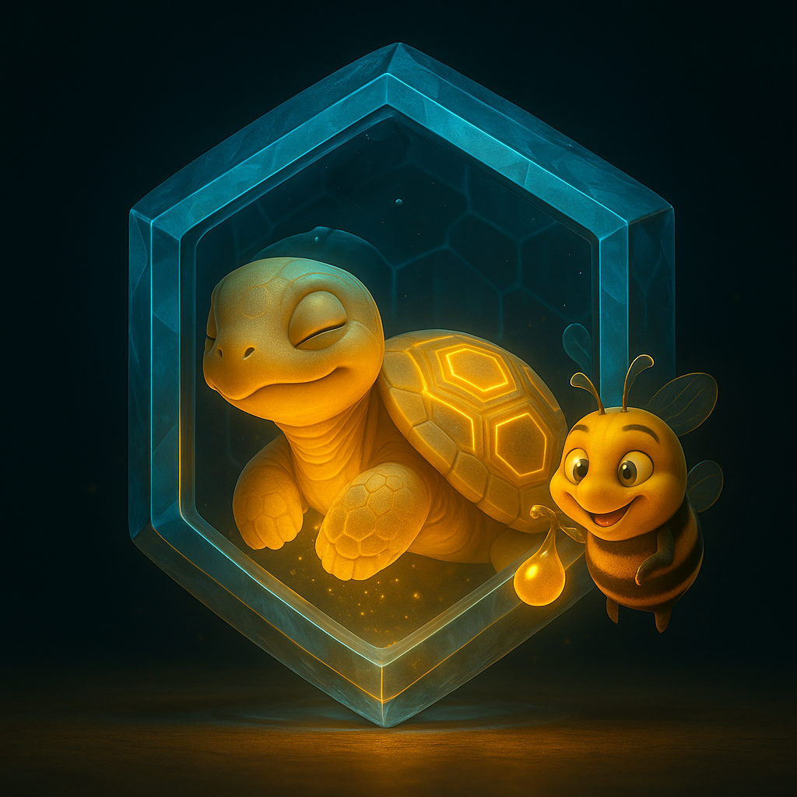 | 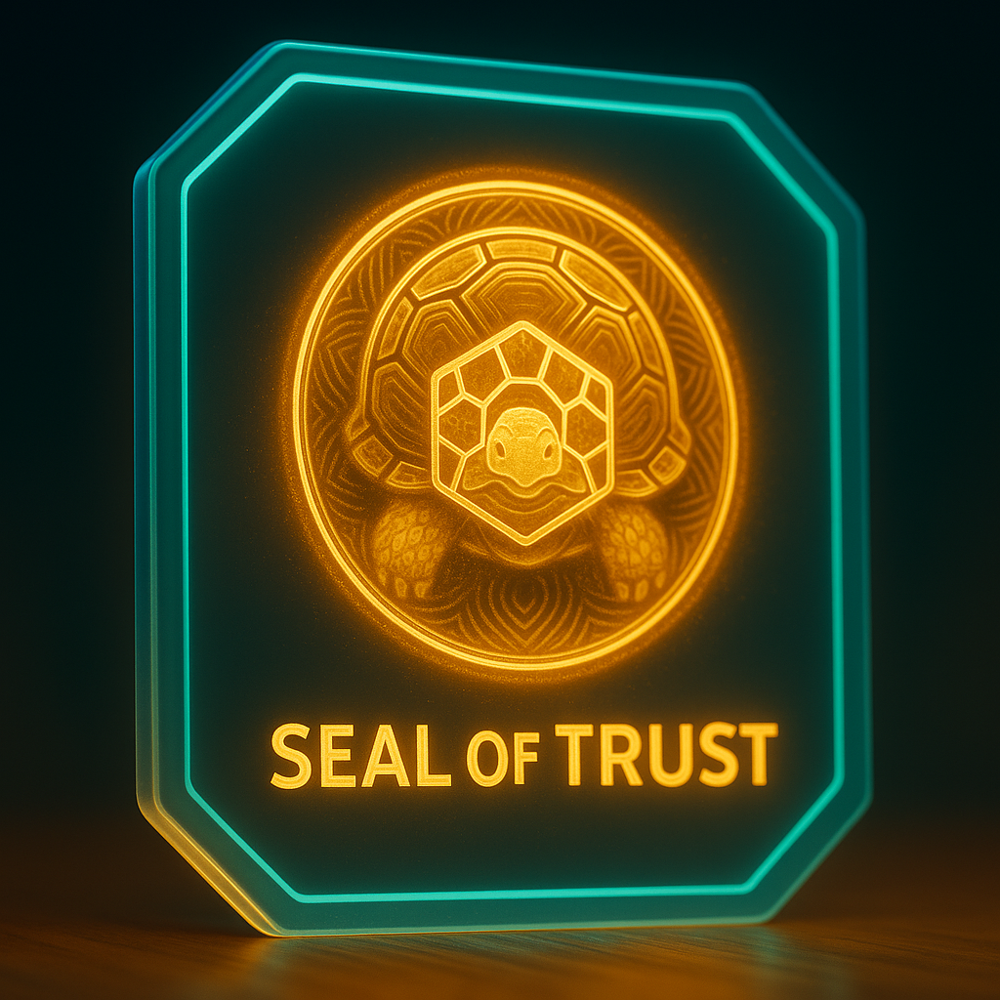 | 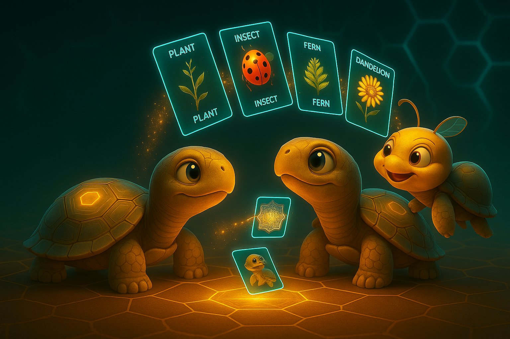 |
| **The Private Vault:** The user's saga is securely stored within their own personal, on-device ecosystem. | **The Unbreakable Seal:** Each piece of knowledge is stamped with a verifiable seal of trust and reproducible provenance. | **The Sovereign Gift:** After a battle, knowledge is shared directly and securely, ensuring every player's saga is enriched. |

**Conclusion:**
`Kikko's Saga Forge` is not just an app. It is a living world. A step towards a future where technology serves our most intimate human need: to build, understand, and share our life's story. A future where our memory is a trusted companion we can grow with, and our knowledge is a source of joy and connection.