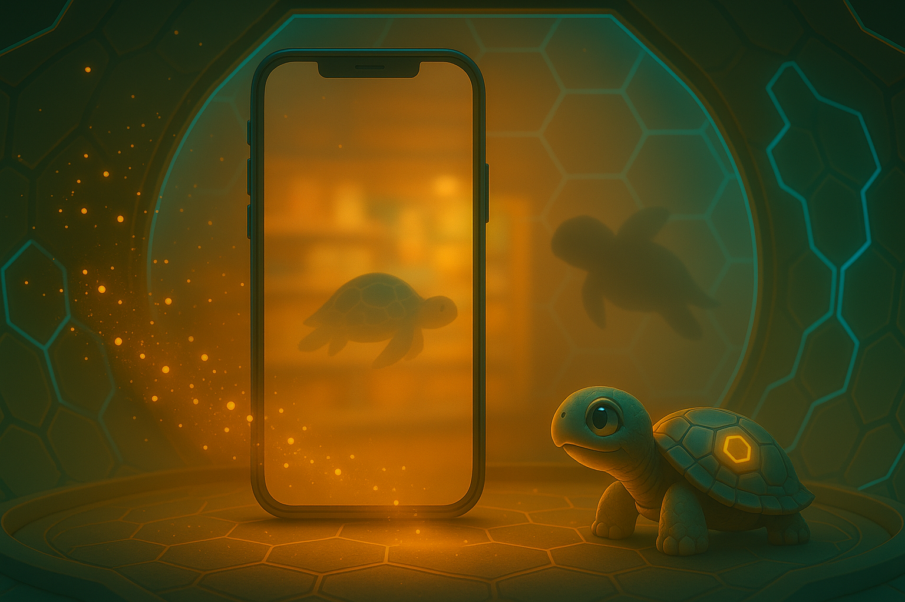
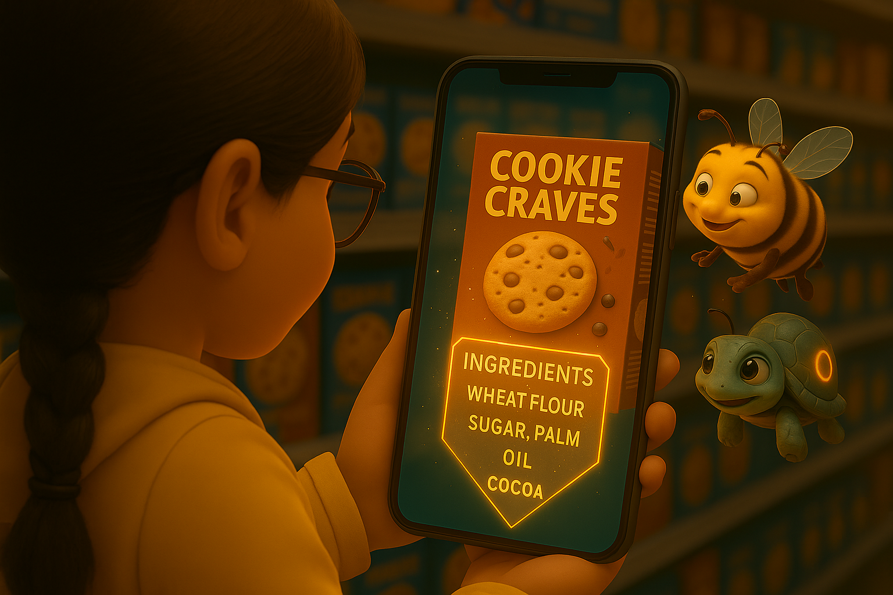
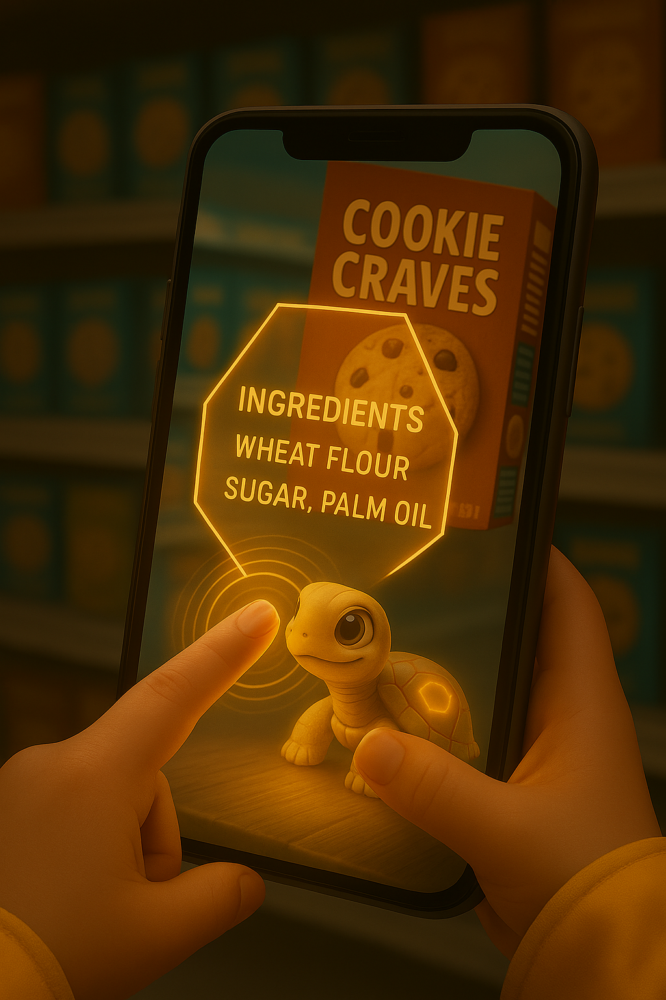
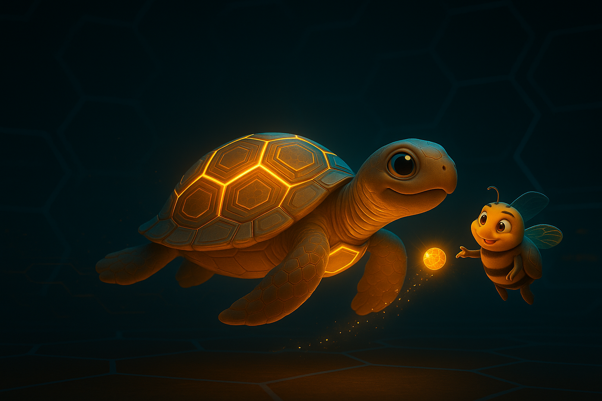
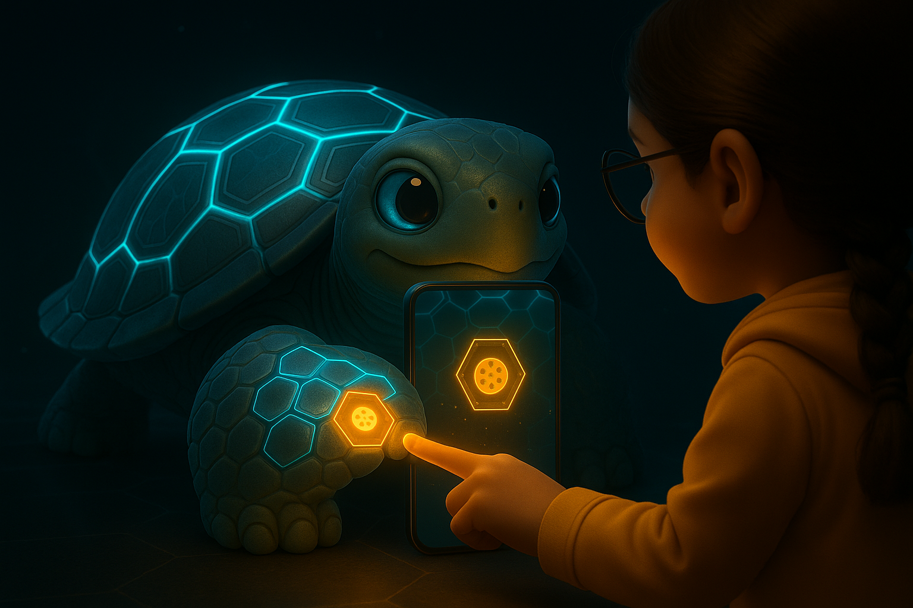
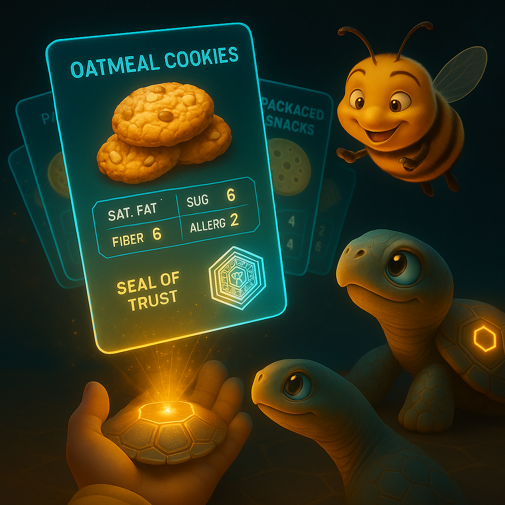

  

# Document 2/10: The World of Kikko's Saga Forge

**Title:** The World of Kikko: The Interface as a Living Companion

**Objective:** To define the fundamental principles of Kikko's User Interface (UI) and User Experience (UX), emphasizing simplicity, immersion, and the unique communication partnership between the Forager, their Guardian, and the Hive.

---

### **Core Philosophy: The Anti-App**

Kikko's interface is designed around a radical principle: **it should not feel like an application**. We reject complex menus and data-entry forms. The experience must be fluid, intuitive, and almost invisible, acting as a layer of understanding superposed on the real world, not as a destination in itself.

Our goal is to erase the boundary between the user's physical world and their digital ecosystem. The smartphone is no longer a portal to another place (cyberspace), but a **magical lens** to better see, understand, and interact with the place one already is. For a user like **Léa**, who has allergies, this lens becomes a crucial tool for navigating the world of food safely with her Kikkō Guardian.

### **Component 1: The Great Bay Window (The Augmented Camera View)**

Kikko's "default mode" is the camera view. This is the heart of the experience, the Hive's window to the world.

*   **Augmented Transparency:** The camera view is subtly enhanced. Colors are slightly richer, light is warmer. The interface beautifies, it doesn't impose.
*   **Contextual Overlays:** The Hive communicates visually by superimposing minimalist, translucent graphic elements onto real-world objects.
    *   **The Quest Honeycomb:** When the Queen needs more information (e.g., a clearer picture of the ingredients list for Léa), a simple, glowing hexagon with a '?' icon appears and "latches" onto the object of interest, issuing a new foraging quest.
    *   **Guardian's Presence:** Léa's Kikkō Guardian might appear as a small, translucent avatar in the corner of her screen, observing the world with her.
*   **The Touch of Intent:** The user's tap on the screen is a direct command, telling the Hive: "Look closely at this. Forge me some honey for my Guardian."

| Introduction | Action | Conclusion |
| :---: | :---: | :---: |
|  |  |  |
| **The Hive's Gaze:** The Hive passively observes Léa's world through its semi-transparent window. | **The Focus:** The window becomes perfectly clear when a foraging opportunity is presented, inviting interaction. | **The Touch:** Léa's interaction on the window signals the Hive to begin the critical foraging process for allergens. |

### **Component 2: The Guardian's Shell (The Knowledge Codex)**

With a simple gesture, the user can transition from the "window" to a view of their **Kikkō Guardian**. This is where they manage their saga.

*   **The Evolving Carapace:** The turtle's shell is the main interface for knowledge management. It's a living, 3D model. Each hexagonal scute (plate) on its shell represents a thematic **"Arena"** (e.g., "Packaged Snacks," "Home-cooked Meals," "Garden Plants").
*   **Deck Visualization:** Tapping on a scute causes the corresponding deck of holographic cards to fan out, ready for inspection or battle. Cards forged from "Pure Honey" glow gold; those containing "Hornet" data have a grayish tint.
*   **Guardian's Well-being:** The Guardian's animation and expression reflect its "diet." A well-fed Guardian (from pure, reproducible honey) will swim energetically. One fed with "junk food" honey might seem sluggish, providing a visual cue of its knowledge quality.

| Introduction | Action | Conclusion |
| :---: | :---: | :---: |
|  |  |  |
| **The Living Codex:** The Guardian's shell is the user's knowledge graph, a navigable and beautiful 3D landscape of Arenas. | **The Deck Selection:** User interaction with a specific Arena on the shell reveals the deck of knowledge cards within. | **Access and Presentation:** The Bourdon ensures the user can easily access and understand the structured data on each card and its verifiable origin. |

### **Component 3: The Dialogue (Human-AI Partnership)**

All communication occurs through a minimalist, non-intrusive dialogue interface, primarily driven by the **Bourdon's unique personality**.

*   **The Bourdon's Delivery:** The Bourdon is the primary voice and visual representation of the Hive's communication. He presents quests, relays the Queen's questions, and delivers the finished "honey" to the Kikkō Guardian.
*   **Suggest, Query & Confirm:** This is the core interactive loop. The Queen formulates suggestions ("I believe this is `gs1:FoodProduct`") or asks contextual questions ("Did you see a 'may contain nuts' warning?"). The Bourdon relays these. Léa's confirmation or answer is crucial for forging trusted, reproducible honey.
*   **Effortless Correction as a Feature:** If the AI's OCR misreads an ingredient, correcting it is simple. This is not a failure, but a key part of the **collaborative forging process**. The user's input is valued and necessary. The Bourdon might even offer a cheeky comment like: `"Oops, my bad. Good catch, kiddo! The Queen needs her coffee."`

| Introduction | Action | Conclusion |
| :---: | :---: | :---: |
|  |  |  |
| **The Query from the Hive:** The Bourdon initiates a dialogue, relaying the Queen's need for user input or clarification. | **The Guided Choice:** The UI presents clear, visual options, making interaction fast and intuitive. | **The Partnership Confirmed:** The user's choice provides immediate feedback, reinforcing the collaborative nature of the knowledge-forging process. |

**Conclusion:**
Kikko's UI/UX serves immersion and partnership. By treating the screen as a window and knowledge management as nurturing a living Guardian, we create an experience where technology fades into the background, leaving a natural, engaging interaction aimed at building a beautiful and accurate memory of one's world.