

  

# Document 3/10: A Forager's Life - The Core Gameplay Loop

**Title:** A Forager's Life: The Core Gameplay Loop of Kikko

**Objective:** To define the primary mechanics of the game, detailing the "Foraging" process from the initial quest to the final reward, and establishing the core loop that drives user engagement and learning through conscious choices.

  

---

### **Core Philosophy: From Chore to Quest**

The fundamental gameplay loop of Kikko is designed to transform the mundane act of data entry into an exciting and rewarding **Quest for Knowledge**. The user is not "filling out a form"; they are assisting their AI companion on a mission of discovery. This re-framing is crucial for maintaining long-term engagement. The loop is simple, satisfying, and cyclical: **Quest -> Forage -> Process -> Reward.** For our young naturalist **Hiro**, this transforms his garden into a real-life RPG.

### **1. The Quest: The Call from the Hive**

The loop begins when the AI Queen identifies an opportunity to learn more about the user's world. This "call to action" is presented as a Quest.

*   **Proactive Quests:** The Hive can be proactive. The Queen might need a clearer photo or a missing piece of information.
    *   *Example for Hiro:* "Forager, the pollen from this flower is incomplete! The Queen requests a photo of its leaves to confirm the species."
*   **User-Initiated Quests:** The user can initiate a quest at any time by simply pointing their device at an object (like a ladybug on a leaf) and tapping the "Forage" button. This is equivalent to telling the Hive, "This is important to me. Learn about it."
*   **Quest Interface:** A quest is presented visually as a translucent, glowing hexagonal frame that overlays the object of interest in the "Great Bay Window" (the camera view). The **Bourdon** often verbally introduces the quest.

| Introduction | Action | Conclusion |
| :---: | :---: | :---: |
| 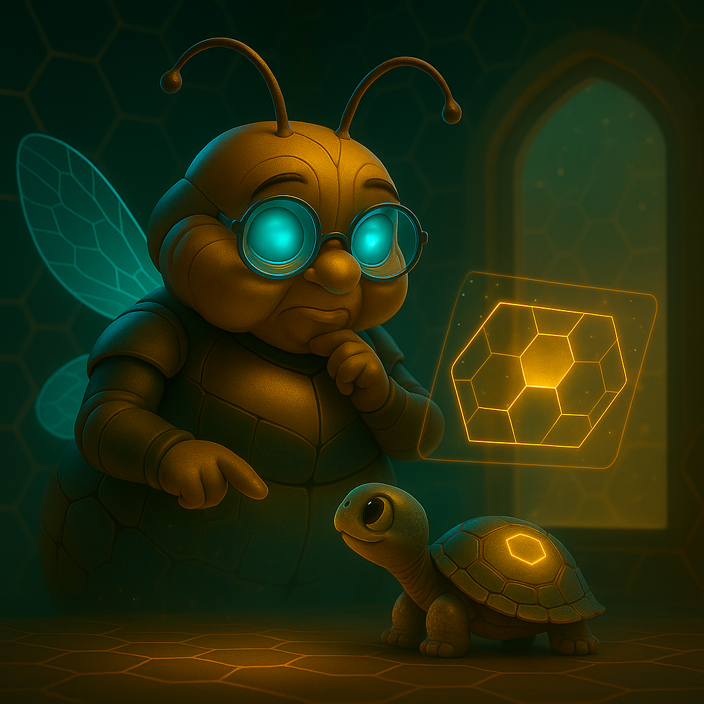 | 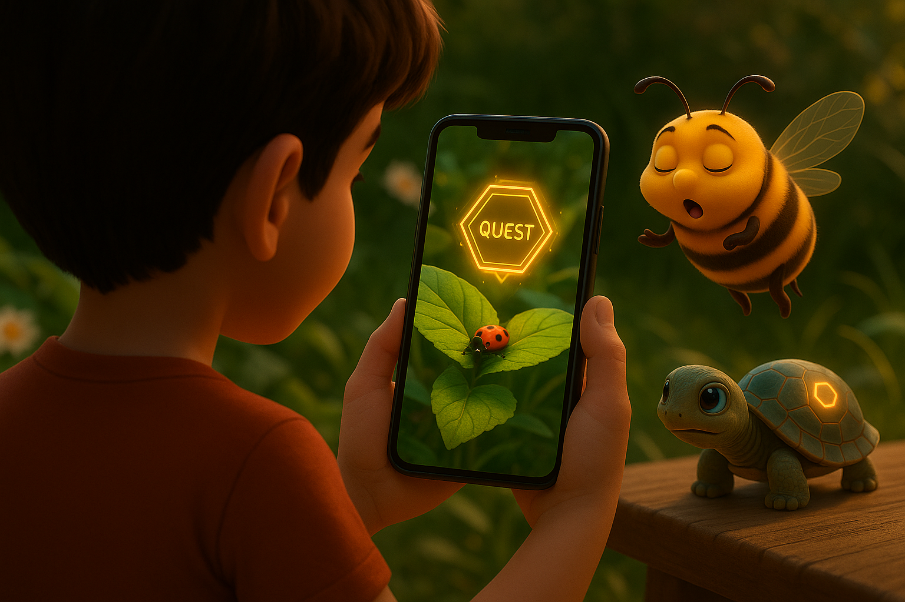 | 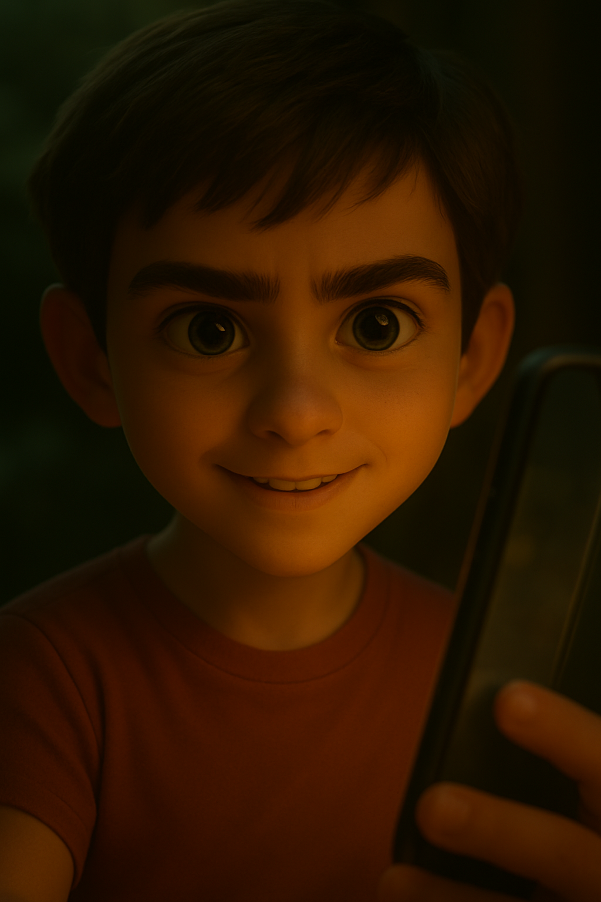 |
| **The Need:** The AI Queen identifies a missing piece of knowledge relevant to her user's world. | **The Call:** A quest visually appears on the user's screen, highlighting the object for foraging. | **The Engagement:** The user accepts the quest, turning a simple observation into a personal adventure. |

### **2. The Foraging: Capturing the Pollen**

This is the central action performed by the user. "Foraging" is the act of capturing raw, unstructured information directly from the real world using the device's sensors.

*   **Multimodal Input:** The user chooses their "foraging tool" based on the nature of the information:
    *   **The Camera (Visual Pollen):** The primary tool. Used for capturing photos of objects (like a ladybug), text on labels, barcodes, documents, or even identifying objects (Object Detection) and their labels (Image Labeling).
    *   **The Microphone (Auditory Pollen):** For dictating notes, descriptions, or recording ambient sounds (like birdsong near the ladybug).
    *   **Sensors (Contextual Pollen):** The Hive automatically gathers GPS location, timestamps, and other sensor data to add rich context.
*   **The "Pollen" Metaphor:** The captured data is visualized as beautiful, glowing particles of light that are "sucked" into the Hive icon.

| Introduction | Action | Conclusion |
| :---: | :---: | :---: |
| 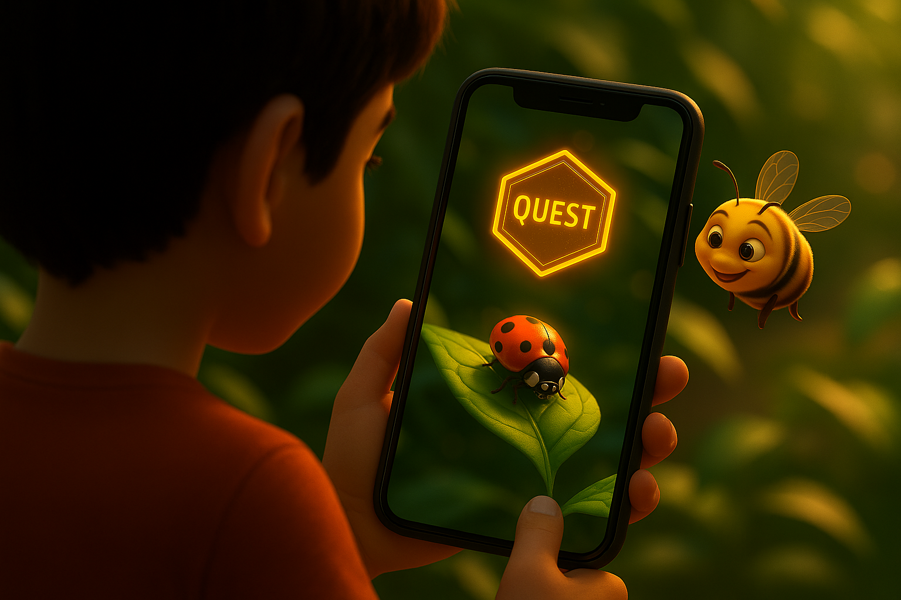 | 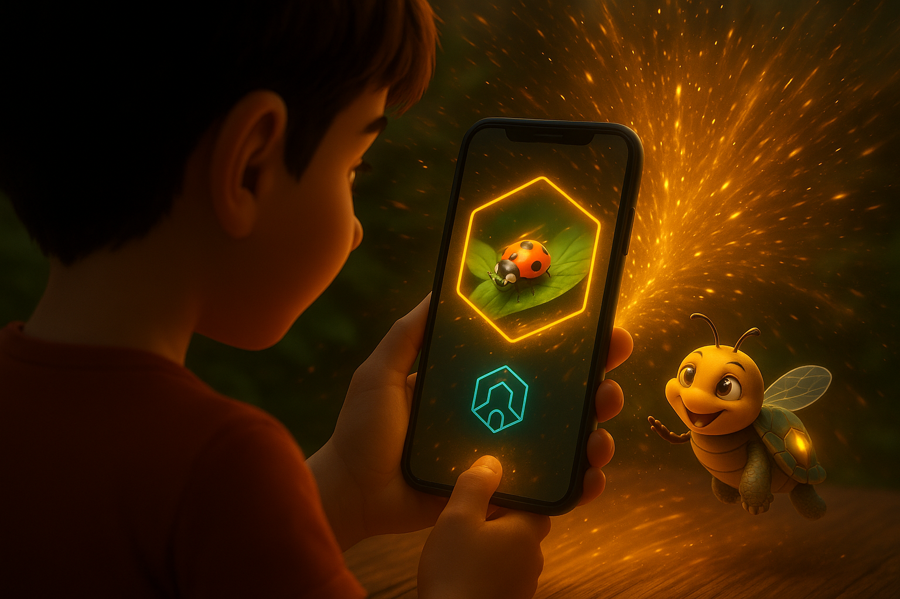 | 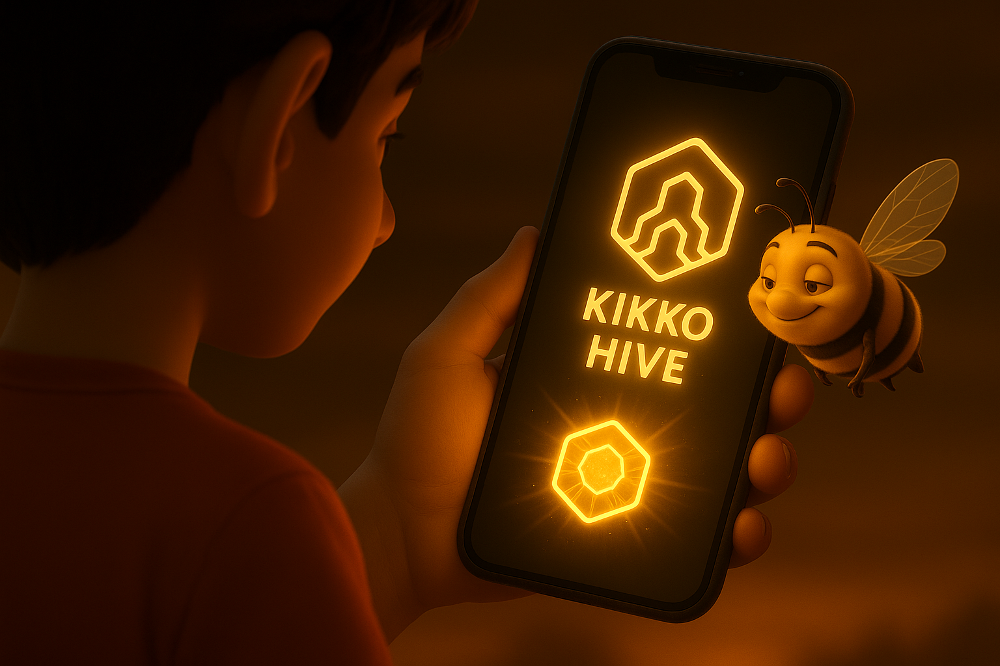 |
| **The Target:** The user aims their device at the object of the quest, preparing to gather raw information. | **The Capture:** The user's action transforms the physical object into magical, digital "pollen" that flows into the Hive. | **The Collection:** The Hive confirms successful collection, providing immediate, satisfying visual feedback. |

### **3. The Process: The Alchemy of Partnership & The Bourdon's Offer**

This is the most critical and complex phase, combining automated processing with a crucial choice presented by the Bourdon.

*   **Initial Extraction (Worker Bees - ML Kit):** As pollen enters the Hive, the Worker Bees immediately begin their meticulous (and slower) processing in parallel.
*   **The Bourdon's Intervention & The Hornet's Offer:** Simultaneously, the **Bourdon** performs a quick web search. He presents any available "AI Overview" as "Hornet's Pollen."
    *   **Bourdon's Dialogue:** `"Hé, Butineur ! Pendant que la Mémère et les filles triment, j'ai demandé à un Frelon du web. Voici une réponse toute prête sur la Coccinelle ! Rapide, non ? Tu peux l'intégrer, elle sera marquée comme venant du Frelon. Ou alors, on fait le travail nous-mêmes pour un miel 100% pur et reproductible."` (He presents the AI Overview and a clear choice).
*   **The Queen's Alchemy (Gemma) & User Validation:** If the user chooses the pure path (or in addition to integrating Hornet data), the AI Queen takes the raw pollen. She suggests classification and structuring, and engages Hiro in a dialogue for validation and context: "Where exactly did you find this ladybug? What plant was it on?". This **human-AI partnership** ensures the Hive-forged part of the "Informative Honey" is accurate and has a verifiable "Thread of Provenance".

| Introduction | Action | Conclusion |
| :---: | :---: | :---: |
| 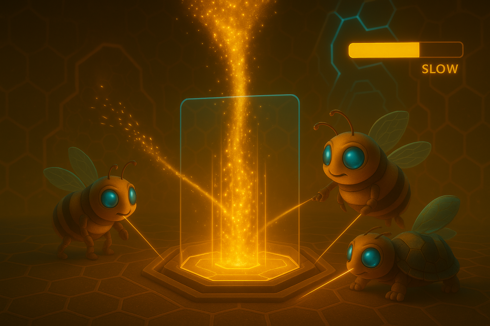 | 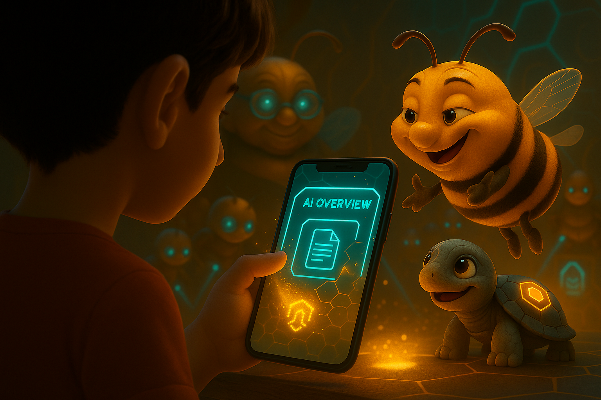 | 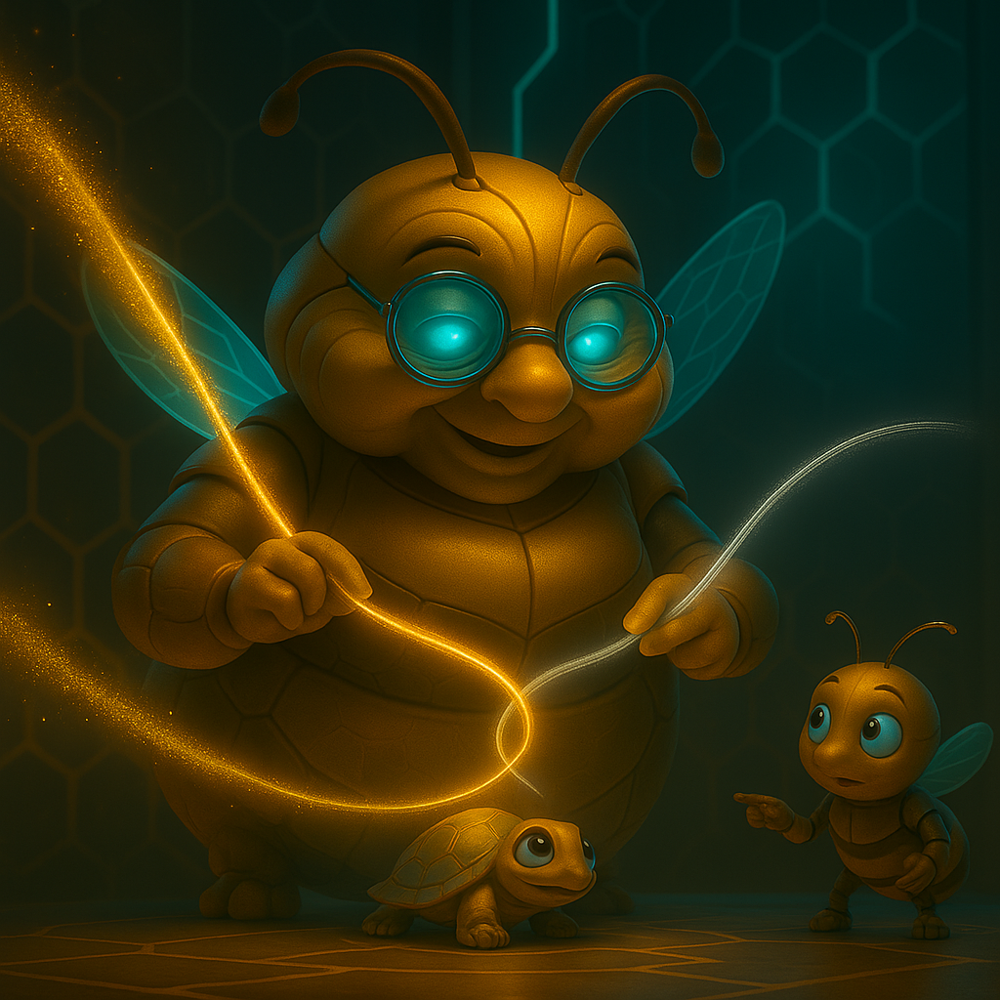 |
| **The Race Against Time:** Pure pollen arrives in the Hive, and Worker Bees begin their meticulous, on-device processing. | **The Temptation of Ease:** The Bourdon offers an instant, pre-digested answer from external AI for quick integration, challenging the user's patience. | **The Path Chosen:** The Queen confidently takes over the pure pollen processing, incorporating the user's input to forge truly trusted knowledge. |

### **4. The Reward: The Sweet Taste of Trusted Knowledge**

This is the final, crucial step of the loop, designed to provide positive reinforcement and a clear sense of accomplishment.

*   **Filling the Honeycomb & Microsite Creation:** The empty quest honeycomb animates, filling with shimmering, golden liquid honey. This "Informative Honey" is then presented as a browsable, multi-language **"Microsite"**.
*   **Data Unveiling & Dual Provenance Seal:** The raw data is replaced by its structured, validated form. A vibrant **"Seal of Trust"** appears. For Hive-forged data, the seal is pure gold. If Hornet data was integrated, a section of the seal is grayish, clearly marking the dual provenance.
*   **Points & Badges:** Hiro is awarded "Honey Points" and unlocks stylish Badges (e.g., "Insect Identifier," "Garden Guardian").
*   **Augmented Memory:** The new, **trusted knowledge** is now part of the user's personal memory graph, ready to be recalled, connected, and used in battle.

| Introduction | Action | Conclusion |
| :---: | :---: | :---: |
| 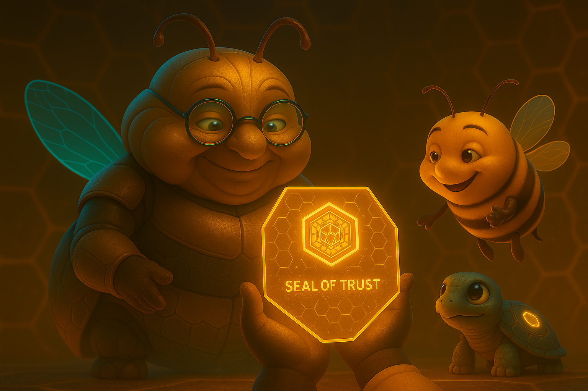 | 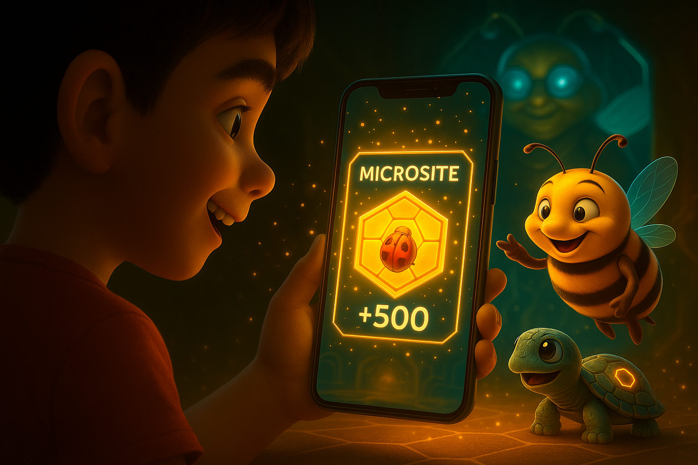 | 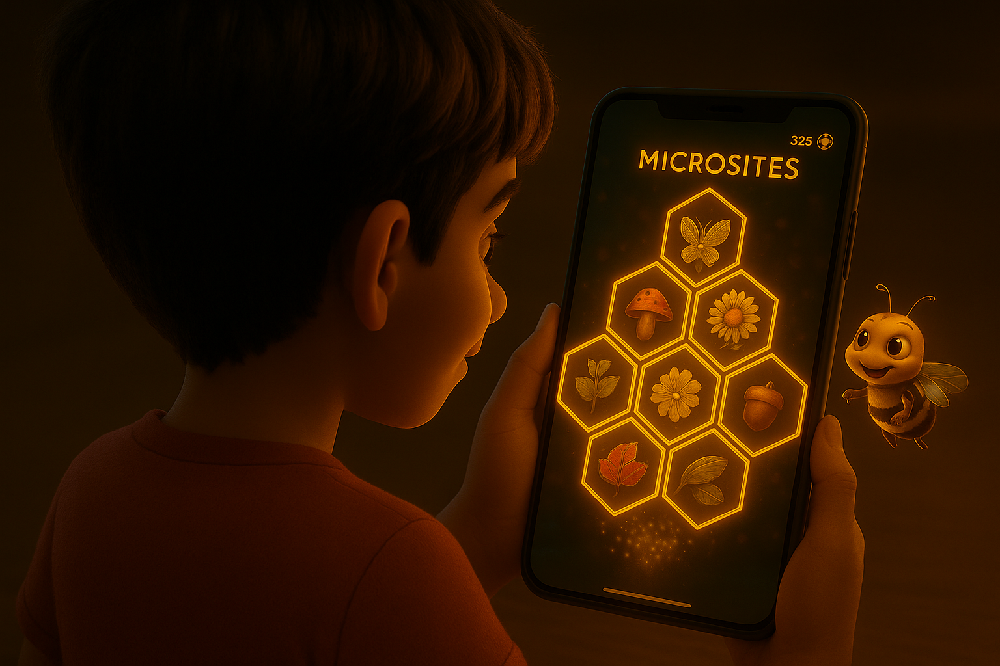 |
| **The Creation:** The AI Queen finishes crafting the "Informative Honey" in partnership with the user, certified with transparent provenance. | **The Delivery:** The result of the quest is delivered to the user's interface with satisfying visual and audio feedback. | **The Collection:** The user sees their personal knowledge base grow, a beautiful and tangible representation of their journey and effort. |

**Conclusion:**
The gameplay loop of Kikko is a virtuous cycle. By gamifying the act of observation, data structuring, and contextualization, we encourage the user to be more present and curious. Each completed loop not only provides a reward but also makes the user's AI companion smarter and more useful, creating a powerful incentive to embark on the next quest for authentic, personal knowledge.