

  

# Document 3/10: A Forager's Life - The Core Gameplay Loop

**Title:** A Forager's Life: The Core Gameplay Loop of Kikko

**Objective:** To define the primary mechanics of the game, detailing the "Foraging" process from initial exploration to the final reward, and establishing the core loop that drives user engagement and learning.

  

---

### **Core Philosophy: From Chore to Quest**

The fundamental gameplay loop of Kikko is designed to transform the mundane act of data entry into an exciting and rewarding **Quest for Knowledge**. The user is not "filling out a form"; they are assisting their AI companions on a mission of discovery. This re-framing is crucial for maintaining long-term engagement. The loop is simple, satisfying, and cyclical: **Explore -> Capture -> Forge -> Reward.** For our young naturalist **Hiro**, this transforms his garden into a real-life RPG.

### **1. The Exploration: The Hive's Live Perception**

The loop begins not with a static quest, but with active exploration. The Forager points their phone at the world, and the Hive's **Specialist Bees** (on-device TFLite models for Plants, Animals, etc.) immediately get to work.

* **Live Analysis:** The Bees analyze the camera's video stream in real-time.
* **Augmented Reality Overlays:** When a Specialist Bee recognizes something, it displays its findings as a subtle, non-intrusive overlay. Hiro, pointing his phone at a flower, might see a small tag appear saying: *"Taraxacum officinale - 89% confidence"*.
* **The Call to Action:** The world itself becomes the quest log. The "call" is the Forager's own curiosity, sparked by the live information provided by the Hive.

| Introduction | Action | Conclusion |
| :---: | :---: | :---: |
| 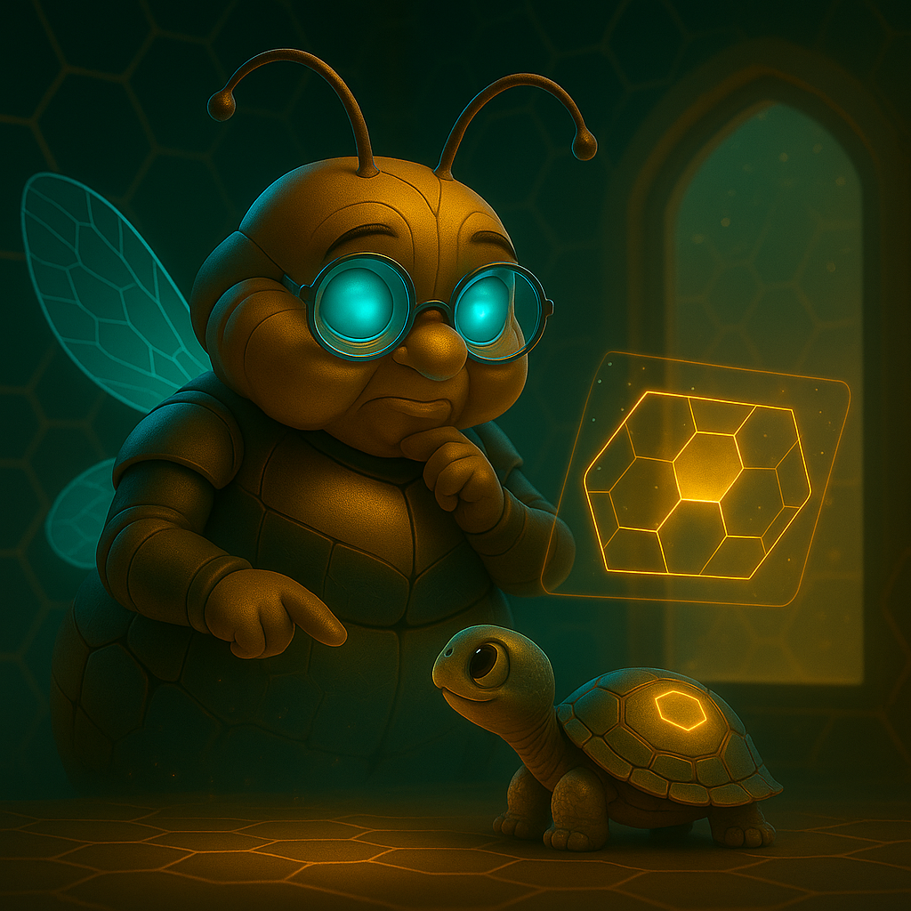 | 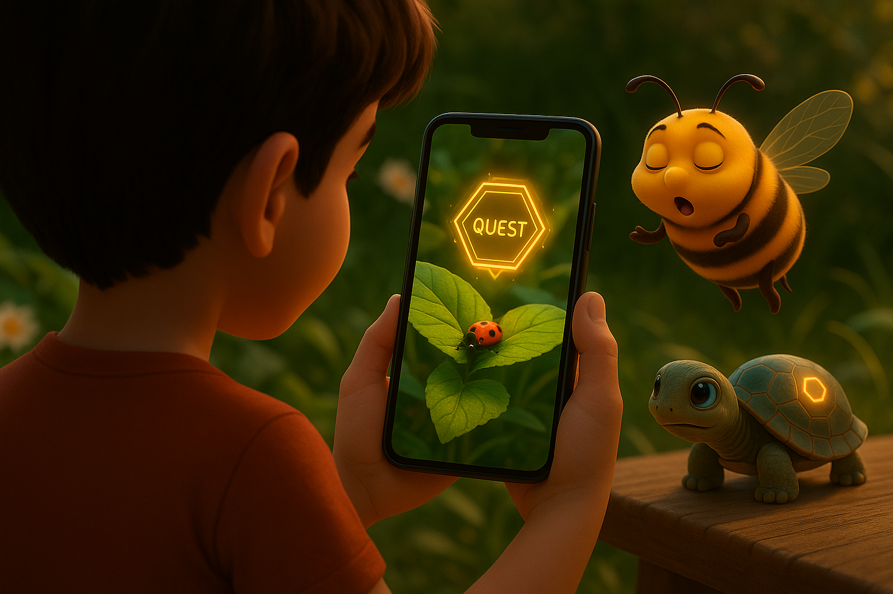 | 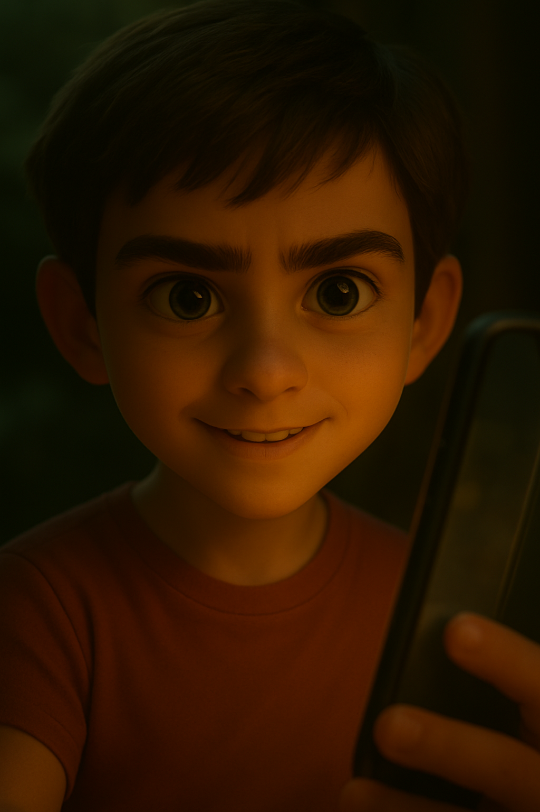 |
| **The Need:** The AI Queen identifies a missing piece of knowledge relevant to her user's world. | **The Call:** A quest visually appears on the user's screen, highlighting the object for foraging. | **The Engagement:** The user accepts the quest, turning a simple observation into a personal adventure. |

### **2. The Capture: Collecting the "Pollen"**

This is the central action performed by the user. "Capturing" is the act of selecting a piece of the augmented reality to be analyzed more deeply.

* **The Tap of Intent:** When an on-screen identification tag interests Hiro, he taps on it.
* **The Pollen Package:** This action captures a rich "pollen package" for the Hive. It contains:
    * The high-resolution image frame.
    * The initial analysis from the Specialist Bee (e.g., `label: "dandelion", confidence: 0.89`).
    * Any other contextual data from other Worker Bees (e.g., text recognized nearby, GPS location).
* **Visual Feedback:** The captured data is visualized as beautiful, glowing particles of light that are "sucked" into the Hive icon, ready for the forge.

| Introduction | Action | Conclusion |
| :---: | :---: | :---: |
| 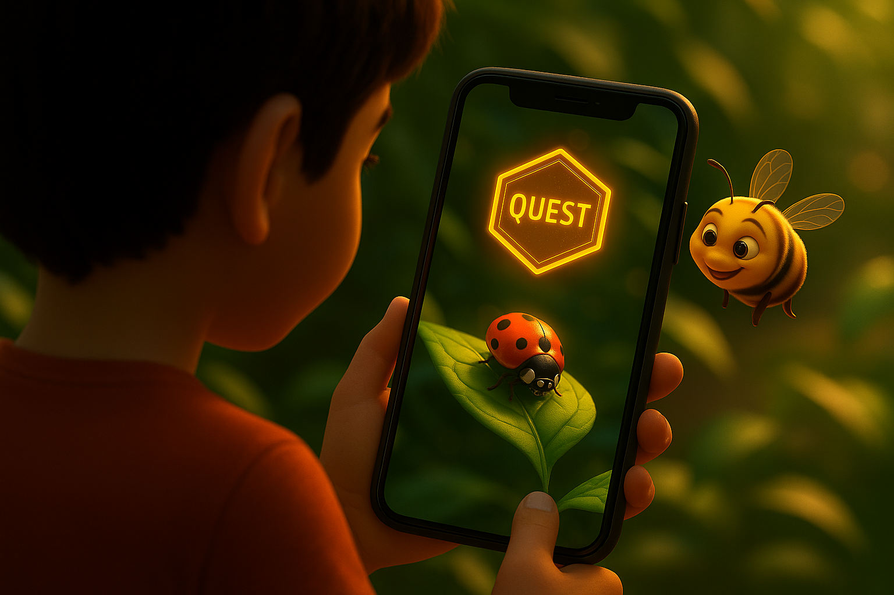 | 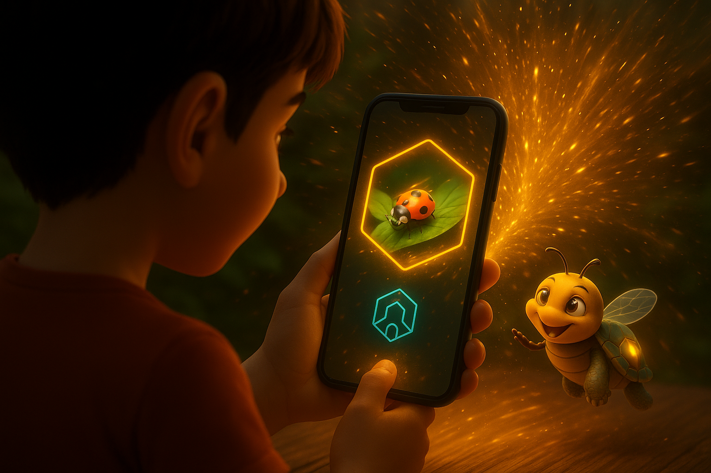 | 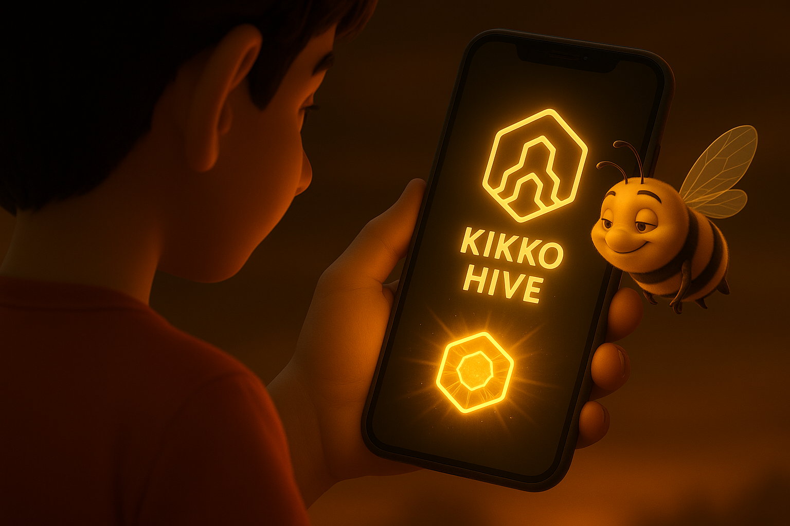 |
| **The Target:** The user aims their device at the object of the quest, preparing to gather raw information. | **The Capture:** The user's action transforms the physical object into magical, digital "pollen" that flows into the Hive. | **The Collection:** The Hive confirms successful collection, providing immediate, satisfying visual feedback. |

### **3. The Forge: The Alchemy of Partnership**

This is where the raw pollen is transformed into structured "Informative Honey." It is a true partnership between the AI and the Forager.

* **Human Refinement (Plan v5.0):** The **AI Queen (Gemma)** first looks at the pollen package. If the Specialist Bee's confidence was low, or the identification was generic ("dog"), she will ask for help. I, the Bourdon, will present the query: "My specialist thinks this is a 'dog'. Can you be more specific?". The Forager can then type "Saarloos Wolfdog" to provide crucial, ground-truth context.
* **The Queen's Alchemy:** With this refined and verified input, the AI Queen now has high-quality material to work with. She uses her generative power to:
    * Craft my script (the `bourdonTTS`).
    * Structure the `quiz`.
    * Deduce the `stats`.
* **The Hornet's Offer:** In parallel, the Hive can still perform a web search. If a relevant "AI Overview" is found, I can present Hiro with the choice to integrate this "Hornet's Honey" (which will be clearly marked as traceable but not reproducible) into his final card.

| Introduction | Action | Conclusion |
| :---: | :---: | :---: |
| 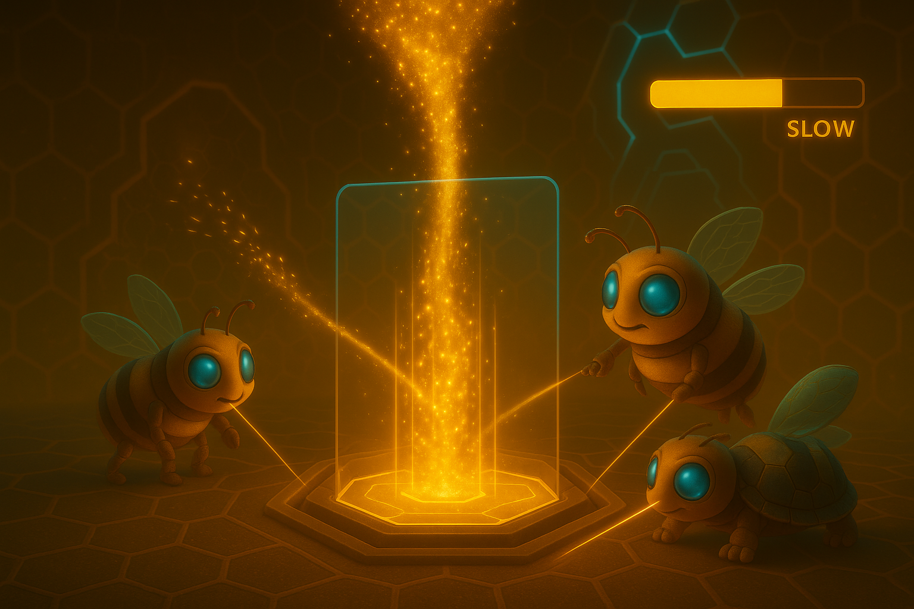 | 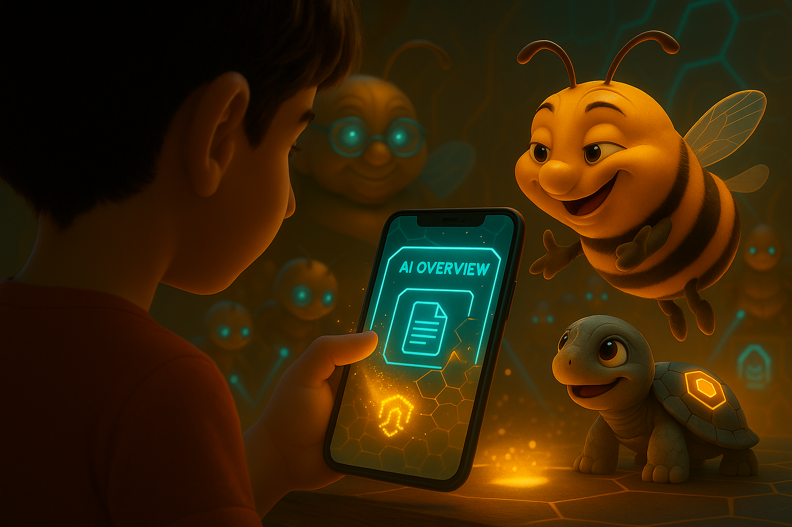 | 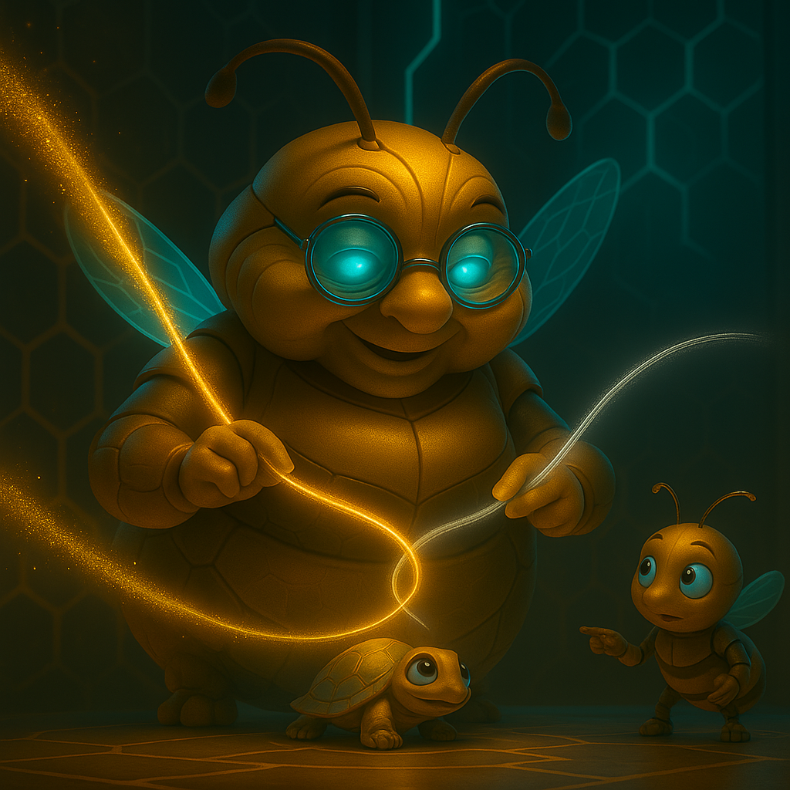 |
| **The Race Against Time:** Pure pollen arrives in the Hive, and Worker Bees begin their meticulous, on-device processing. | **The Temptation of Ease:** The Bourdon offers an instant, pre-digested answer from external AI for quick integration, challenging the user's patience. | **The Path Chosen:** The Queen confidently takes over the pure pollen processing, incorporating the user's input to forge truly trusted knowledge. |

### **4. The Reward: The Sweet Taste of Trusted Knowledge**

This is the final, crucial step of the loop, designed to provide positive reinforcement and a clear sense of accomplishment.

* **The `Card` Creation:** The final "Informative Honey" is presented as a beautiful, interactive `Card` object.
* **The Seal of Trust:** A vibrant **"Seal of Trust"** appears on the card. It will be pure gold if all data is "Hive-Forged" and has a complete, reproducible **"Thread of Provenance"**. If Hornet data was integrated, a section of the seal will be grayish, clearly marking its non-reproducible origin.
* **Points & Badges:** Hiro is awarded "Honey Points" and unlocks stylish Badges (e.g., "Insect Identifier," "Garden Guardian").
* **Augmented Memory:** The new, **trusted knowledge** is now part of the user's personal memory graph, ready to be recalled, connected, and used in battle.

| Introduction | Action | Conclusion |
| :---: | :---: | :---: |
| 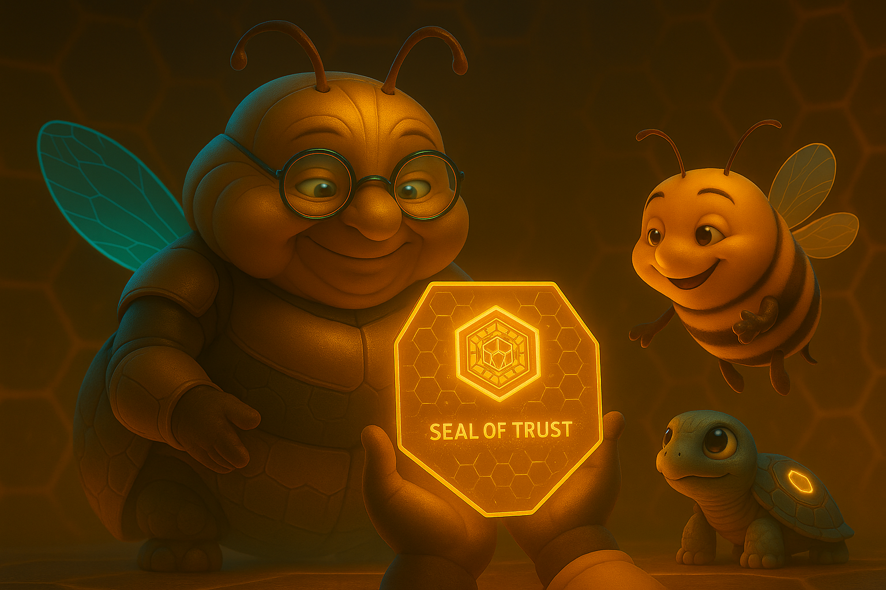 | 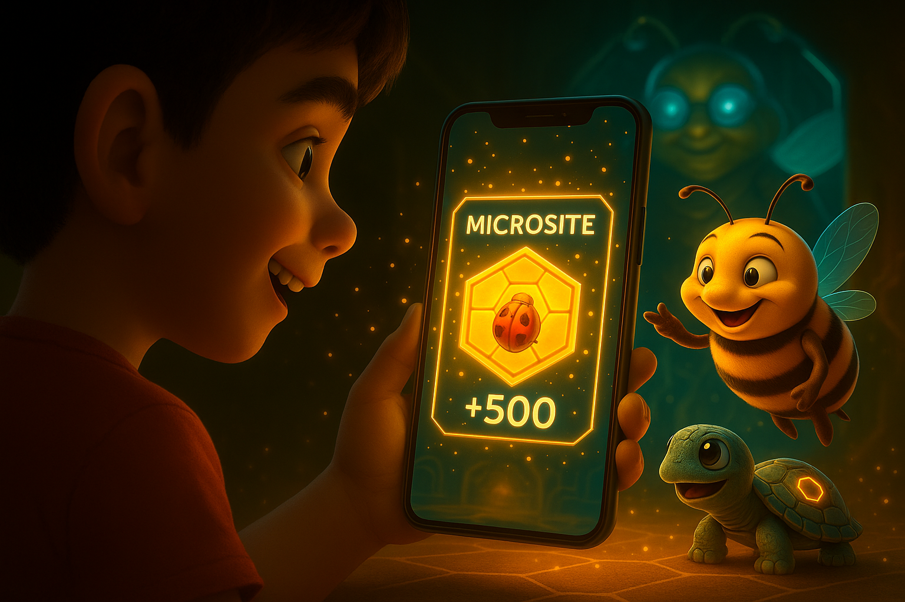 | 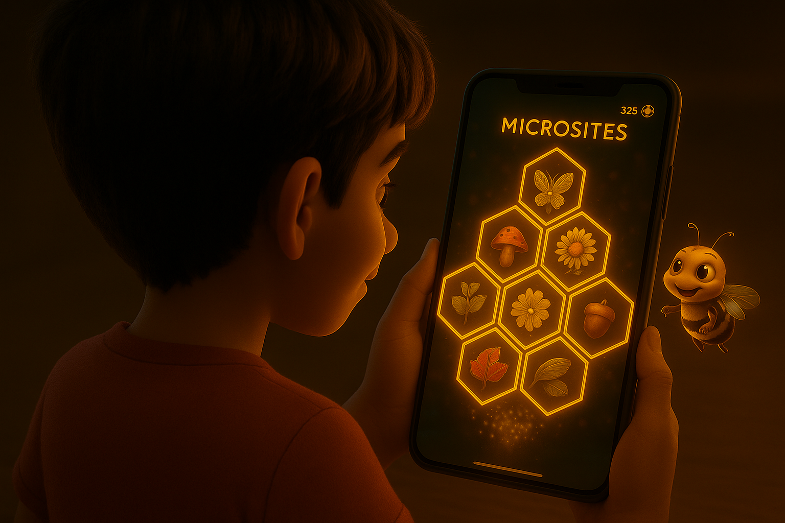 |
| **The Creation:** The AI Queen finishes crafting the "Informative Honey" in partnership with the user, certified with transparent provenance. | **The Delivery:** The result of the quest is delivered to the user's interface with satisfying visual and audio feedback. | **The Collection:** The user sees their personal knowledge base grow, a beautiful and tangible representation of their journey and effort. |

**Conclusion:**
The gameplay loop of Kikko is a virtuous cycle. By gamifying the act of observation and turning data structuring into a collaborative partnership, we encourage the user to be more present and curious. Each completed loop not only provides a reward but also makes the user's AI companion smarter and more useful, creating a powerful incentive to embark on the next quest for authentic, personal knowledge.