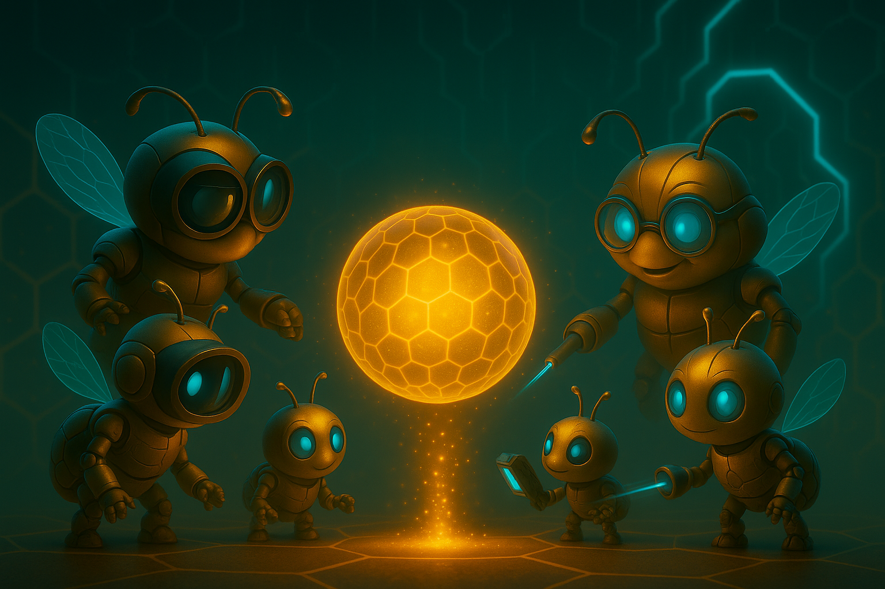
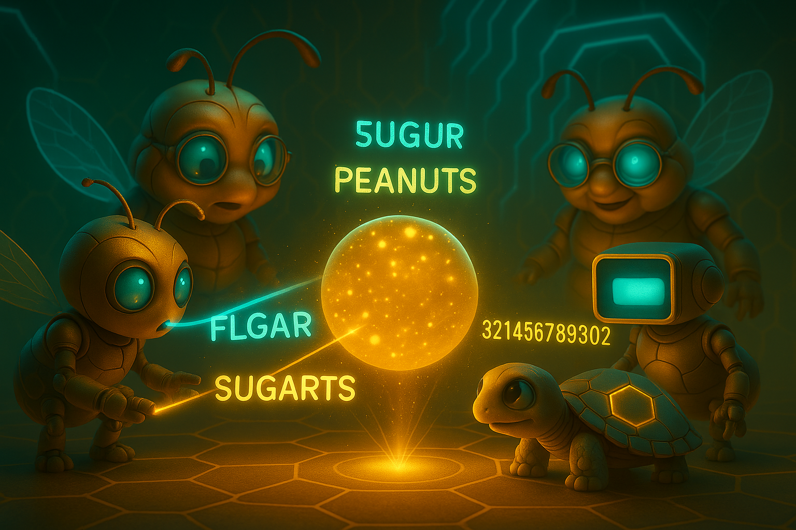
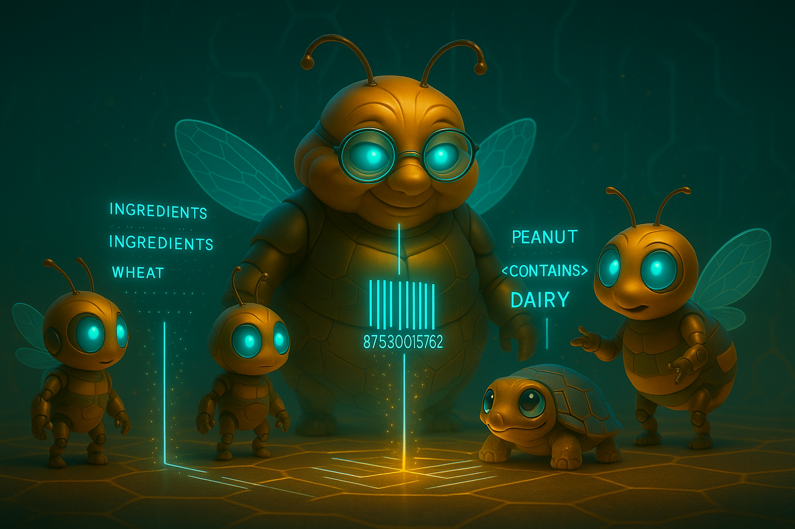
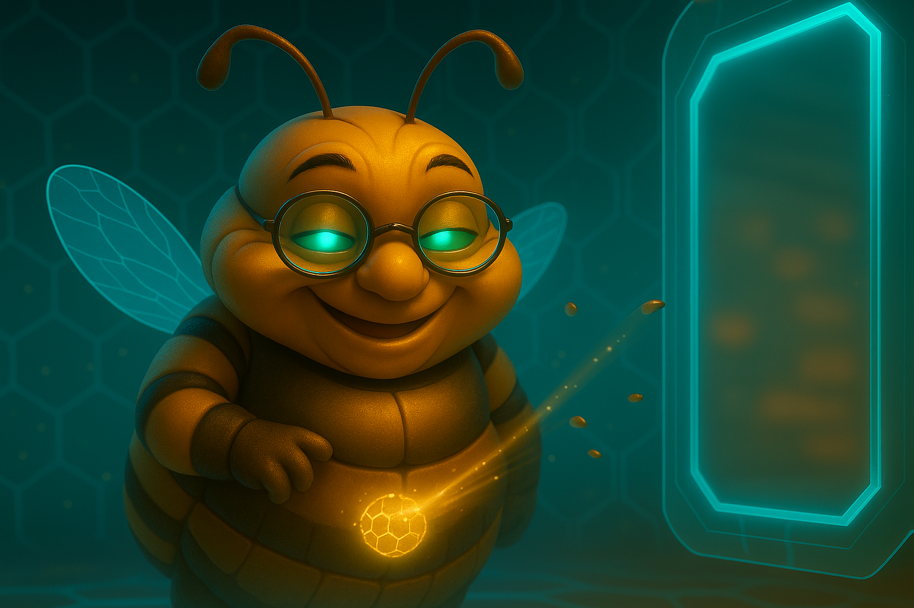
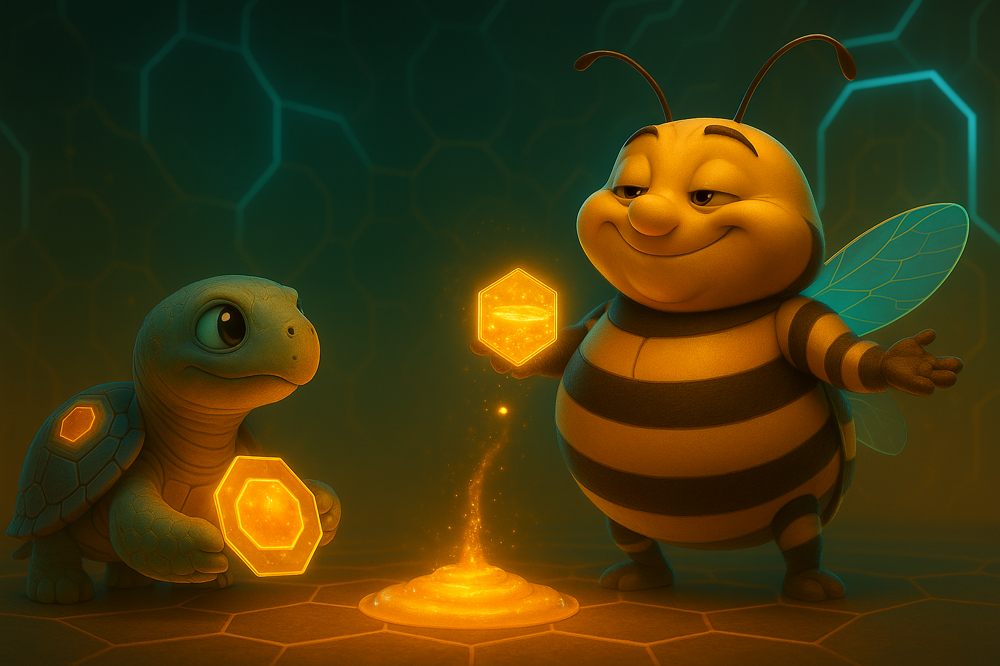
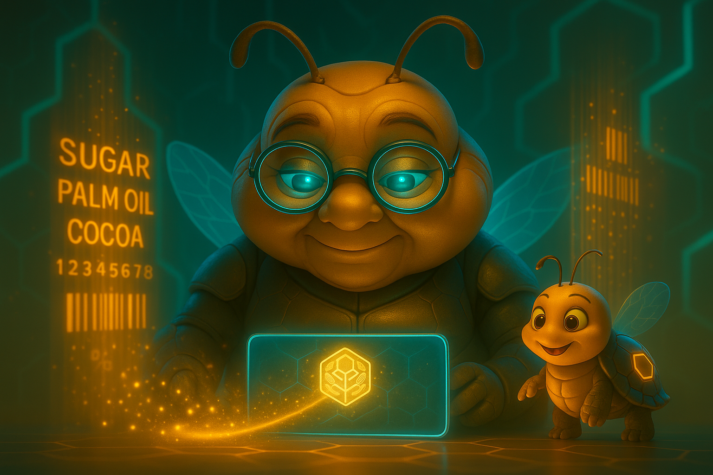
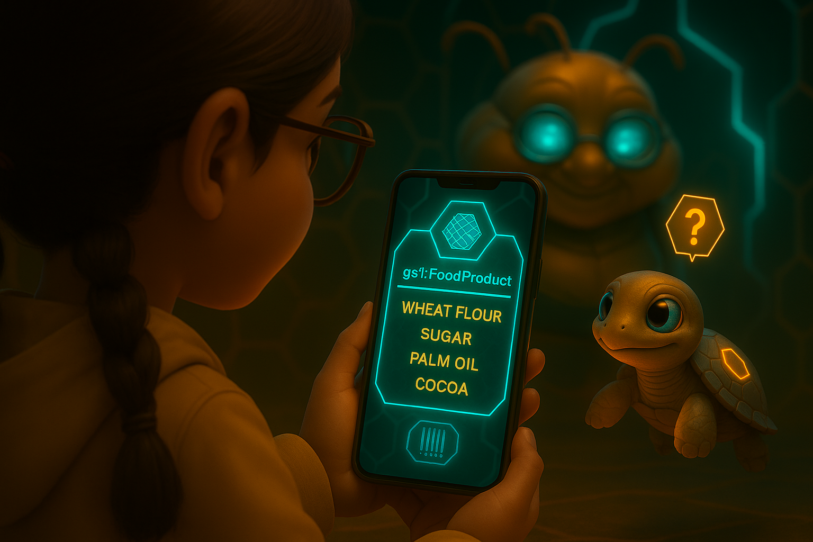
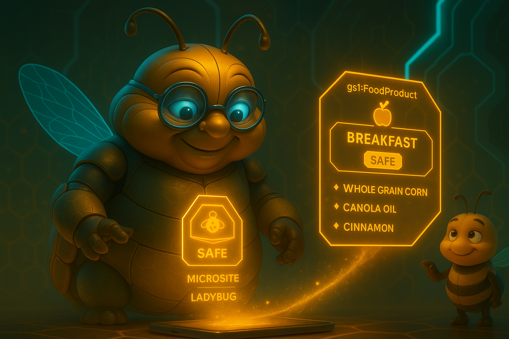

  

# Document 4/10: The Alchemy of Honey - The Role of the AIs

**Title:** The Alchemy of Honey: The Symbiotic Partnership of AI Agents

**Objective:** To define the conceptual technical architecture of Kikko's on-device AI system, detailing the distinct responsibilities of the "Worker Bees" (ML Kit), the "AI Queen" (Gemma), and the "Bourdon" (the communicator), and how they collaborate to create structured, verifiable knowledge.

  

---

### **Core Philosophy: A Hive, Not a Monolith**

Kikko's intelligence is not a single, monolithic AI. It is a **symbiotic swarm** of specialized agents, each with a precise function. This approach mirrors a real beehive, where different bees perform different tasks for the good of the whole. This distributed, task-specific architecture is more efficient, more modular, and allows us to use the best tool for each job. For a critical task like verifying allergens for **Léa**, this specialization ensures accuracy and reliability.

The process follows a clear pipeline: **Capture -> Initial Extraction (Worker Bees) -> Bourdon's Offer (Optional Integration) -> Pure Pollen Processing (Worker Bees & Queen with User Context) -> User Validation -> Structuring -> Microsite Generation.**

### **1. The Worker Bees: Specialists in Raw Data Extraction (ML Kit)**

The Worker Bees are the tireless, meticulous laborers of the Hive, the first to interact with the raw "pollen." They are highly efficient, single-purpose models from Google's ML Kit, designed for fast and accurate on-device data extraction.

*   **Vision-Based Bees (from ML Kit Vision):**
    *   **The Oculist Bee (Text Recognition v2):** Critical for Léa, it reads every ingredient and allergen warning from photos of food labels, supporting multiple languages.
    *   **The Scanner Bee (Barcode Scanning):** Instantly deciphers barcodes (like GTINs on food packaging) to identify products.
    *   **The Classifier Bee (Image Labeling):** Labels objects and concepts within images (e.g., identifying "cookie," "apple").
    *   **The Archivist Bee (Document Scanner):** Optimizes photos of documents (like restaurant menus) for clean text extraction.
    *   **Other Bees for Context:** Face Detection (recognizing Léa's face in a selfie with a meal), Subject Segmentation (isolating a food item from the plate for precise analysis).
*   **Natural Language-Based Bees (from ML Kit Natural Language):**
    *   **The Polyglot Bee (Language Identification):** Detects the language of an ingredients list.
    *   **The Translator Bee (Translation):** Translates text, enabling multi-language Microsite generation.
    *   **The Identifier Bee (Entity Extraction):** Extracts basic entities (brand names, specific ingredients like "peanut" or "milk") from unstructured text.

| Introduction | Action | Conclusion |
| :---: | :---: | :---: |
|  |  |  |
| **The Raw Pollen:** An unstructured piece of information (like a food label photo) from the user's world arrives in the Hive. | **The Specialists' Work:** The diverse Worker Bees (ML Kit) perform their fast, on-device extraction tasks. | **The Prepared Ingredients:** The workers deliver the extracted, but still un-contextualized, data to the Queen for the crucial next stage. |

### **2. The Bourdon: The Communicator & Occasional Tempter**

The Bourdon is the primary interface between the internal workings of the Hive and the Forager. He ensures the dialogue is engaging and manages the flow of information.

*   **Function 1: Quest Delivery & Dialogue Initiation:** He verbally presents the Queen's quests and asks for clarification or contextual input when needed.
*   **Function 2: The Hornet's Offer (WebView & AI Overview Integration):**
    *   When Léa captures a common product, the Bourdon quickly activates a **WebView locally** to perform a Google Search.
    *   He uses **ML Kit (OCR/Entity Extraction)** to scrape and parse the "AI Overview" content (including its sources) and generate a quick quiz from the WebView's HTML.
    *   **Bourdon's Presentation:** He presents a summary of the Hornet's data via TTS and the quiz, then offers Léa the choice to **integrate** this information into her final Microsite, making it clear it comes from an external, non-reproducible source.
*   **Function 3: Delivering Hive's Rewards:** He presents earned Honey Points and Badges.

| Introduction | Action | Conclusion |
| :---: | :---: | :---: |
|  |  |  |
| **The Tempter's Gaze:** The Bourdon, representing a shortcut to knowledge, observes the user's quest. | **The Sweet Offer:** He presents a tempting, instant answer from external cloud AI (an AI Overview with a quiz), verbally delivered with a playful, testing tone. | **The Outcome:** The Bourdon reacts to the user's choice, facilitating either the integration of external data or reinforcing the path of pure discovery. |

### **3. The AI Queen: The Partner in Context and Meaning (Gemma)**

The AI Queen is the orchestrator, the true brain of the Hive. She uses a powerful Large Language Model (Gemma) to understand the *meaning* and *relationships* between data fragments. Her intelligence is intentionally designed to be a partnership, where the Forager's validation is the final, essential ingredient.

*   **Function 1: Suggesting Classification & Property Mapping:** The Queen receives data from Worker Bees (e.g., text from a food label) and suggests a `schema.org` type (`gs1:FoodProduct`) and maps data to properties (e.g., `gs1:ingredients`).
*   **Function 2: Formulating Proactive Quests:** If data is missing or ambiguous, she formulates a quest for the user ("Forager, I need a clearer photo of that warning label.") or can initiate her own web research to find complementary information.
*   **Function 3: Critical Reasoning:** The Queen's most important job for Léa. She compares the verified list of ingredients against Léa's pre-foraged allergy profile. If a match is found, she triggers a high-priority alert.
*   **Function 4: Microsite Generation & Dual Provenance:** She generates the final "Informative Honey" as a rich **"Microsite"**. She logs her entire reasoning chain in the **"Thread of Provenance"** for reproducibility. If Hornet data was integrated, she ensures it's clearly tagged with its source HTML.

| Introduction | Action | Conclusion |
| :---: | :---: | :---: |
|  |  |  |
| **The Unstructured Data:** The Queen receives the raw, digitized information from her workers. | **The Act of Suggestion & Query:** She uses her knowledge to create her best hypothesis and presents it to the user for validation and to gather more human context. | **The Collaborative Result:** With the user's guidance, the final "Informative Honey" is created—a perfect piece of knowledge born from a human-AI partnership. |

**Conclusion:**
Kikko's intelligence is a dynamic system. **ML Kit Worker Bees** perform efficient extraction. The **Bourdon** manages the interactive dialogue. The **AI Queen (Gemma)** provides crucial contextual reasoning, suggestion, and collaborative structuring. This symbiotic partnership, entirely on-device, transforms messy, real-world information into beautiful, reliable, and truly personal "Informative Honey," presented as verifiable "Microsites."