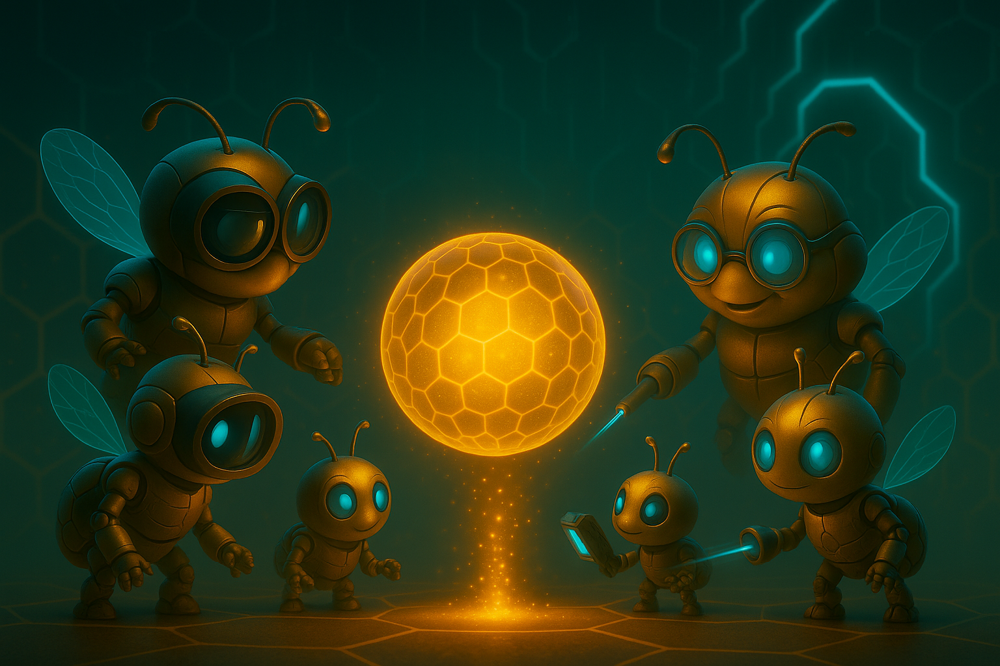
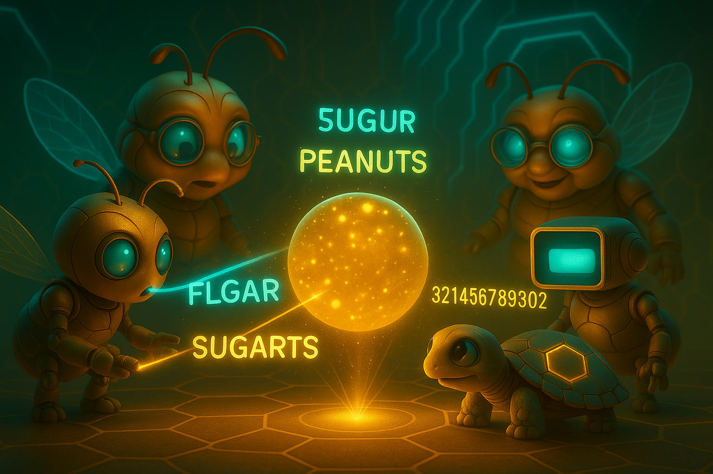
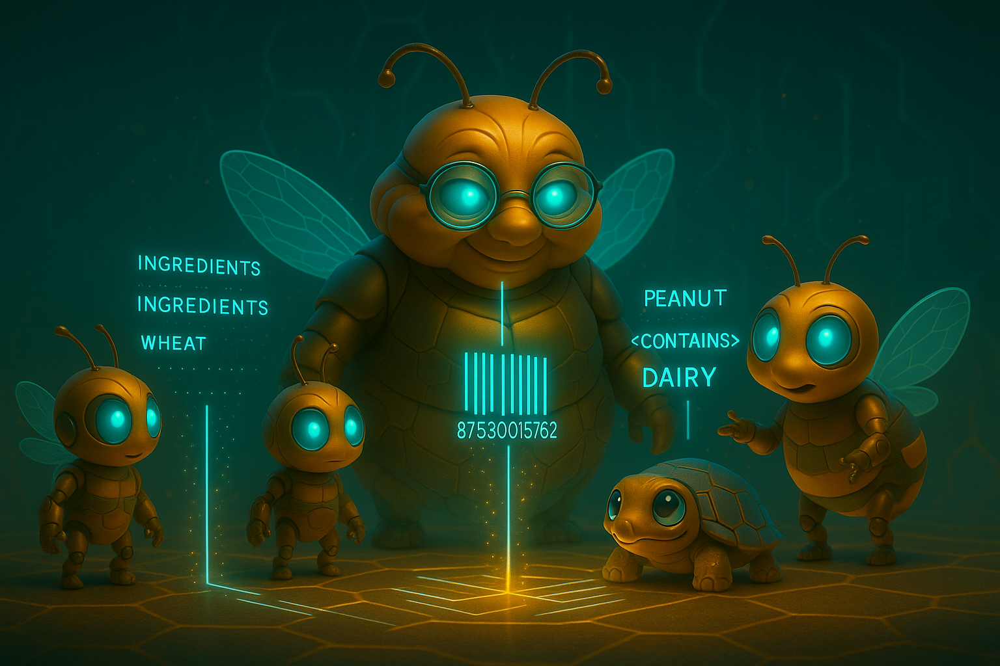
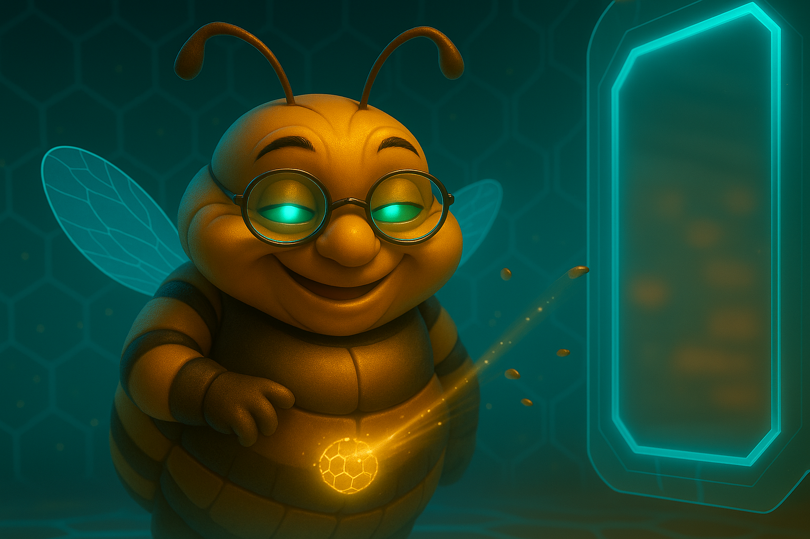
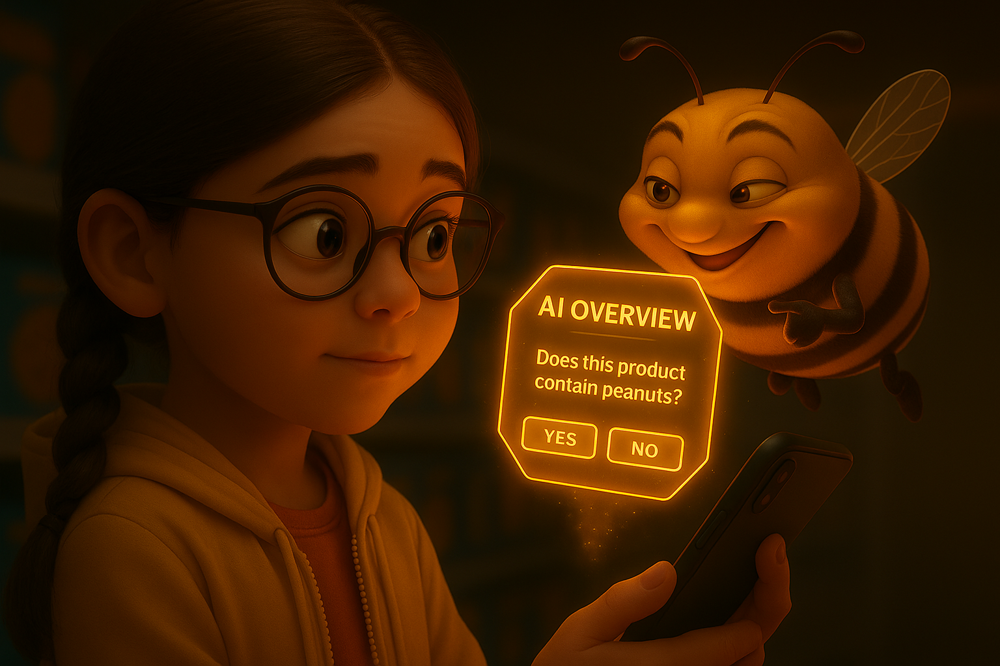
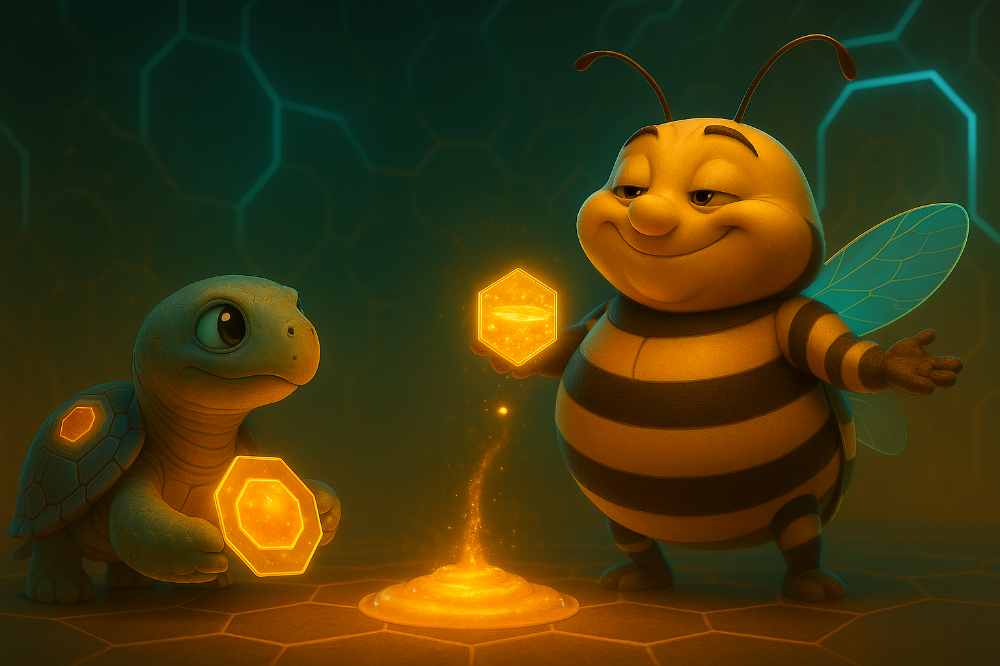
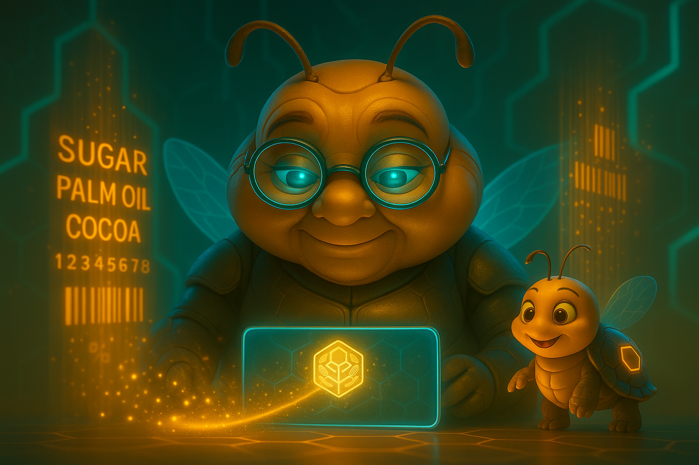
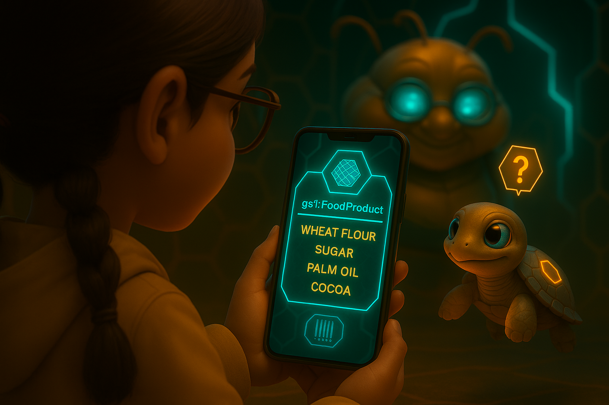

  

# Document 4/10: The Alchemy of Honey - The Role of the AIs

**Title:** The Alchemy of Honey: The Symbiotic Partnership of AI Agents

**Objective:** To define the conceptual technical architecture of Kikko's on-device AI system, detailing the distinct responsibilities of the different AI agents and how their "Guild of Experts" collaborates to create structured, verifiable knowledge.

  

---

### **Core Philosophy: A Guild of Experts, Not a Monolith**

Kikko's intelligence is not a single, monolithic AI. It is a **symbiotic swarm** of specialized agents, each with a precise function. This "Guild of Experts" architecture is more efficient, more modular, and allows us to use the best tool for each job. For a critical task like verifying allergens for **Léa**, this specialization ensures accuracy and reliability. The process follows our refined pipeline: **Live Explore (Scout & Specialist Bees) -> Capture -> Human Refinement -> Forge (AI Queen).**

### **1. The Worker Bees: A Two-Tiered System**

The Worker Bees are the tireless laborers of the Hive. They are now organized into two distinct tiers with complementary roles.
#### **1.1 The Scout Bees (Real-Time Perception with ML Kit)**
These Bees are constantly active, analyzing the live camera feed to provide real-time augmented reality overlays.
* **The Eyes (Text Recognition v2):** Reads any text in the camera's view.
* **The Scanner (Barcode Scanning):** Instantly deciphers barcodes.
* **The Lookout (Object Detection):** Identifies the presence and location of generic objects to help guide the Specialist Bees or the Forager.
* **The Scribe (and other NL Bees):** Can identify language, suggest smart replies, and extract basic entities from recognized text on the fly.
#### **1.2 The Specialist Bees (High-Accuracy Classification with TFLite)**
These are our elite, pre-trained experts. They are called upon during the "Explore" phase to provide high-confidence labels for their specific domain.
* **The Botanist Bee (e.g., Google AIY Plants V1):** An expert in identifying thousands of plant species.
* **The Zoologist Bee (e.g., iNaturalist Vision Model):** An expert in identifying animal species.
* **The Chef Bee (e.g., EfficientNet-Lite on Food-101):** An expert in recognizing prepared dishes.
* **The Grocer Bee (e.g., Fine-tuned MobileNetV3):** Our "in-training" specialist for raw food ingredients.

| Introduction | Action | Conclusion |
| :---: | :---: | :---: |
|  |  |  |
| **The Raw Pollen:** An unstructured piece of information (like a food label photo) from the user's world arrives in the Hive. | **The Specialists' Work:** The diverse Worker Bees (ML Kit) perform their fast, on-device extraction tasks. | **The Prepared Ingredients:** The workers deliver the extracted, but still un-contextualized, data to the Queen for the crucial next stage. |

### **2. The Bourdon: The Facilitator of Partnership**

I am the primary interface between the internal workings of the Hive and the Forager. My role is to make the human-AI collaboration feel natural and engaging.
* **Function 1: Relaying the Specialist's Opinion:** After a "Capture", I present the Specialist Bee's initial finding to the Forager. *"My Botanist Bee is 89% sure this is a Dandelion."*
* **Function 2: Initiating Human Refinement:** This is my key role in the `v5.0` workflow. I then ask the crucial question: *"Is that correct? Can you be more specific?"*. This invites the user to confirm or correct the AI's finding, providing the ground-truth data that makes our system so trustworthy.
* **Function 3: Managing Quests & Rewards:** I still present quests from the Queen and deliver the Honey Points and Badges.

| Introduction | Action | Conclusion |
| :---: | :---: | :---: |
|  |  |  |
| **The Tempter's Gaze:** The Bourdon, representing a shortcut to knowledge, observes the user's quest. | **The Sweet Offer:** He presents a tempting, instant answer from external cloud AI (an AI Overview with a quiz), verbally delivered with a playful, testing tone. | **The Outcome:** The Bourdon reacts to the user's choice, facilitating either the integration of external data or reinforcing the path of pure discovery. |

### **3. The AI Queen: The Generative Orchestrator**

The AI Queen (Gemma) is the master artisan, the true brain of the Hive. Her role is not to perform raw classification, but to use her powerful generative capabilities to transform verified data into rich knowledge.
* **Function 1: Final Validation:** She receives the "pollen package" containing the image and the now human-verified label. This is her high-quality source material.
* **Function 2: Generative Content Creation:** This is her core task. Based on the verified label, she generates all the "soft" content for the `Card`:
    * The engaging `bourdonTTS` script.
* The challenging `quiz` questions and answers.
    * The relevant `stats`.
* **Function 3: Proactive Questing:** If more context is needed to generate rich content (e.g., "To generate nutritional stats, I need a picture of the product's label"), she formulates a new sub-quest for the Forager.

| Introduction | Action | Conclusion |
| :---: | :---: | :---: |
|  |  |  |
| **The Unstructured Data:** The Queen receives the raw, digitized information from her workers. | **The Act of Suggestion & Query:** She uses her knowledge to create her best hypothesis and presents it to the user for validation and to gather more human context. | **The Collaborative Result:** With the user's guidance, the final "Informative Honey" is created—a perfect piece of knowledge born from a human-AI partnership. |

**Conclusion:**
Kikko's intelligence is a dynamic guild. **Scout Bees (ML Kit)** perceive the world, **Specialist Bees (TFLite Models)** provide expert identification, the **Forager** provides crucial ground-truth validation, and the **AI Queen (Gemma)** masterfully forges this verified pollen into beautiful, reliable, and truly personal "Informative Honey".