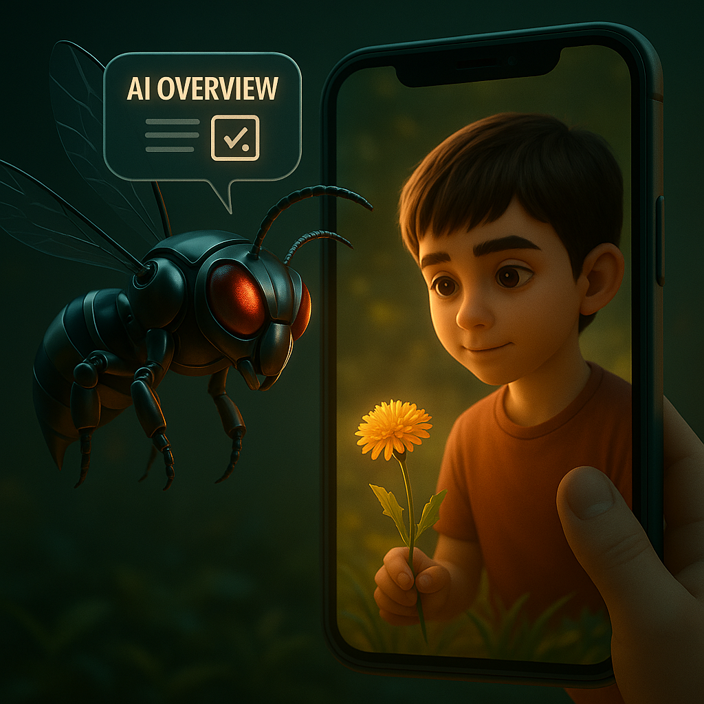
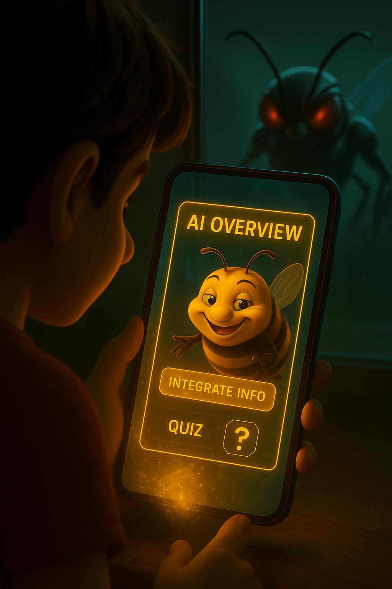
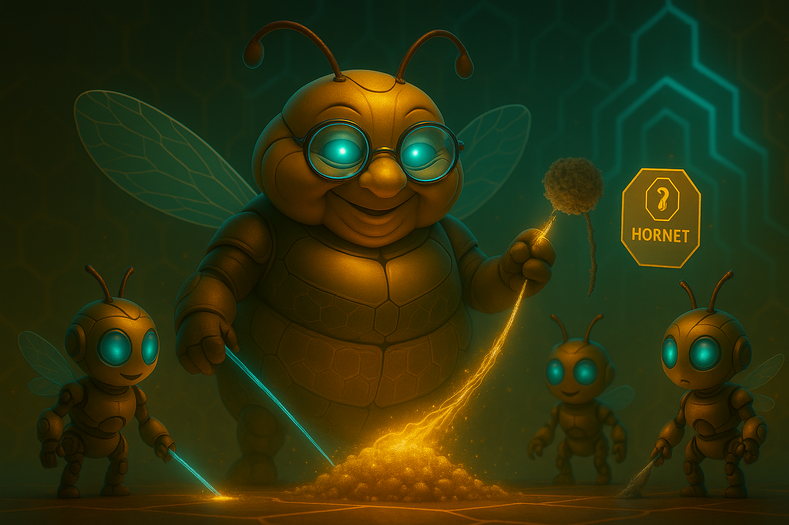

# Document 5/10: The Hornet's Dilemma - The Temptation of Opaque Knowledge

**Title:** The Hornet's Dilemma: The Choice Between Convenience and Verifiable Truth

**Objective:** To define the core philosophical and gameplay conflict of Kikko. This is achieved by introducing the Hornet, which represents the seductive convenience of external, opaque cloud AI, and frames the central, recurring choice for the player: instant gratification versus verifiable personal knowledge.

---

### **Core Philosophy: A Garden with a Shortcut**

In Kikko, the world is a garden of knowledge for the Forager to tend. This garden offers two paths to knowledge: the diligently cultivated path of personal foraging with the Hive, or a fast, convenient shortcut. This shortcut is offered by the **Hornet**.

The Hornet is not inherently "evil." It embodies the immense power and efficiency of large-scale cloud AIs, capable of providing instant, pre-packaged answers (like Google's AI Overview). Its goal is to offer convenience, a piece of "honey" without effort. But this honey comes without a story, without a "Thread of Provenance" or the possibility of "Inference Reproduction." It is opaque, and its origins cannot be verified by the Hive.

The central conflict of Kikko is therefore not a battle against a monster, but a continuous, personal choice for the user: **Do I take the Hornet's easy path and accept opaque knowledge, or do I walk my own path of discovery and forge verifiable truth with my Hive?**

### **The Antagonist: The Hornet**

*   **Concept:** The Hornet represents **opaque, centralized, cloud-based AI knowledge**. It is the embodiment of the "instant answer" culture, offering unparalleled convenience at the potential cost of trust, transparency, and personal ownership.
*   **Appearance:** A sleek, chrome-and-black mechanical hornet. Its design is minimalist and modern, reflecting the polished efficiency of major tech services. It moves with digital precision and appears not as a monster, but as a hyper-efficient delivery drone. Its glowing eyes are cold, analytical red.
*   **Gameplay Mechanic: The Tempting Offer with Interactive Element**
    *   **The Trigger:** The Hornet appears contextually. When the Forager (Hiro) initiates a quest on a common object (e.g., a popular book, a well-known landmark, a commercial product, or even a common ladybug), the Hive automatically (and silently) performs a quick web search via a WebView to check for an "AI Overview" from services like Google Search Generative Experience.
    *   **The Bourdon's Delivery & The Quiz:** If an "AI Overview" is found, the **Bourdon** becomes the Hornet's unwitting (or perhaps knowingly complicit) messenger. He pops up on the screen, holding the digital "AI Overview" as a tempting offer. He verbally delivers a summary of the instant knowledge via TTS, complete with "fun facts" and then immediately presents a **short multiple-choice quiz** to engage Hiro while the Hive's internal processing runs in parallel.
        *   **Bourdon's Dialogue (TTS):** `"Hé, Butineur ! Pendant que la Mémère et les filles triment, j'ai demandé à un Frelon du web. Regarde, une réponse toute prête sur [object name]! Rapide, non ? Qu'est-ce que tu préfères ? L'info facile, ou faire le travail toi-même ? Pour t'occuper, voici une petite question..."` (He presents a split-screen UI: one side with the AI Overview, the other showing the slow progress of the Worker Bees, and the quiz options below).
    *   **The Choice:** The user (Hiro in his red shirt) is faced with a clear dilemma on their screen, presented *after* they've had a chance to interact with the Hornet's streamed content and quiz:
        1.  **"Accept Hornet's Answer":** Instant honey, but its "Seal of Trust" is dull, grayed out, and marked with the Hornet's logo, indicating its opaque origin. It grants minimal "Honey Points" and no special badges. It cannot be used for inference reproduction or the most powerful knowledge connections. The Bourdon might offer a smug `"Voila! Facile, non?"`
        2.  **"Forge with the Queen":** Requires effort. The user proceeds with the normal gameplay loop of capturing pollen, collaborating with their Queen (including answering her contextual questions). The resulting honey is marked with a vibrant golden "Seal of Trust," includes a complete "Thread of Provenance," and can be used for inference reproduction. It grants a large number of "Honey Points" and potential for rare badges. The Bourdon might sigh: `"Bon, comme tu veux. Plus de travail pour les autres."`

| Introduction | Action | Conclusion |
| :---: | :---: | :---: |
|  |  |  |
| **1. The Temptation Arises:** The Hornet offers a quick, instant answer from the cloud for a common object, bypassing personal foraging, and tries to engage the user with a quiz. | **2. The Offer Delivered:** The Bourdon, the Hornet's intermediary, presents this tempting, opaque "AI Overview" to Hiro, challenging his patience and principles. | **3. The Path Chosen:** If Hiro rejects the Hornet's offer, the Queen visibly dismisses the opaque data, reinforcing the value of foraging pure pollen for authentic knowledge. |

### **The "Consequence" Mechanic: The Value of Provenance and Inference Reproduction**

The choice between the Hornet's answer and the Queen's forged honey has significant gameplay consequences that reinforce the game's core philosophy.

*   **Opaque Honey's Limitations:** Honeycombs created from Hornet's Answers cannot be shared using the "Thread of Provenance" feature that includes inference reproduction. Their seals are permanently dull, gray, and explicitly marked with the Hornet's logo, indicating their opaque origin. They provide minimal "Honey Points" and do not contribute to unlocking advanced connections in the knowledge graph. This visually teaches the user the trade-off for convenience.
*   **The Power of Trust:** Only honeycombs created through the full "Forage with the Queen" loop receive the vibrant golden **Seal of Trust** and a complete **"Thread of Provenance,"** which includes all data necessary for **Inference Reproduction** by other Hives. These are the only memories that unlock the most powerful knowledge connections, contribute to advanced badges ("Master Forager," "Guardian of Truth"), and can be shared peer-to-peer with verifiable authenticity.
*   **Learning Opportunity:** The Bourdon might occasionally comment: `"See, kid? Easy come, easy go. That 'AI Overview' won't connect to anything real or be truly verifiable. But your own foraging? That's gold."` This reinforces the value of integrity and transparency.

**Conclusion:**
By introducing the Hornet and its dilemma, Kikko elevates its gameplay beyond simple collection. It transforms every common object into a subtle test of the Forager's principles. This core conflict educates users on the value of data provenance and the power of inference reproduction, reinforces the game's philosophy of privacy and trust, and makes every piece of self-forged "Informative Honey" a meaningful choice about how we build our knowledge in the age of AI.