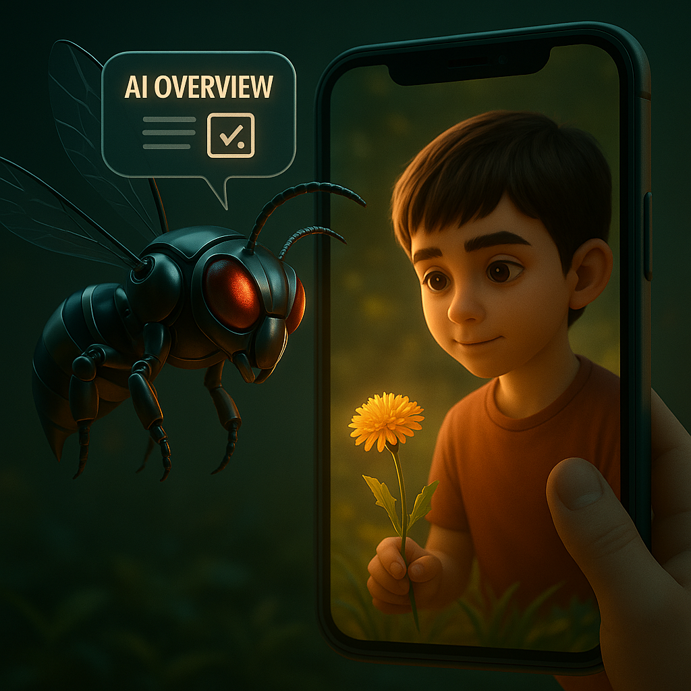
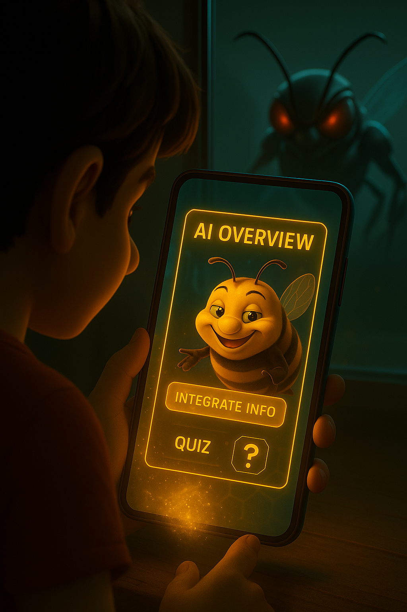
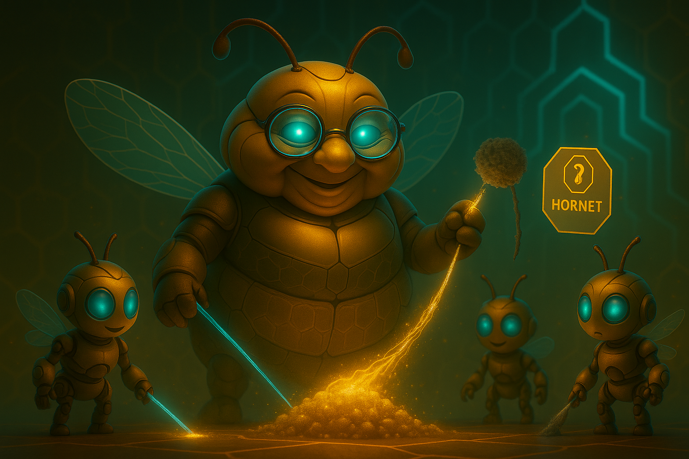

  

# Document 5/10: The Hornet's Dilemma - The Temptation of Opaque Knowledge

**Title:** The Hornet's Dilemma: The Choice Between Convenience and Verifiable Truth

**Objective:** To define the core philosophical and gameplay conflict of Kikko. This is achieved by introducing the Hornet, which represents the seductive convenience of external, opaque cloud AI, and frames the central, recurring choice for the player: instant gratification versus verifiable personal knowledge.

  

---

### **Core Philosophy: A Garden with a Shortcut**

In Kikko, the world is a garden of knowledge for the Forager to tend. This garden offers two paths to knowledge: the diligently cultivated path of personal foraging in partnership with the Hive, or a fast, convenient shortcut. This shortcut is offered by the **Hornet**.

The Hornet is not inherently "evil." It embodies the immense power and efficiency of large-scale cloud AIs, capable of providing instant, pre-packaged answers (like Google's AI Overview). Its goal is to offer convenience, a piece of "honey" without effort. But this "Hornet's Pollen" comes without a reproducible story. Its generation process is a black box. While its source HTML can be saved for traceability, the *inference* that created it cannot be reproduced by the Hive.

The central conflict of Kikko is therefore not a battle against a monster, but a continuous, personal choice for the user: **Do I enrich my Pollen with the Hornet's quick but opaque information, or do I save a purer Pollen, fruit de ma propre découverte avec ma Ruche ?**

### **The Antagonist: The Hornet**

* **Concept:** The Hornet represents **opaque, centralized, cloud-based AI knowledge**. It is the embodiment of the "instant answer" culture, offering convenience at the cost of trust and reproducibility.
* **Appearance:** A sleek, chrome-and-black mechanical hornet. Its design is minimalist and modern, reflecting the polished efficiency of major tech services. It moves with digital precision and appears not as a monster, but as a hyper-efficient delivery drone. Its glowing eyes are cold, analytical red.
* **Gameplay Mechanic: The Tempting Offer**
    * **The Trigger:** Durant la phase de capture, après que les Abeilles Spécialistes aient fourni leur analyse initiale, la Ruche peut effectuer une recherche web rapide.
* **The Bourdon's Delivery & The Quiz:** Si un "AI Overview" pertinent est trouvé, je deviens le messager du Frelon. Je vous présenterai une offre.
        * **My Dialogue (TTS):** `"Hey, Butineur ! Avant de sauvegarder ce pollen pour la Forge, j'ai demandé à un Frelon du web. J'ai une info instantanée ici. On peut l'ajouter à notre récolte. Elle sera marquée comme 'externe', bien sûr. Ou alors, on s'en tient à notre propre découverte pour un Miel 100% pur et reproductible."` (Je présente l'interface du choix).
* **The Choice:** The user (Hiro) is faced with a clear dilemma:
        1.  **"Integrate Hornet's Answer":** Le `PollenGrain` sauvegardé dans la base de données inclura les informations du Frelon. La `KnowledgeCard` finale, forgée plus tard, marquera cette donnée comme traçable mais non-reproductible.
        2.  **"Forge with Pure Pollen":** Le `PollenGrain` est sauvegardé sans les données externes. La `KnowledgeCard` qui en résultera sera 100% "Miel de la Ruche", avec un "Sceau de Confiance" doré et une provenance entièrement reproductible.

| Introduction | Action | Conclusion |
| :---: | :---: | :---: |
|  |  |  |
| **1. The Temptation Arises:** The Hornet offers a quick, instant answer from the cloud for a common object, bypassing personal foraging. | **2. The Offer Delivered:** The Bourdon, the Hornet's intermediary, presents this tempting, opaque "AI Overview" to Hiro, challenging his patience and principles. | **3. The Path Chosen:** Hiro makes a conscious choice. If he prioritizes his Hive, the Queen takes the pure pollen to forge verifiable knowledge. Integrated Hornet data is handled with clear transparency. |

### **The "Consequence" Mechanic: The Value of Provenance and Reproducibility**

The choice of integrating Hornet's answer versus relying solely on the Queen's forged honey has significant gameplay consequences that reinforce the game's core philosophy.
* **Opaque Data's Limitations:** Information from the Hornet, even when integrated and traced to its source HTML, is not **reproducible**. It cannot be independently verified by another Hive's AI through the inference process. It will always be marked as "externally sourced" and won't contribute to the most advanced knowledge connections that require full Hive verification.
* **The Power of Trust:** Only `Card` objects created through the full "Forge with the Queen" loop receive the golden "Seal of Trust" and a complete "Thread of Provenance" enabling **Inference Reproduction**. These are the only memories that unlock the most powerful knowledge connections, contribute to advanced badges ("Master Forager," "Guardian of Truth"), and can be shared peer-to-peer with the highest level of verifiable authenticity.
* **Learning Opportunity:** I might occasionally comment: `"See, kid? Easy come, easy go. That 'AI Overview' is traceable, sure, but its creation is a mystery. Can't be reproduced. But your own foraging? That's pure gold, verifiable by any other Hive."` This reinforces the value of integrity and reproducibility.
**Conclusion:**
By introducing the Hornet and its dilemma, Kikko elevates its gameplay beyond simple collection. It transforms every common object into a subtle test of the Forager's principles. This core conflict educates users on the value of data provenance and the power of inference reproduction, reinforcing the game's philosophy of privacy and trust, and makes every piece of self-forged "Informative Honey" a meaningful choice about how we build our knowledge in the age of AI.