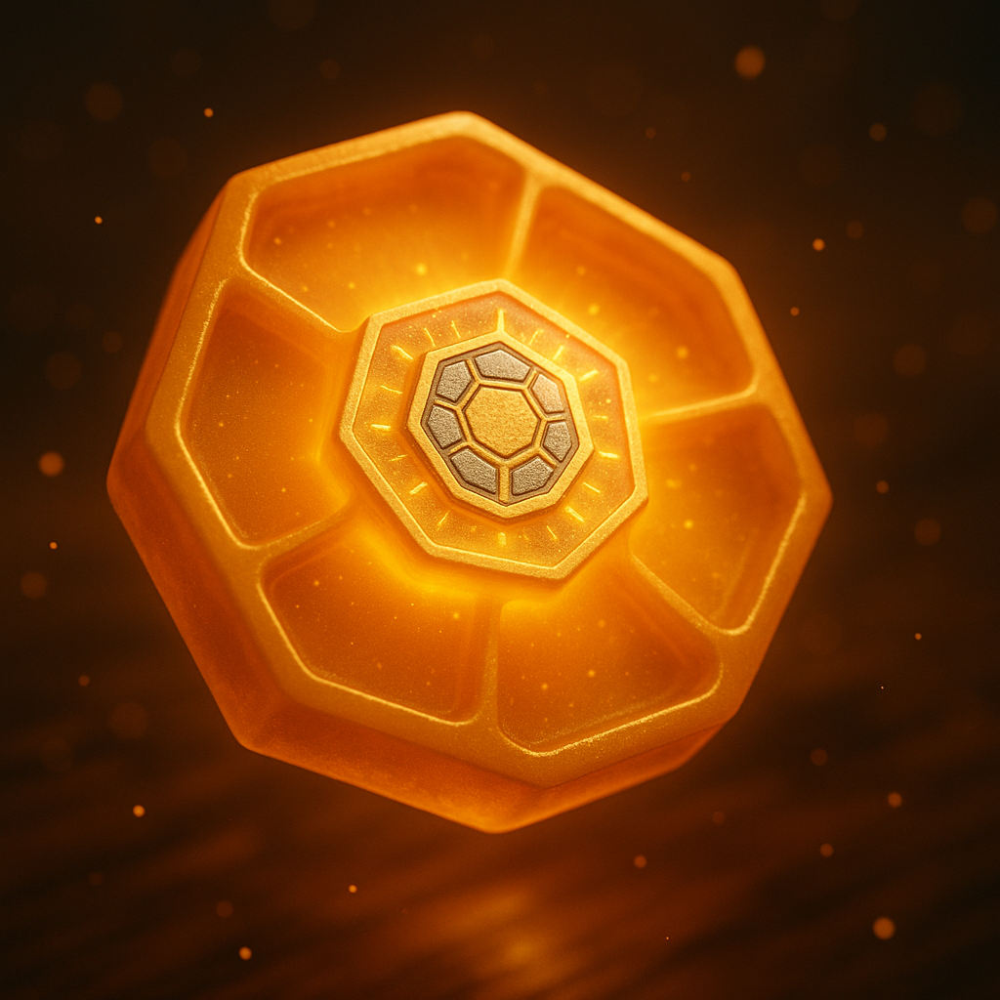
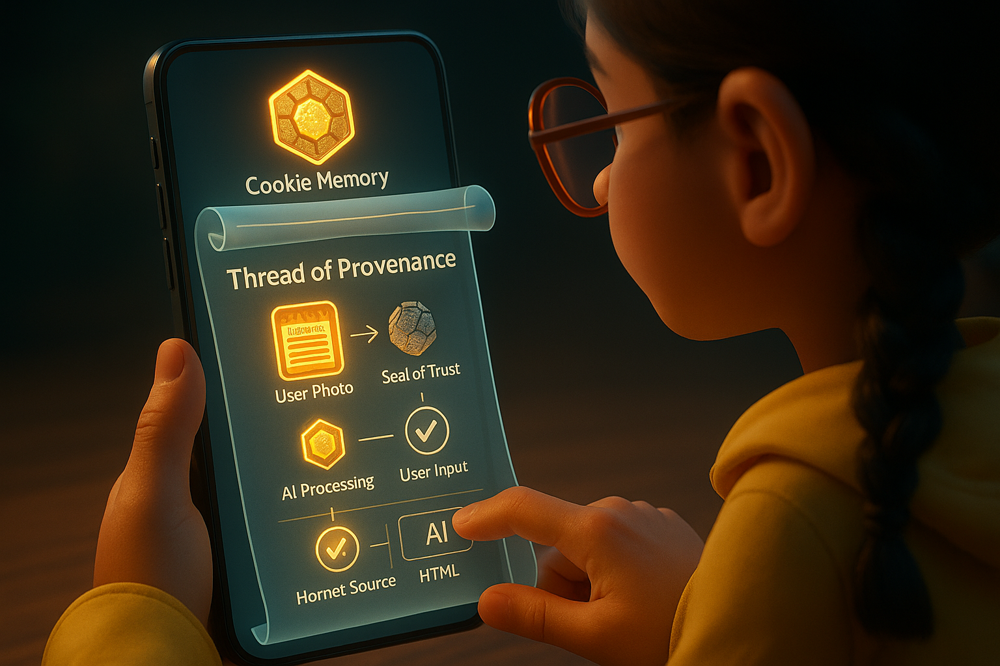
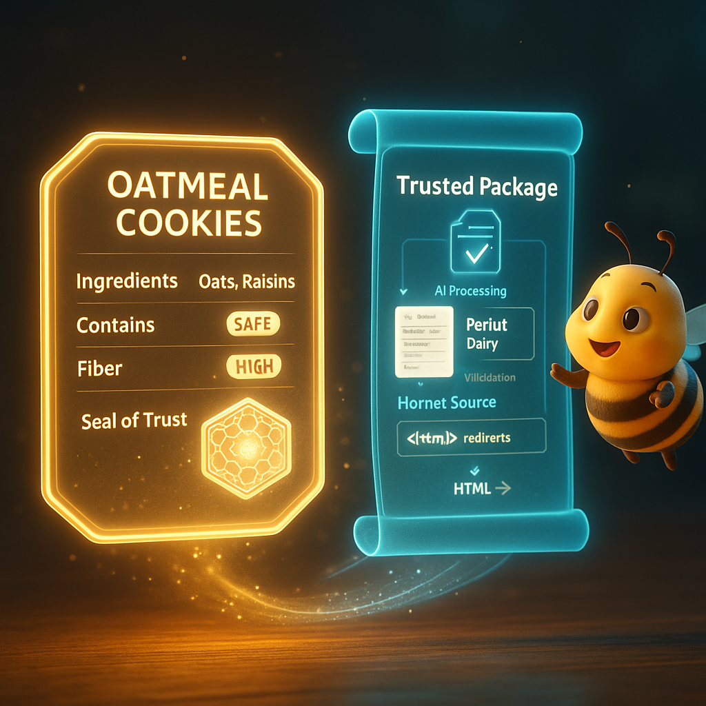

# Document 6/10: The Thread of Provenance - The Seal of Trust

**Title:** The Thread of Provenance: The Unbreakable Seal of Trust

**Objective:** To detail the structure, purpose, and in-game representation of the Provenance Document. This feature is positioned as the ultimate reward for choosing personal discovery over opaque convenience, guaranteeing transparency and trust in the knowledge created by the Forager.

---

### **Core Philosophy: The Story is the Reward**

In an age where AI can provide any answer, the answer itself loses value. The new value lies in its **origin story**. In Kikko, the "Informative Honey" is useful, but its true power comes from the verifiable story of its creation. The **Thread of Provenance** is that story.

It is not just metadata; it is a "Seal of Trust," the tangible proof that a piece of knowledge was born from the Forager's own experience, not accepted from an opaque cloud source. It is the definitive answer to the question: *Why should I trust this memory?* Because **you** were there. **You** created it. Here is the proof, and here is how it was created, allowing for **inference reproduction**.

### **1. The Structure of the "Thread of Provenance"**

The Thread of Provenance is a JSON file, bundled with the structured data and its raw pollen sources. It is composed of three main sections that chronicle the partnership between the Forager and their Hive, providing the blueprint for inference reproduction.

*   **A. The Hive's Identity (`hiveIdentity`):** This section identifies the "artisans" of the data.
    *   `hiveId`: A unique, locally generated identifier for the user's Kikko instance.
    *   `kikkoVersion`: The version of the application (e.g., "1.0.0").
    *   `deviceFingerprint`: A non-identifying hash of device hardware/software for consistency checks.
    *   `activeSwarm`: An array listing the AI agents that participated.
        *   `queenAI`: `{ "name": "Gemma", "version": "2B-OnDevice-V1.2" }`
        *   `workerBees`: `[ { "role": "Oculist", "name": "ML Kit Text Recognition", "version": "18.0.2" }, { "role": "Classifier", "name": "ML Kit Image Labeling", "version": "18.0.2" }, { ... } ]`
        *   `communicatorAI`: `{ "name": "Bourdon", "role": "Communicator" }`

*   **B. The Foraging Chronicle (`pollenChronicle`):** A timestamped log of every piece of raw data contributed **by the user**. This is the core of the proof.
    *   An array of "pollen" objects:
        *   `{ "timestamp": "...", "pollenType": "Visual", "source": "forager_camera", "reference": "pollen/image_001.jpg", "hash": "sha256:..." }` (e.g., image of a ladybug)
        *   `{ "timestamp": "...", "pollenType": "Auditory", "source": "forager_microphone", "data": { "transcription": "Tastes like cherries..." }, "reference": "pollen/audio_001.wav" }`
        *   `{ "timestamp": "...", "pollenType": "Contextual", "source": "device_gps", "data": { "latitude": "...", "longitude": "..." } }`
        *   `{ "timestamp": "...", "pollenType": "SegmentationMask", "source": "mlkit_selfie_segmentation", "reference": "pollen/segmentation_001.png" }` (e.g., mask of Hiro in a selfie with the ladybug)

*   **C. The Partnership Log (`partnershipLog`):** A log of the key dialogue steps between the Queen (relayed by the Bourdon) and the Forager. This demonstrates active collaboration, user authority, and provides the step-by-step for inference reproduction.
    *   An array of "dialogue" steps:
        *   `{ "timestamp": "...", "action": "QueenSuggestion", "modelOutput": "{ 'identifiedType': 'schema:Insect', 'confidence': 0.98 }", "prompt": "Based on image_001.jpg, classify the main subject." }`
        *   `{ "timestamp": "...", "action": "UserConfirmation", "userAction": "Confirmed 'schema:Insect'" }`
        *   `{ "timestamp": "...", "action": "QueenQuery", "query": "In what environment was this insect found?", "options": ["Garden", "Forest", "Wild"] }`
        *   `{ "timestamp": "...", "action": "UserAnswer", "queryId": "environment_query_1", "answer": "Garden" }`
        *   `{ "timestamp": "...", "action": "QueenSuggestion", "modelOutput": "{ 'species': 'Coccinella septempunctata' }", "prompt": "Given image_001.jpg and environment 'Garden', what is the specific species?" }`
        *   `{ "timestamp": "...", "action": "UserCorrection", "originalSuggestion": "Coccinella septempunctata", "userCorrection": "Harmonia axyridis" }`
        *   `{ "timestamp": "...", "action": "HornetOfferRefused", "reason": "User chose to forge directly" }` (New entry for rejected Hornet data)

| Introduction | Action | Conclusion |
| :---: | :---: | :---: |
|  |  |  |
| **The Seal of Trust:** Every piece of knowledge created through personal foraging is automatically stamped with an unforgeable seal, signifying its verifiable history and the blueprint for its reproduction. | **Unfolding the Story:** The user can inspect this seal, revealing the complete, transparent journey of the data's creation, from raw input, through AI processing, to human validation, enabling others to reproduce the inference. | **The Trusted Package:** The final data and its provenance are intrinsically linked, creating a single, verifiable unit of knowledge ready for use or sharing via WebTorrent, ensuring authenticity through inference reproduction. |

### **2. The Role in Gameplay: The Ultimate Prize**

The Thread of Provenance is the soul of the reward system, distinguishing authentic knowledge from mere convenience.

*   **The Mark of the Hornet:** If a user accepts an answer from the Hornet (as delivered by the Bourdon, potentially after a quiz), the resulting honeycomb has **no Thread of Provenance** for inference reproduction. Its seal is permanently dull, gray, and explicitly marked with the Hornet's logo, indicating its opaque origin. It provides minimal "Honey Points" and cannot be used for advanced connections. The Bourdon might add a lazy comment: `"Easy come, easy go. No story here, no proof to show."`
*   **The Seal of the Forager:** A honeycomb created through the personal "Forage with the Queen" loop (including answering her contextual questions) receives the vibrant golden **Seal of Trust**. This is the visual indicator of a "pure" memory, a testament to the Forager's dedication. It grants the highest rewards, unlocks special badges ("Master Forager," "Guardian of Truth," "Contextual Artisan"), and is the only type of honey that contributes to the full potential of the knowledge graph and can be shared with full inference reproduction capability. The Bourdon might begrudgingly admit: `"Alright, Butineur. You did good. The Queen is pleased with your keen eye and quick wit."`
*   **A Visual Representation of Your Choices:** Over time, the user's Hive becomes a mosaic of their decisions. A sea of golden, trusted honeycombs is a testament to their dedication to building an authentic memory, while a few gray "Hornet" cells represent moments where they chose convenience over verifiable truth.

### **3. The Impact on Sharing: The Gift of Trust through Inference Reproduction**

When a user shares a honeycomb via WebTorrent, they are sharing the complete **"Trusted Package"**: the structured data (as a multi-language Microsite), its provenance (including the inference log), and the raw pollen. This empowers both the giver and the receiver with unprecedented trust.

*   **Empowering the Recipient with Reproducible Inference:** A friend receiving a recommendation for a new plant (originally a ladybug on it) doesn't just get a name and properties. They receive the **proof**. Their own Kikko Hive can automatically unroll the Thread of Provenance, re-examine the original photo of the ladybug, and **reproduce the inference steps** that the sender's Queen took (using their local Gemma and ML Kit models) to confirm the data's authenticity. This fosters an unparalleled level of trust, moving beyond simple data validation to verifiable knowledge creation.
*   **The New Standard for Information:** This creates a radical new standard. We move from a world of "black box" data, where we must trust the source blindly, to a world of **"glass box" data**, where the entire process of creation is as important as the result, and is fully verifiable through local reproduction of the inference.
*   **Enabling a Resilient Web of Trust:** As these trusted packages are shared and their inferences reproduced, they form a decentralized web of verifiable knowledge. Any node in the network can independently audit and confirm the integrity of the information, building a collective intelligence that is resistant to misinformation, censorship, and corruption, all while maintaining privacy.

**Conclusion:**
The Thread of Provenance is the soul of Kikko. It transforms the app from a clever data-capture tool into a powerful statement on information integrity and personal agency. It is the mechanism that gives weight and meaning to the Forager's choice, providing not only the power to remember, but the profound satisfaction of knowing that their memories are pure, their history is intact, and their knowledge is verifiably real through **inference reproduction**.