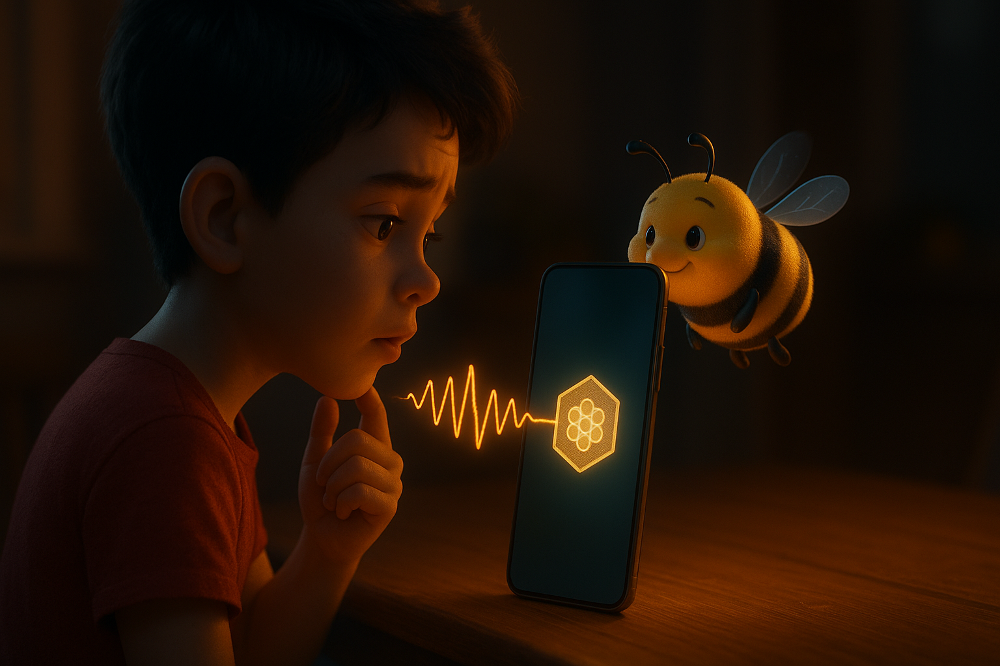
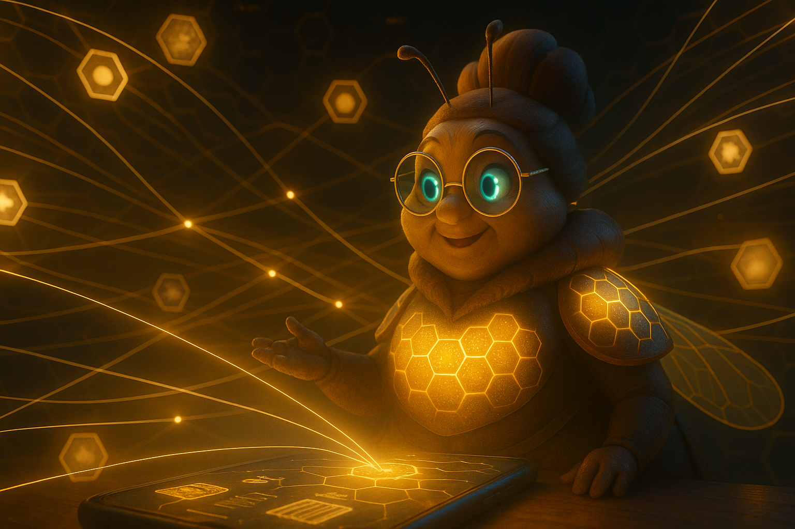
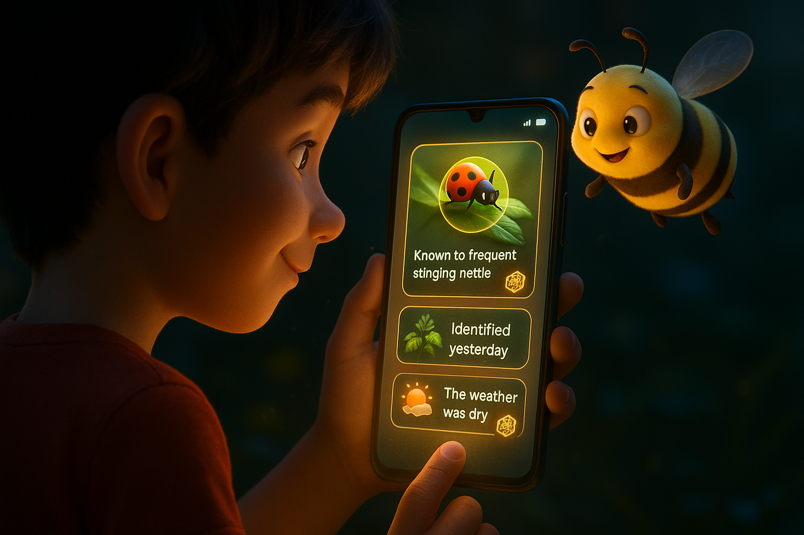

# Document 7/10: The Augmented Memory - Long-Term Utility

**Title:** The Augmented Memory: The Power of a Trusted Knowledge Graph

**Objective:** To define the "endgame" of Kikko, showcasing how the accumulated, **trusted** knowledge transforms the application from a game of collection into an indispensable, proactive personal AI assistant that augments the user's daily life with unparalleled relevance and verifiable accuracy.

---

### **Core Philosophy: From Connection to Confidence**

The initial joy of Kikko comes from the act of collecting. The long-term value, however, comes from the **emergent intelligence** of the Hive, built exclusively on a foundation of trusted, user-verified honeycombs. The AI Queen's true potential is unlocked only when she can reason on a knowledge graph that she and the Forager have built together, a graph free from the opaque data of Hornets, and fully capable of **inference reproduction**.

The endgame is not just about making connections; it's about having **absolute confidence** in those connections because every single data point has a verifiable "Thread of Provenance" and its creation process can be reproduced.

### **1. The Proactive Assistant: The Hive That Truly Knows You**

After weeks and months of foraging, the AI Queen has built a rich map of what matters to Hiro, based entirely on his verified inputs and contextual answers. Because she operates only on "pure" honey (marked with the Seal of Trust), her proactive assistance is incredibly reliable and trustworthy. The Bourdon delivers these insights, often with his characteristic commentary.

*   **High-Confidence Reminders:** The Hive knows Hiro has foraged (with a Seal of Trust) a specific ladybug species (e.g., Coccinella septempunctata) and also indicated (via contextual questions) that he found it on a particular rose bush he often cares for.
    *   **Bourdon's Delivery:** `"Hé, Butineur ! La Mémère vient de capter un truc. Selon nos registres certifiés (et reproductibles !), la coccinelle que tu as butinée il y a deux mois est le prédateur préféré des pucerons sur ton rosier. À surveiller de près, gamin !"`
*   **Critical Safety Alerts (Verified):** The Hive has a trusted record of Hiro's allergy to a specific plant foraged by him personally. He now scans a new wild berry.
    *   **Bourdon's Delivery (voice suddenly serious):** `"ALERTE, Butineur ! La Mémère me dit que ce pollen est dangereux pour toi. Nos données vérifiées (avec preuve d'inférence !) confirment une allergie à cette famille de baies. Ne touche pas à ça, gamin !"`
*   **Personalized Discovery (Authentic Interests):** The Hive analyzes only the "pure" honey and Hiro's contextual answers to understand his true passions, such as entomology or sustainable gardening.
    *   **Bourdon's Delivery:** `"Bon, Forager. La Mémère a tracé un truc cool. Vu toutes tes captures vérifiées sur les insectes auxiliaires et les plantes indigènes, il y a une pépinière locale qui fait une vente de semences rares que tu n'as pas encore butinée. Qu'est-ce qu'on attend ?"`

| Introduction | Action | Conclusion |
| :---: | :---: | :---: |
|  |  |  |
| **The Trusted Library:** Hiro's Hive is a living map built exclusively from his verified, personal experiences and contextual inputs. | **The Spark of Insight:** The AI Queen actively navigates this trusted map, identifying patterns and connections with high confidence, which the Bourdon eagerly points out. | **The Proactive Partner:** The Hive's true power is revealed: it uses these reliable insights to provide timely, personalized, and genuinely useful assistance. |

### **2. The Conversational Search Engine of Your Life**

The ultimate utility is the ability to query one's own life with natural language, knowing the answers are drawn from facts, not assumptions, and delivered by the Bourdon, with the underlying proof of inference reproduction.

*   **Queries with Verifiable Answers:** The user is no longer limited to simple lookups.
    *   *User (voice input):* "Hey Bourdon, what was the name of that interesting ladybug I foraged in the garden last summer?"
    *   **Bourdon's Delivery (TTS):** `"Mmm, la coccinelle... La Mémère a cherché dans nos registres blindés. C'était la 'Coccinella septempunctata', butinée le 12 juillet dans le jardin familial. Ton pollen visuel dit 'couleur vive, très active'. Je te montre le Microsite et la preuve d'inférence, tu veux ?" `(The screen displays the relevant Microsite, ready to show the Thread of Provenance).
*   **Creative Summaries of Your Own Mind:** The Queen can synthesize information based on Hiro's verified interests and contextual contributions.
    *   *User (voice input):* "Kikko, what are the common themes in the plant species I've personally foraged and rated highly for their medicinal properties?"
    *   **Bourdon's Delivery:** `"Ok, gamin. La Mémère a fait son analyse de tes butinages 'pur miel' (avec reproduction d'inférence, bien sûr !). T'es branché botanique, surtout les plantes médicinales et les insectes auxiliaires. Et tu as foragé trois espèces de roses. Tiens, c'est marrant, non ? Un lien avec les pucerons que les coccinelles adorent ?"`
*   **Cross-Domain Connections You Can Trust:**
    *   *User (voice input):* "Bourdon, je dois acheter un cadeau pour ma tante qui aime les jardins. Qu'est-ce que je sais d'elle en vrai, selon nos captures vérifiées ?"
    *   **Bourdon's Delivery:** `"La Mémère est formelle. D'après tes captures vérifiées de vos moments (et mon analyse de tes observations), elle est à fond sur les plantes aromatiques, elle a mentionné 'jardin zen' plusieurs fois, et vous avez scanné un livre sur les oiseaux de jardin. Ça, c'est du pollen solide !" `(The Bourdon might playfully add: "Et on peut reproduire l'inférence pour chaque info, si tu doutes de moi !").

| Introduction | Action | Conclusion |
| :---: | :---: | :---: |
|  |  |  |
| **The Human Question:** The user asks a complex, natural language question based on their past, personal experiences. | **The Trusted Search:** The AI Queen performs a deep search across the verified personal knowledge graph, ensuring data purity and incorporating human context, while the Bourdon observes. | **The Verifiable Answer:** The Bourdon delivers a synthesized, actionable, and deeply personal answer, clearly marked as trustworthy and reproducible. |

**Conclusion:**
The endgame of Kikko is the ultimate payoff for choosing the path of the Forager. By patiently building a knowledge graph based on personal truth and human-provided context, the user creates an AI that is more than just smart—it's **wise** and **verifiable**. It doesn't just provide answers; it provides **their answers**, rooted in their specific experiences and capable of **inference reproduction**. It's a memory that doesn't just store facts but understands trusted relationships. It's an assistant that doesn't just react but anticipates with confidence, all mediated by the charmingly blunt insights of the Bourdon. It is the fulfillment of the promise: a truly personal AI, built by you, for you.