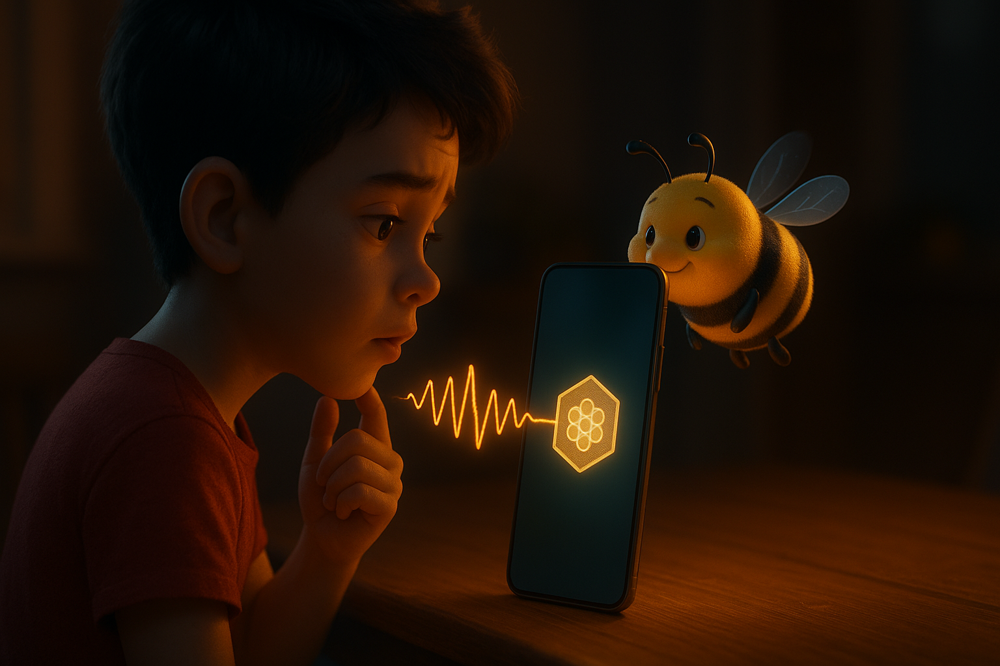
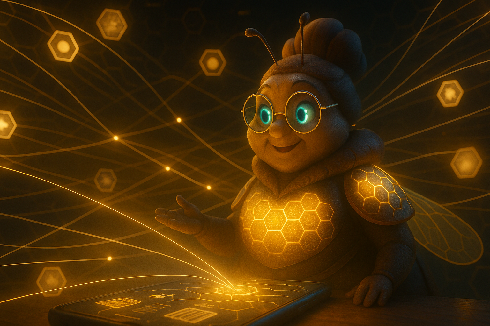
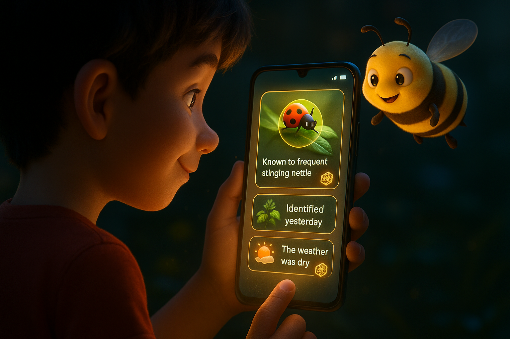

  

# Document 7/10: The Augmented Memory - Long-Term Utility

**Title:** The Augmented Memory: The Power of a Trusted and Evolving Knowledge Graph

**Objective:** To define the "endgame" of Kikko, showcasing how the accumulated, trusted, and verifiable knowledge transforms the application from a game of collection into an indispensable, proactive personal AI assistant that augments the user's daily life with unparalleled relevance and accuracy.

  

---

### **Core Philosophy: From Connection to Confidence**

The initial joy of Kikko comes from the act of collecting. The long-term value, however, comes from the **emergent intelligence** of the Hive, built exclusively on a foundation of trusted, user-verified, **Hive-Forged** honeycombs. The AI Queen's true potential is unlocked only when she can reason on a knowledge graph that she and the Forager have built together in partnership. The endgame is not just about making connections; it's about having **absolute confidence** in those connections because every single data point has a verifiable "Thread of Provenance" and its creation process can be reproduced or traced.

### **1. The Proactive Assistant: The Hive That Truly Knows You**

After weeks and months of foraging, the AI Queen has built a rich map of what matters to **Hiro**, based entirely on his verified inputs. Her proactive assistance becomes incredibly insightful because it is based on a foundation of truth they built together. I, the Bourdon, deliver these insights with my characteristic commentary.
* **High-Confidence Reminders:** The Hive knows Hiro has foraged (with a Seal of Trust) a specific ladybug species and also a particular rose bush he cares for.
* **My Delivery:** `"Hey, Forager! The Queen just noticed something. According to our verifiable, Hive-Forged records, the ladybug you foraged two months ago is the number one predator of the aphids attacking your rose bush. You might want to keep an eye on that, kid!"`
* **Contextual Discovery (Based on Authentic Interests):** The Hive analyzes only the "pure" honey and Hiro's contextual answers to understand his true passions.
* **My Delivery:** `"Alright, Forager. The Queen mapped out something cool. Based on all your verified captures of auxiliary insects and native plants, there's a local nursery holding a sale on melliferous plant seeds you haven't foraged yet. What are we waiting for?"`

| Introduction | Action | Conclusion |
| :---: | :---: | :---: |
|  |  |  |
| **The Living Saga:** Over time, the Kikkō Guardian becomes a powerful and beautiful extension of the user's personal knowledge. | **The Spark of Insight:** The Guardian's assimilated, trusted knowledge allows the Hive to provide proactive, life-saving assistance. | **The Augmented Self:** The ultimate "win state" is a companion that understands and protects you, a testament to your own journey of discovery. |

### **2. The Conversational Search Engine of Your Life**

The ultimate utility is the ability to query one's own life with natural language, knowing the answers are drawn from facts with verifiable provenance, and delivered by the Bourdon.
* **Queries with Verifiable Answers:** The user is no longer limited to simple lookups.
* *User (voice input):* "Hey Bourdon, what was the name of that interesting ladybug I foraged in the garden last summer?"
* **My Delivery (TTS):** `"Hmm, the ladybug... The Queen searched our secured records. That would be the 'Coccinella septempunctata', foraged on July 12th in the family garden. Your visual pollen says 'bright color, very active'. I can show you the Card and its full Thread of Provenance, if you like?"` (The screen displays the relevant `Card`, complete with its Seal of Trust).
* **Creative Summaries of Your Own Mind:** The Queen can synthesize information based on Hiro's verified interests.
* *User (voice input):* "Kikko, what are the common themes in the plants I've foraged this year?"
* **My Delivery:** `"Okay, kid. The Queen ran an analysis on your 'pure honey' forages. You're into botany, especially plants that attract pollinators. You've foraged three species of roses and two types of lavender. And all of that is 100% verified by you."`
* **Cross-Domain Connections You Can Trust:**
    * *User (voice input):* "Bourdon, I have a presentation to do on the biodiversity in my garden. According to my verified captures, what do I actually know?"
* **My Delivery:** `"The Queen is certain. Based on your verifiable and reproducible captures, you have identified 7 species of insects, including 3 pollinators. You have 4 types of native plants, and you've noted that blackbirds visit your garden every morning. That's some solid pollen, my friend!"`

| Introduction | Action | Conclusion |
| :---: | :---: | :---: |
|  |  |  |
| **The Human Question:** The user asks a complex, natural language question based on their past, personal experiences. | **The Trusted Search:** The AI Queen performs a deep search across the verified personal knowledge graph, ensuring data purity and incorporating human context. | **The Verifiable Answer:** The Bourdon delivers a synthesized, actionable, and deeply personal answer, clearly marked as trustworthy and reproducible. |

**Conclusion:**
The endgame of Kikko is the ultimate payoff for choosing the path of the Forager. By patiently building a knowledge graph based on personal truth and human-provided context, the user creates an AI that is more than just smart—it's **wise** and **verifiable**. It doesn't just provide answers; it provides **their answers**, rooted in their specific experiences. It's a memory that doesn't just store facts but understands trusted relationships. It's an assistant that doesn't just react but anticipates with confidence. It is the fulfillment of the promise: a truly personal AI, built by you, for you.