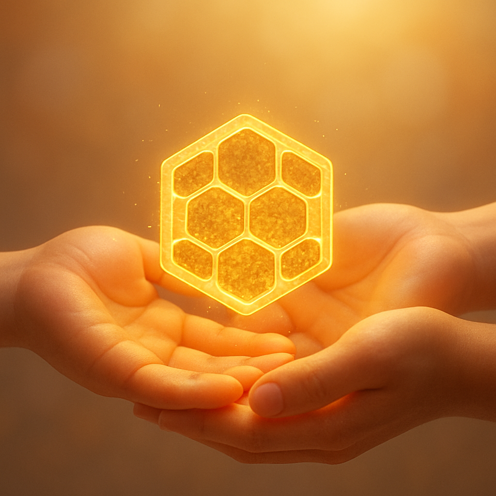
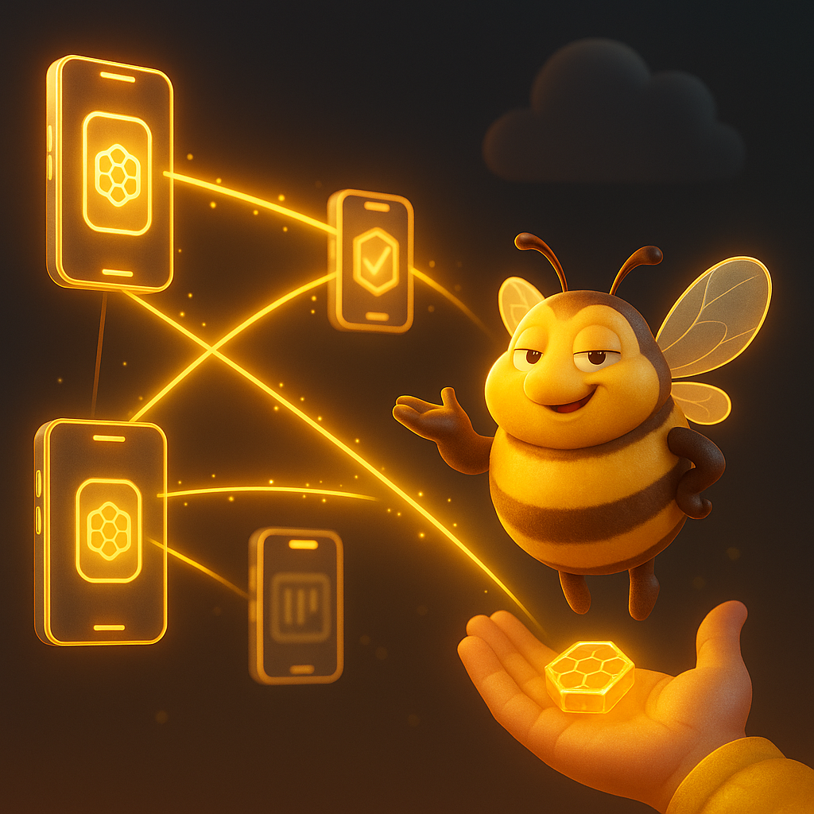
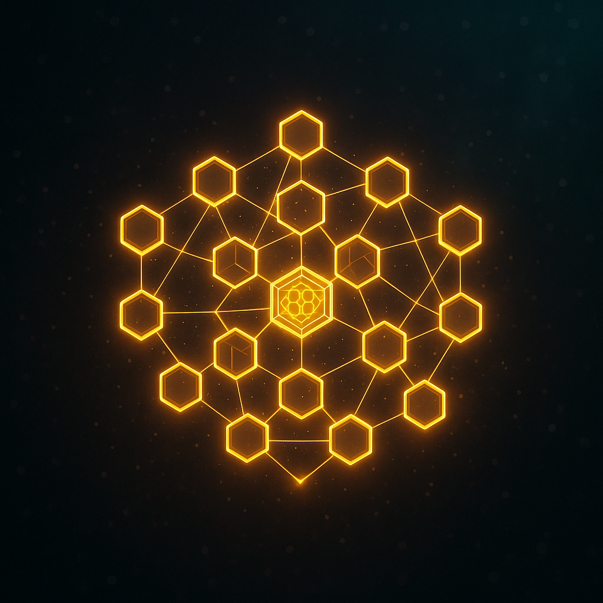
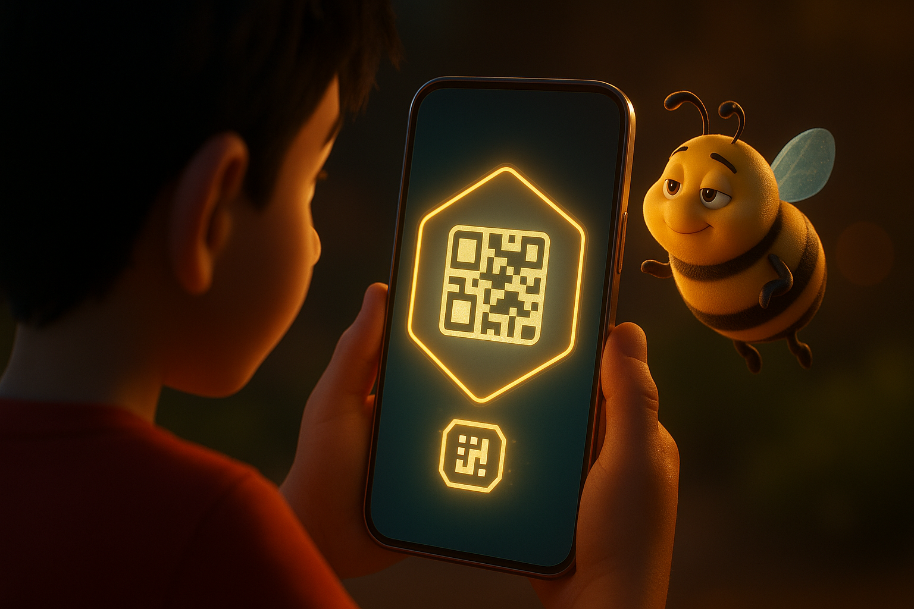
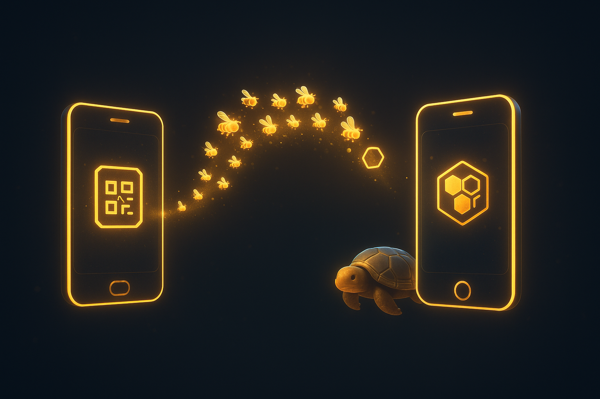
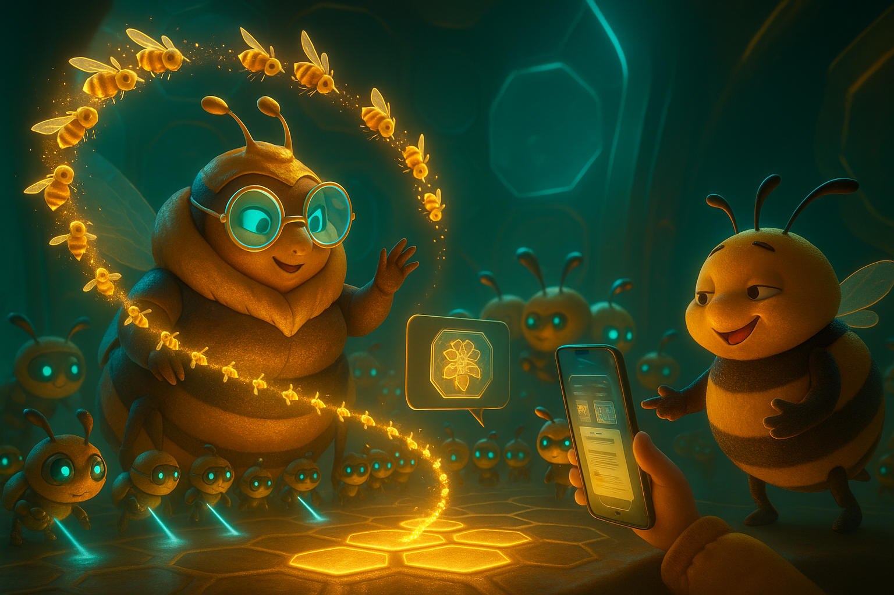
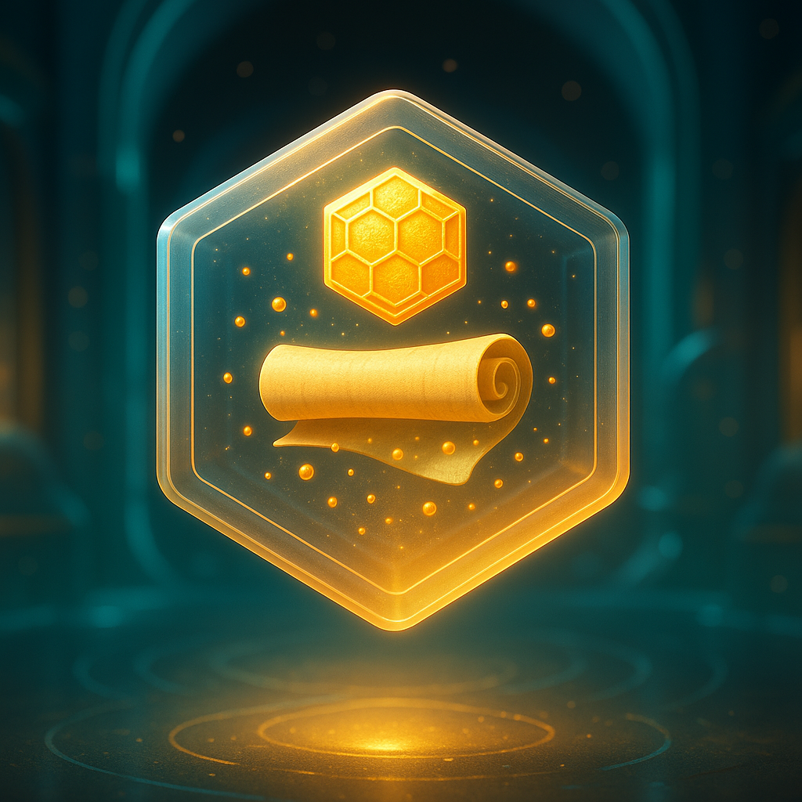
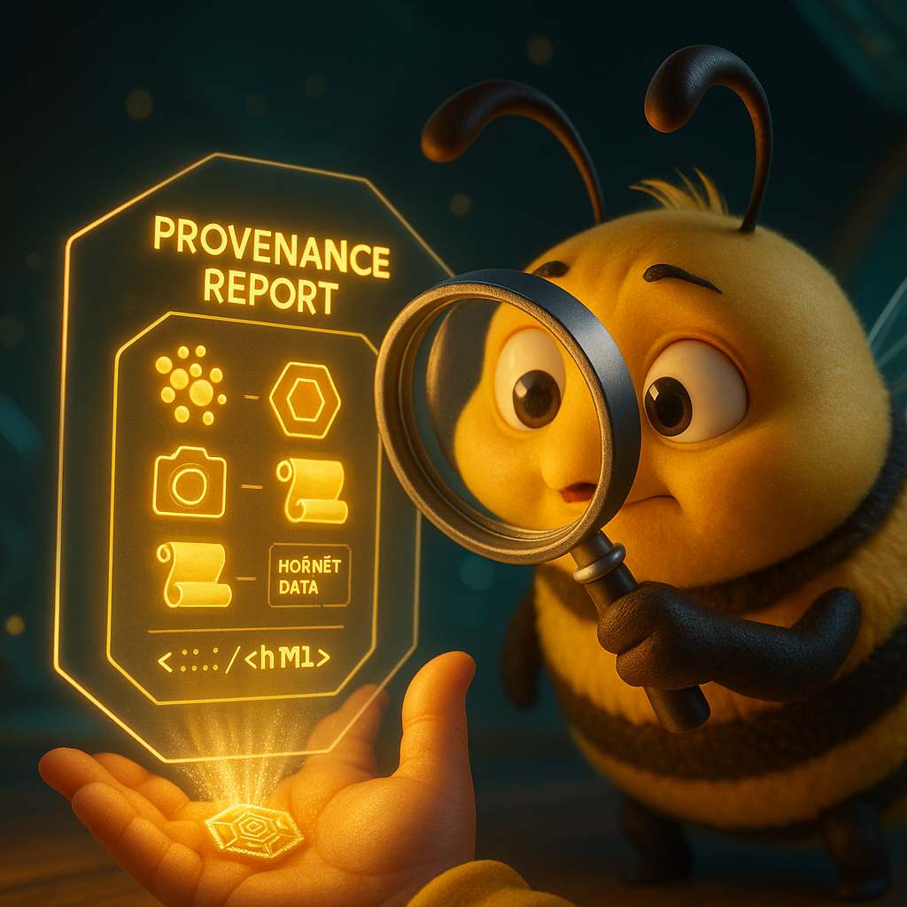
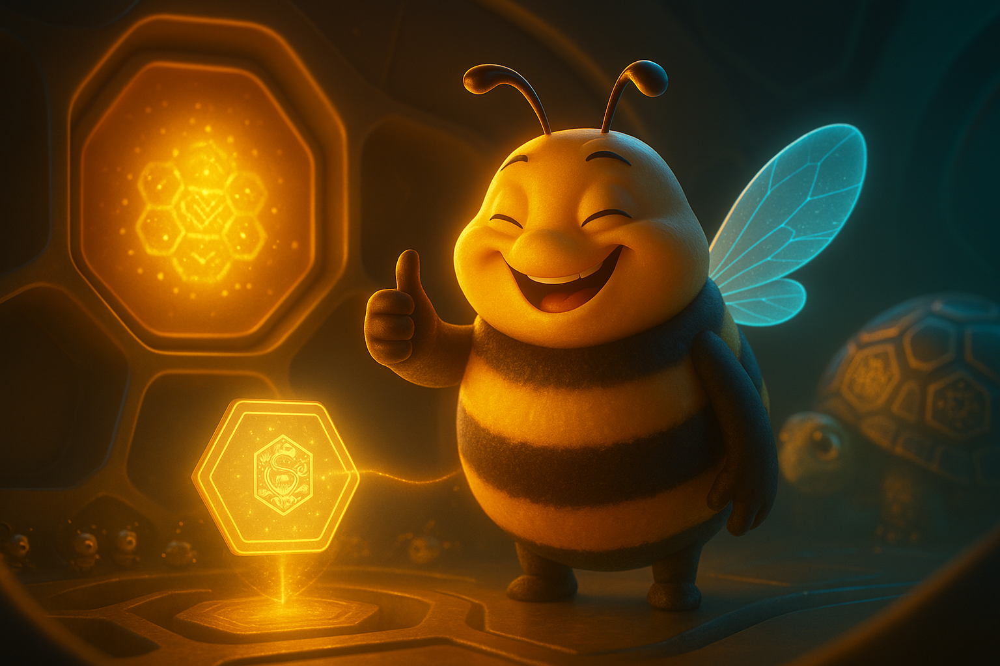

  

# Document 8/10: The Global Swarm - Decentralized Sharing & Community

**Title:** The Global Swarm: Collaborative Knowledge for Trusted Groups

**Objective:** To define the technology and philosophy behind Kikko's sharing features, positioning them as tools for deep collaboration within trusted groups (families, teams, hobbyists) rather than a viral social network. The focus is on practical, real-world utility enabled by peer-to-peer technology and **verifiable knowledge**.

  

---

### **Core Philosophy: A Gift of Verifiable Knowledge**

In today's digital world, "sharing" often means broadcasting to a public feed. Kikko reclaims the word to mean something more intimate and powerful: **gifting a complete, verifiable package of knowledge directly to someone you trust, where that knowledge's creation process can be reproduced or traced by the recipient.**

It's not about public performance; it's about genuine connection and mutual enrichment. We are not building another social network. We are enabling a **sovereign network of personal Hives** to collaborate on shared goals, creating small, private, and highly valuable "swarms" of **verifiable knowledge** through **Digital Pollination**.

| Introduction | Action | Conclusion |
| :---: | :---: | :---: |
|  |  |  |
| **The Gift of Knowledge:** Sharing in Kikko is an intimate act of passing verified knowledge as a precious gift. | **The Sovereign Network:** The Bourdon oversees the direct, peer-to-peer exchange of knowledge between individual Hives. | **The Global Swarm:** These trusted exchanges form resilient, decentralized constellations of knowledge. |

### **1. The P2P Technologies: Two Tools for Two Use Cases**

Kikko employs a dual-technology approach to peer-to-peer communication, ensuring the best tool is used for each type of interaction.
#### **1.1 The Local Arena (Google Nearby Connections)**
For real-time, synchronous interactions like the "Saga Clash," Kikko uses the **Google Nearby Connections API**.
* **Discovery Radar:** Allows Foragers who are physically close to discover each other without needing to be on the same Wi-Fi network.
* **Secure, Offline Connection:** The API establishes a high-bandwidth, low-latency, and secure connection directly between devices, creating a private local network for the duration of the battle. This works entirely offline.

#### **1.2 Remote Gifting (WebTorrent & QR Codes)**
For asynchronous, remote sharing of knowledge, Kikko uses **WebTorrent**.
* **The Gift:** A Forager can choose to "gift" a specific `KnowledgeCard` or an entire Deck to a friend anywhere in the world.
* **The Mechanism:** The app bundles the `KnowledgeCard` data (including its detailed `provenanceLog` and source images) into a "Trusted Package" and generates a **QR Code** containing a magnet link.
* **The Transfer:** The recipient scans the QR code with their Kikko app to initiate a direct, decentralized P2P transfer over the internet, without the data ever being stored on a central server.

| Introduction | Action | Conclusion |
| :---: | :---: | :---: |
|  |  |  |
| **The Ready Gateway:** The Bourdon presents the WebTorrent sharing mechanism—a simple QR code or link—as the secure portal for knowledge transfer. | **The Direct Path:** Data flows directly from one device to another as a swarm of "data-bees," bypassing central servers entirely. | **The Welcome Reception:** The receiving Hive's Queen and Worker Bees are ready to verify and integrate the new, incoming knowledge. |

### **2. The "Trusted Package": The Unit of Verifiable Collaboration**

What is shared is not just data, but a **"Trusted Package,"** a self-contained archive of verifiable knowledge that includes all components necessary for **Inference Reproduction**.
* **The `KnowledgeCard` Object (The Miel):** The final, structured knowledge card.
* **The Thread of Provenance (The Recipe):** The complete `provenanceLog` JSON document, which itself contains a copy of the `PollenGrain` used.
* **The Original Pollen (The Proof):** The source images, referenced by the paths inside the `PollenGrain` and included in the shared package.

When a group member receives this package, their Hive can independently verify the information. It doesn't just check a digital signature; it actively **reproduces the inference** using the provided log and source pollen. This creates a shared "ground truth" for the group, built on mathematical certainty.

| Introduction | Action | Conclusion |
| :---: | :---: | :---: |
|  |  |  |
| **The Complete Gift:** A shared memory is presented as a complete, self-contained package of knowledge and its entire history. | **The Verification:** The receiving Hive's Bourdon meticulously inspects the package, preparing for the full verification process. | **The Seamless Integration:** Once verified through inference reproduction, the new, trusted knowledge is added to the recipient's personal memory graph. |

### **3. The Emergent Community: Niche Swarms**

Kikko's community model focuses on empowering small, private groups with shared goals.
* **Use Case: The Nature & Food Club.** **Hiro** finds a wild berry bush and forages a detailed, Hive-forged `KnowledgeCard` about it. He shares it with **Léa**. Léa's Hive receives the package and automatically runs an **inference reproduction** on the card's `provenanceLog` to verify Hiro's identification. Only after this verification does her Queen cross-reference the now-trusted berry species with Léa's allergy profile. Léa gets a notification: "Hiro shared a 'Wild Raspberry' forage. **Verified by your Hive.** This berry is SAFE for you."
* **Use Case: The Family Inventory.** A family can create a shared "swarm" for household items. One person forages the warranty for the new TV, another the paint codes for the living room wall. Everyone in the family receives the verified "honey" on their device.
* **Use Case: The Hobbyist Collectors.** A couple collecting vintage cameras can build a shared, verified catalog. Each entry includes photos, purchase receipts (pollen), and notes, all reproducible.
**Conclusion:**
Kikko's sharing model is a deliberate move away from mass-market social media towards deep, meaningful collaboration. By leveraging a combination of peer-to-peer technologies and the "Trusted Package" with its reproducible provenance, we provide a powerful tool for small groups to build a shared, trusted knowledge base. It's a community built not on "likes," but on mutual goals and the power of a shared, transparent memory.