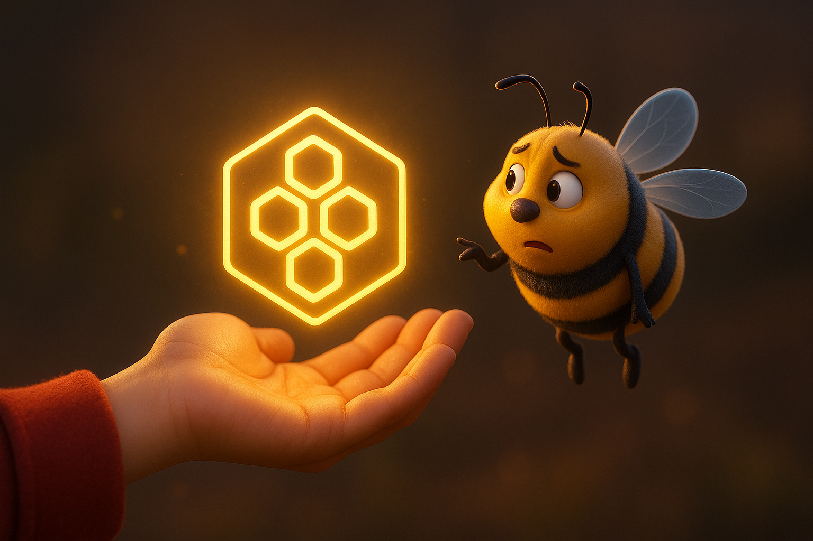
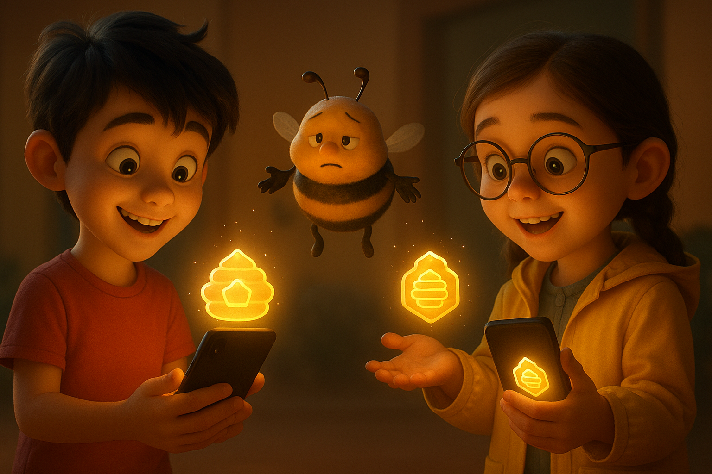
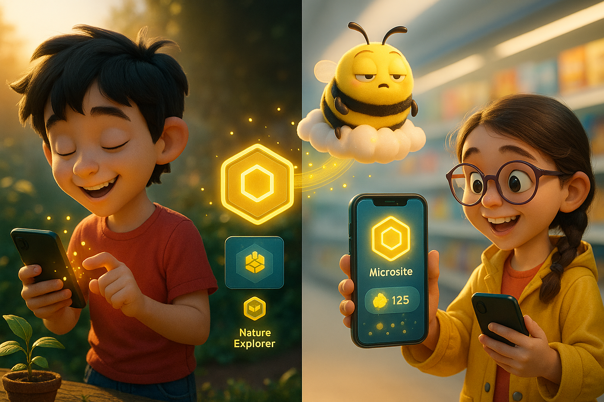
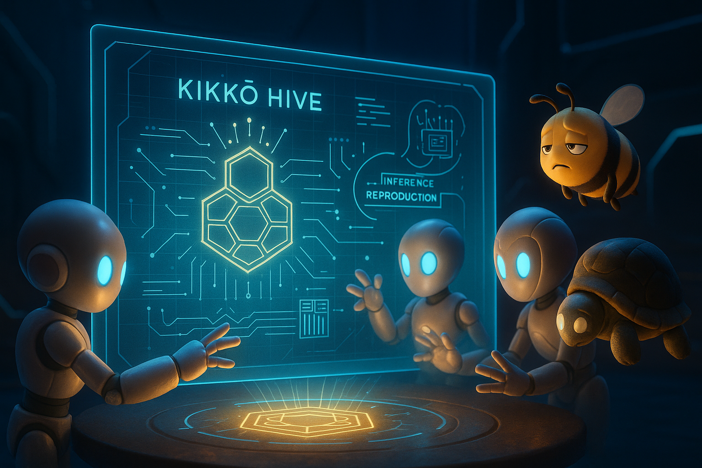
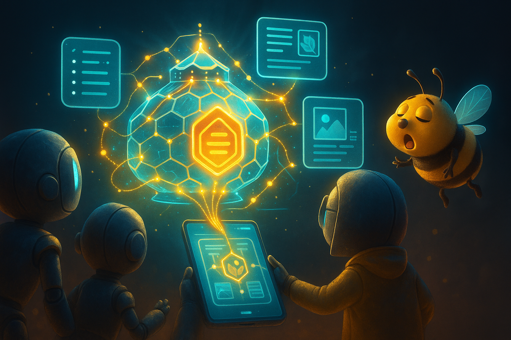
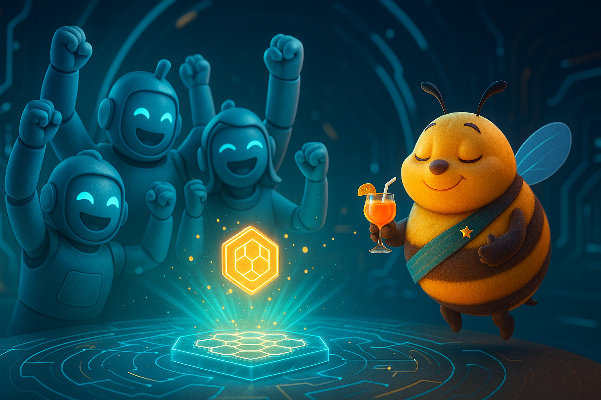

# Document 9/10: The Philosophy of Gifting - A Non-Commercial Vision

**Title:** The Philosophy of Gifting: Kikko as a Public Good

**Objective:** To define Kikko's core motivation and "business model" as explicitly non-commercial for its initial release. This document frames the project not as a product to be sold, but as a gift to the community and a powerful proof-of-concept for a new category of ethical, personal AI.

---

### **Core Philosophy: Not a Product, a Proposal**

In a world where every application is designed with a monetization strategy, Kikko dares to be different. For its presentation in the Google AI Edge Challenge and its initial release, **Kikko is not a business. It is a proposal.**

It is a proposal for a new relationship with our data, our memories, and our devices. It is a functional piece of art and a philosophical statement, designed to inspire and to demonstrate what is possible when technology is built for empowerment, not for profit.

We are not building a company; we are building an idea. And the best way to share an idea is to give it away.

### **1. The "Gift" Model: 100% Free and Unrestricted**

Kikko will be offered to everyone, completely free, with no strings attached. There are no premium tiers, no advertisements, no plans for future subscriptions. Every feature is available to every user from the moment they install the application.

*   **The Full Experience, For Everyone:**
    *   The complete foraging and gamification experience.
    *   The AI Queen (Gemma) and all Worker Bees (ML Kit) at their full potential.
    *   Unlimited local storage of "honey" (as Microsites) and "pollen."
    *   The complete "Thread of Provenance" and "Seal of Trust" features, including the full data required for **Inference Reproduction**.
    *   Unlimited peer-to-peer sharing of "Trusted Packages" via WebTorrent, with full reproducibility for recipients.
    *   A starter set of badges and quests, including all advanced features like multi-language Microsites and contextual questioning from the Queen.

This free tier is not a "demo." It is a complete, powerful tool that fulfills the core promise of the application. The **Bourdon**, ever the pragmatist, might grumble about the lack of "honey-money," but ultimately agrees it's the most effective way to get more foragers for the Queen and spread the power of verifiable knowledge.

| Introduction | Action | Conclusion |
| :---: | :---: | :---: |
|  |  |  |
| **The Unconditional Offer:** The Kikko experience, including its most advanced features like Inference Reproduction, is presented as a gift to all, symbolizing its commitment to user empowerment over profit. | **The Acceptance:** The user accepts the free, full-featured Hive, beginning their journey of personal knowledge discovery and verifiable memory building. | **The Flourishing Hive:** The user thrives, collecting memories, creating Microsites, and earning rewards, while the Bourdon observes the growing popularity of the freely-given Kikko. |

### **2. Why This Approach? The Economics of a Powerful Idea**

Choosing a non-commercial path is a strategic decision that serves the core goals of the project.

*   **Maximizing Impact for the Competition:** For the Google AI Edge Challenge, our goal is to present the most powerful and uncompromised vision possible. A business model, no matter how ethical, would distract from the core message: the technological and philosophical innovation, especially around on-device AI, privacy, and verifiable knowledge through inference reproduction. The Bourdon might comment: `"Moi, je préfère les siestes. Moins de soucis de rentabilité, plus de temps pour flâner et pour que la Mémère peaufine ses algos d'inférence."`
*   **Building Trust Through Action:** The strongest way to prove our commitment to user sovereignty is to remove profit from the equation entirely. Our actions speak louder than any privacy policy. We are not interested in the user's money because we are only interested in empowering them with verifiable, personal knowledge. The Bourdon might add: `"Pas de piège à miel, gamin. La Mémère, elle, joue pas à ça, surtout quand il s'agit de transparence."`
*   **Fostering an Authentic Community:** A non-commercial project attracts a different kind of community: one built on passion, collaboration, and shared ideals, not on consumer transactions. We hope to inspire developers, designers, and thinkers to build upon the ideas presented in Kikko, particularly those around privacy-first AI and verifiable data. The Bourdon would nod: `"Les vrais butineurs, pas les pique-assiettes. J'aime ça. Ça fera une belle armée de butineurs pour la Reine."`
*   **A Focus on Pure Innovation:** By removing the pressure to generate revenue, the development team (us!) can focus 100% of its energy on solving the complex challenges of the user experience, AI partnership, on-device performance, and the groundbreaking concept of inference reproduction. The Bourdon: `"Moins de paperasse, plus de temps pour que la Reine et les filles inventent des trucs dingues et des vérifications impossibles à tricher. Ça me va."`

| Introduction | Action | Conclusion |
| :---: | :---: | :---: |
|  |  |  |
| **The Dedicated Artisans:** The development team is shown focusing purely on technological and philosophical innovation, particularly the complex verifiable AI systems. | **The Fruit of Labor:** Unburdened by commercial pressures, the team generates truly groundbreaking features, like Inference Reproduction and multi-language Microsites. | **The Shared Triumph:** The success of the project is a testament to the power of pure innovation, benefiting all by providing a truly trustworthy personal AI. |

### **3. The Future: An Open Question**

While the initial vision for Kikko is non-commercial, we believe that successful, ethical projects can find sustainable paths forward. A future version of Kikko *could* explore models like:

*   **Professional Guilds:** Offering highly specialized, paid "Queen" AIs for professional use-cases (e.g., a "Paramedic Queen" for emergency responders, a "Lab-Tech Queen" for scientists), where the value of verifiable, domain-specific knowledge and reproducible inference is paramount.
*   **Donation-Based Support:** Allowing passionate users to support the project's maintenance and development voluntarily.
*   **Becoming an Open-Source Project:** Entrusting the future of Kikko to the community itself, ensuring its longevity and evolution, especially regarding its transparency and reproducibility features.

However, these are possibilities for a distant future. **For now, Kikko is a gift.** Its value is not measured in dollars, but in the potential it has to change how we think about personal technology and the integrity of our digital memories. The Bourdon's parting thought: `"L'avenir ? On verra bien. Pour l'instant, c'est gratuit, c'est beau, et ça me laisse tranquille à butiner les vraies infos. Quoi de plus ?"`

**Conclusion:**
Kikko's "business model" is to not have one. It is an investment in an idea. By offering it as a free, complete, and powerful tool, incorporating cutting-edge features like Inference Reproduction and multi-language Microsites, we aim to make the strongest possible case for a new paradigm of personal AI—one based on trust, sovereignty, and the simple joy of understanding one's own world with verifiable truth.