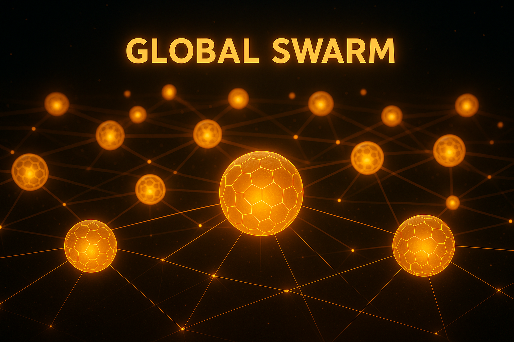

  

# Document 10/10: The Kikko Project - Synopsis for the Google AI Edge Challenge

**Title:** Kikko: Your Personal Memory Hive - A Personal Knowledge Game Built on Trust

**Objective:** To provide a comprehensive summary of the Kikko project for the Google AI Edge Challenge, highlighting its innovative concept, its sophisticated use of Google's on-device AI to tackle a modern-day dilemma, and its profound potential for real-world impact.

  

---

### **1. High-Concept Pitch**

In an age where AI offers instant but opaque answers, **Kikko** introduces a new genre: the **Personal Knowledge Game**. It reframes the smartphone not as a window to the cloud, but as a private, intelligent **Memory Hive** that helps you forge a rich, verifiable graph of your own life. In a **true human-AI partnership**, you (the **Forager**) and your on-device AI companions—the wise **AI Queen (Gemma)** and her diligent **Worker Bees (ML Kit)**, guided by the witty **Bourdon**—collaborate to turn personal experiences into **trusted knowledge**. It poses a central question for our time: do you accept the quick, easy answer from the cloud, or do you forge your own, verifiable truth, whose creation is provably authentic through **inference reproduction**?

### **2. The Vision & Impact (40 Points)**

Kikko's vision is to combat **assisted digital amnesia** by empowering individuals with **sovereignty over their digital memory**.

*   **Tackling a Modern Dilemma: The Hornet's Temptation.** Kikko gamifies the "convenience vs. truth" problem. It presents a choice between accepting opaque "AI Overviews" from external sources (the "Hornet's Offer," complete with an engaging quiz) and the rewarding effort of forging personal, verifiable knowledge. This subtly educates users on digital literacy and the critical importance of **inference reproduction**.
*   **A New Paradigm for Personal AI: Human-AI Partnership.** The AI Queen (Gemma) doesn't just answer, she collaborates. She actively asks **contextual questions** and issues new **foraging quests** to enrich memories. The user's validation is the final, essential ingredient, creating a system built on mutual trust.
*   **Radical Privacy & Trust:** With a **100% on-device architecture**, all user data and AI models remain private. The "Thread of Provenance" for every user-created memory is an auditable, locally generated log that contains the full blueprint for **inference reproduction**, ensuring unparalleled transparency.
*   **A Gift to the Community: Non-Commercial Vision.** Kikko is a **non-commercial project**, offered entirely free. Its sole focus is on impact and demonstrating a viable, ethical model for personal AI built on verifiable knowledge.

| Introduction | Action | Conclusion |
| :---: | :---: | :---: |
|  |  |  |
| **Individual Sovereignty:** Kikko empowers each user with complete control over their digital memory, securing it within their personal device and making it verifiable. | **The Conscious Choice:** The core gameplay loop is a continuous test where Hiro chooses authentic, personally forged knowledge over convenient, opaque external data. | **Collective Resilience:** This model fosters a decentralized community, creating a more private and equitable web of shared, trusted, and reproducible knowledge. |

### **3. Technical Depth & Execution (30 Points & Google AI Edge Prize)**

Kikko is a sophisticated showcase of how Google's on-device technologies can be orchestrated to create a novel, privacy-first experience.

*   **The AI Queen (Gemma - The Partner):** At the heart of the Hive is **Gemma**, leveraged for its on-device reasoning as a collaborative partner:
    1.  **Suggestion & Structuring:** It suggests `schema.org` classifications for raw data and structures it into rich, multi-language **"Microsites"**.
    2.  **Proactive Questing & Dialogue:** It formulates natural language questions and quests to gather crucial human context ("Forager, I need a picture of the leaves to be sure."). This human-in-the-loop approach is fundamental to building verifiable knowledge.
    3.  **Inference Reproduction Blueprint:** It logs its entire reasoning chain—prompts, intermediate steps, and user inputs—within the "Thread of Provenance," creating a verifiable blueprint for other Hives to reproduce the inference locally and confirm its validity.

*   **The Worker Bees (ML Kit - The Specialists):** A comprehensive suite of **ML Kit** APIs acts as specialized "Worker Bees" for fast, on-device data extraction:
    *   **Vision:** Text Recognition v2, Barcode Scanning, Document Scanner, Image Labeling, Object Detection, and more are used to parse the real world.
    *   **Natural Language:** Language ID, Translation, and Entity Extraction help process and enrich the captured pollen.

*   **The Bourdon (The Communicator & The Hornet's Messenger):** This unique AI agent manages the interactive dialogue and presents the core dilemma.
    1.  **Dialogue Orchestration:** Relays the Queen's quests and suggestions via TTS.
    2.  **Hornet's Offer Delivery with Quiz:** Activates a local **WebView** to perform a Google Search. It then uses **ML Kit's OCR and Entity Extraction** to scrape the "AI Overview" from the WebView's HTML and generate an engaging quiz. This "Hornet's Pollen" is then presented to the user as a tempting, instant alternative.

*   **The Architecture of Trust & Digital Pollination:**
    *   **Core App & UI:** Built on Android (Kotlin) with a `WebView`-based UI for rapid, immersive iteration.
    *   **Decentralized Sharing:** **WebTorrent** is integrated for secure, P2P sharing of "Trusted Packages". The receiving Hive uses its local Gemma and ML Kit to **reproduce the inference** based on the sender's provenance log, independently verifying the data's integrity before integration.

| Introduction | Action | Conclusion |
| :---: | :---: | :---: |
|  |  |  |
| **1. Initial Extraction:** As raw pollen enters the Hive, Worker Bees (ML Kit) begin meticulous on-device processing. | **2. The Bourdon's Offer:** Simultaneously, the Bourdon delivers an instant, pre-packaged "AI Overview" (from a local WebView search) as a tempting shortcut. | **3. The Forger's Path:** If the user chooses authenticity, the AI Queen (Gemma) forges verifiable knowledge in partnership with them, culminating in a pristine "Seal of Trust". |

### **4. Video Pitch & Storytelling (30 Points)**

Our 5-minute animated short film, **"Hiro's Choice,"** will bring the core dilemma to life, showcasing the problem of fleeting memory, the magic of the human-AI partnership, the temptation of the Hornet's offer, and the profound satisfaction of forging verifiable truth. The video will visually explain the revolutionary concept of **Inference Reproduction** and highlight the long-term utility of having a proactive, trusted AI companion.

**Conclusion:**
Kikko is more than an application; it is a timely and necessary response to the evolution of AI. By masterfully combining the on-device power of **Gemma** and **ML Kit** within an engaging, gamified, and ethically-uncompromising framework, Kikko doesn't just showcase what the technology can do—it makes a powerful statement about how it *should* be used to create truly personal, verifiable, and reproducible knowledge.