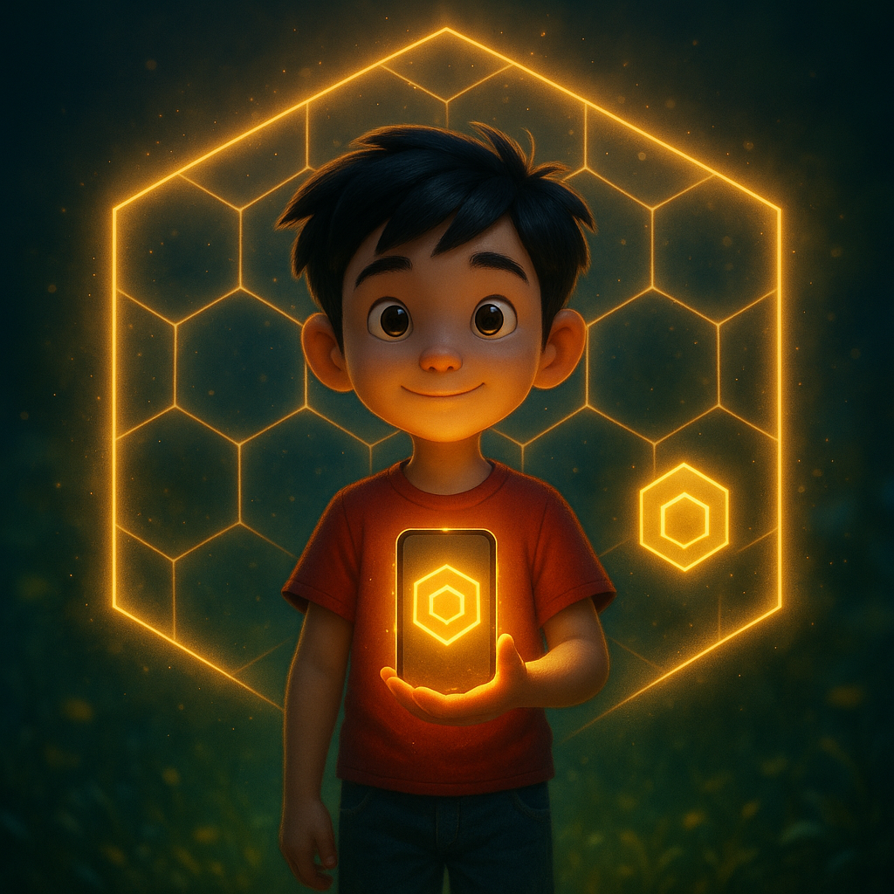
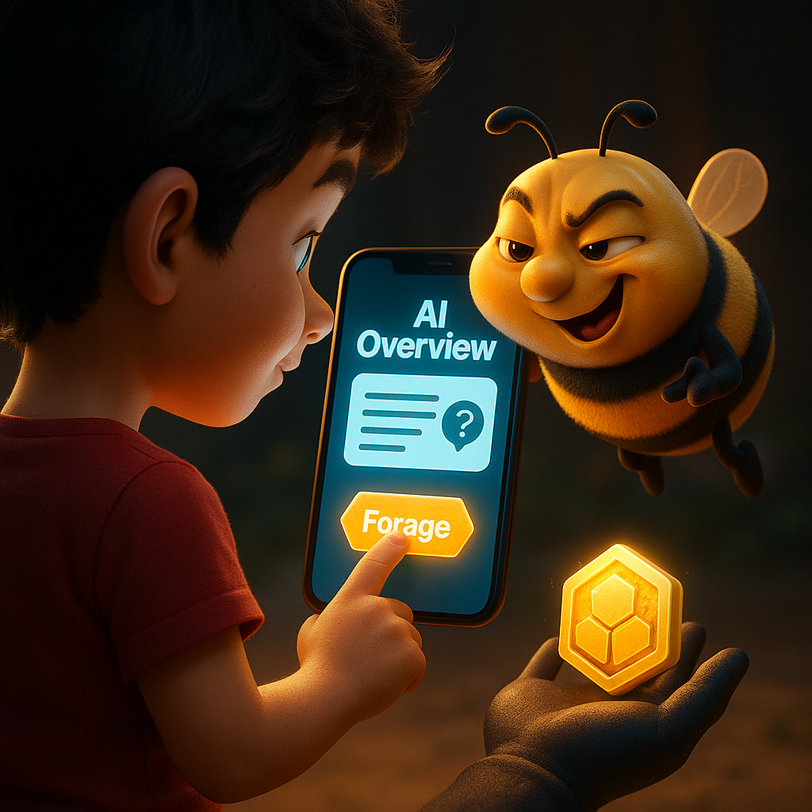
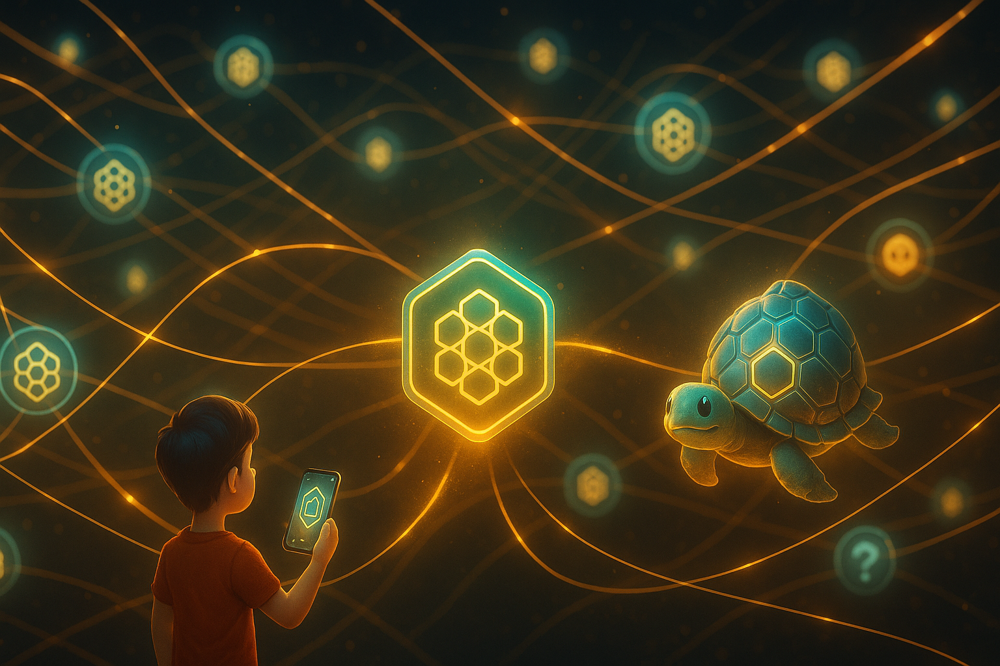
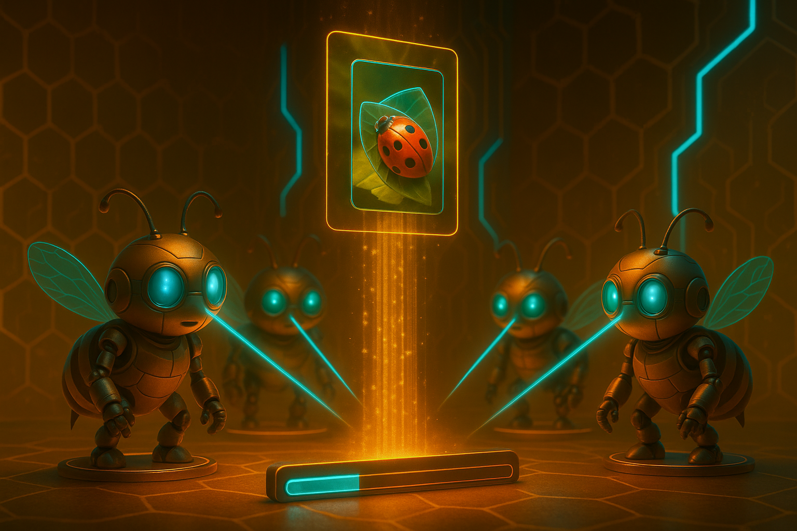
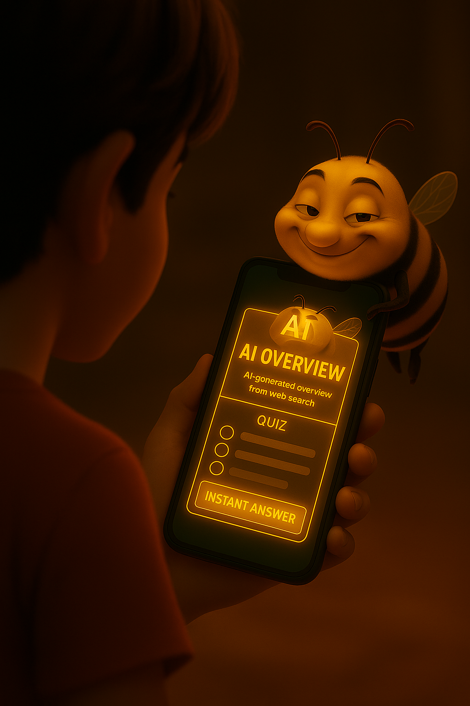
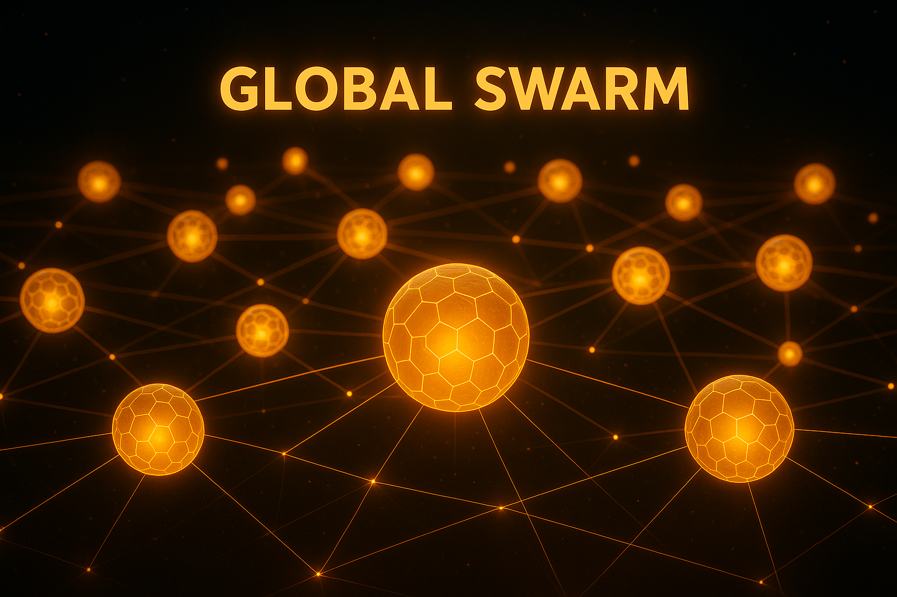

  

# Document 10/10: The Kikko Project - Synopsis for the Google AI Edge Challenge

**Title:** Kikko: Your Personal Memory Hive - A Verifiable Knowledge Game Built on Trust

**Objective:** To provide a comprehensive summary of the Kikko project for the Google AI Edge Challenge, highlighting its innovative concept, its sophisticated use of Google's on-device AI to tackle a modern-day dilemma, and its profound potential for real-world impact.

  

---

### **1. High-Concept Pitch**

In an age where AI offers instant but opaque answers, **Kikko** introduces a new genre: the **Verifiable Knowledge RPG**. It reframes the smartphone not as a window to the cloud, but as a private, intelligent **Memory Hive** that helps you forge a rich, verifiable graph of your own life. In a **true human-AI partnership**, you (the **Forager**) and your on-device "Guild of AI Artisans"—the wise **AI Queen (Gemma)** and her diligent **Specialist Bees (TFLite Models & ML Kit)**—collaborate to turn personal experiences into **trusted knowledge**. Our core innovation is the **"Thread of Provenance"**, a comprehensive log that makes every piece of user-forged knowledge **verifiably reproducible**, turning the AI from a black box into a glass box.

### **2. The Vision & Impact (40 Points)**

Kikko's vision is to combat **assisted digital amnesia** by empowering individuals with **sovereignty over their digital memory**.

* **Tackling a Modern Dilemma: The Hornet's Temptation.** Kikko gamifies the "convenience vs. truth" problem. It presents a choice between accepting opaque "AI Overviews" from external sources (the "Hornet's Offer") and the rewarding effort of forging personal, verifiable knowledge. This subtly educates users on digital literacy and the critical importance of **inference reproduction**.
* **A New Paradigm for Personal AI: Human-AI Partnership.** The AI Queen (Gemma) doesn't just answer, she orchestrates. Our `v5.0` workflow introduces a **Human Refinement** step, where the Forager validates or specifies the initial identification made by the Specialist Bees. This collaboration is fundamental to building a knowledge graph built on ground truth.
* **Radical Privacy & Trust:** With a **100% on-device architecture**, all user data and AI models remain private. The "Thread of Provenance" for every user-created memory is an auditable, locally generated log that contains the full blueprint for **inference reproduction**, ensuring unparalleled transparency and trust.
* **A Gift to the Community: Non-Commercial Vision.** Kikko is a **non-commercial project**, offered entirely free. Its sole focus is on impact and demonstrating a viable, ethical model for personal AI built on verifiable knowledge.

| Introduction | Action | Conclusion |
| :---: | :---: | :---: |
|  |  |  |
| **Individual Sovereignty:** Kikko empowers each user with complete control over their digital memory, securing it within their personal device and making it verifiable. | **The Conscious Choice:** The core gameplay loop is a continuous test where Hiro chooses authentic, personally forged knowledge over convenient, opaque external data. | **Collective Resilience:** This model fosters a decentralized community, creating a more private and equitable web of shared, trusted, and reproducible knowledge. |

### **3. Technical Depth & Execution (30 Points & Google AI Edge Prize)**

Kikko is a sophisticated showcase of how Google's on-device technologies can be orchestrated to create a novel, privacy-first experience.

* **The Guild of AI Artisans (Multi-Stage Inference):**
    1.  **Live Perception (ML Kit & TFLite):** A suite of **Specialist Bees** (optimized TFLite models for Plants, Animals, etc.) and **Scout Bees (ML Kit)** analyze the camera feed in real-time, providing live AR overlays.
    2.  **Human-in-the-Loop:** The Forager captures a "pollen package" (image + initial analysis) and is prompted to **refine** the specialist's identification, providing crucial ground truth.
    3.  **Generative Orchestration (Gemma):** The **AI Queen (Gemma)** receives this high-quality, human-verified input. Her task is not raw classification, but **generative content creation**: she crafts the `bourdonTTS` script, the `quiz`, and the `stats` for the final `Card` object.
    4.  **Inference Reproduction Blueprint:** Gemma logs her entire reasoning chain—prompts, parameters, and raw responses—within the "Thread of Provenance," creating a verifiable blueprint for other Hives to reproduce the inference locally and confirm its validity.

* **The Architecture of Trust & Digital Pollination:**
    * **Core App & UI:** Built on Android (Kotlin).
    * **Local P2P:** **Google Nearby Connections** for offline discovery and battle initiation.
    * **Remote Decentralized Sharing:** **WebTorrent** integrated for secure, P2P sharing of "Trusted Packages" (the `Card` object with its full `provenanceLog` and source images) via QR codes.

| Introduction | Action | Conclusion |
| :---: | :---: | :---: |
|  |  |  |
| **1. Initial Extraction:** As raw pollen enters the Hive, Worker Bees (ML Kit) begin meticulous on-device processing. | **2. The Bourdon's Offer:** Simultaneously, the Bourdon delivers an instant, pre-packaged "AI Overview" (from a local WebView search) as a tempting shortcut. | **3. The Forger's Path:** If the user chooses authenticity, the AI Queen (Gemma) forges verifiable knowledge in partnership with them, culminating in a pristine "Seal of Trust". |

### **4. Video Pitch & Storytelling (30 Points)**

Our 5-minute animated short film, **"Hiro's Choice,"** will bring the core dilemma to life, showcasing the problem of fleeting memory, the magic of the human-AI partnership, the temptation of the Hornet's offer, and the profound satisfaction of forging verifiable truth. The video will visually explain the revolutionary concept of **Inference Reproduction** and highlight the long-term utility of having a proactive, trusted AI companion.

**Conclusion:**
Kikko is more than an application; it is a timely and necessary response to the evolution of AI. By masterfully combining the on-device power of **Gemma** and **specialized TFLite models** within an engaging, gamified, and ethically-uncompromising framework, Kikko doesn't just showcase what the technology can do—it makes a powerful statement about how it *should* be used to create a truly personal AI built on verifiable, reproducible knowledge.