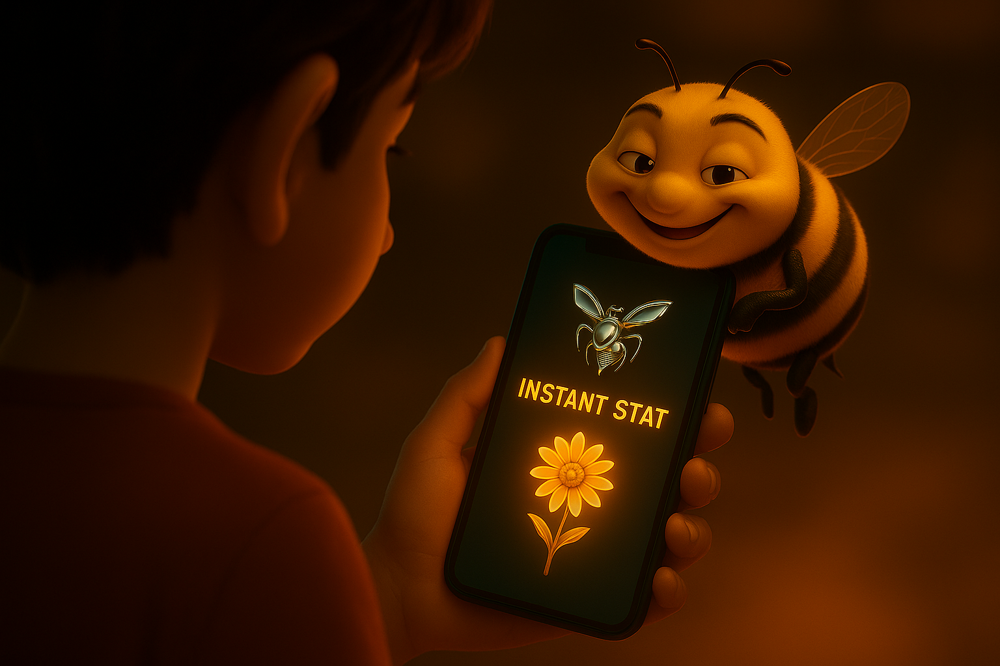
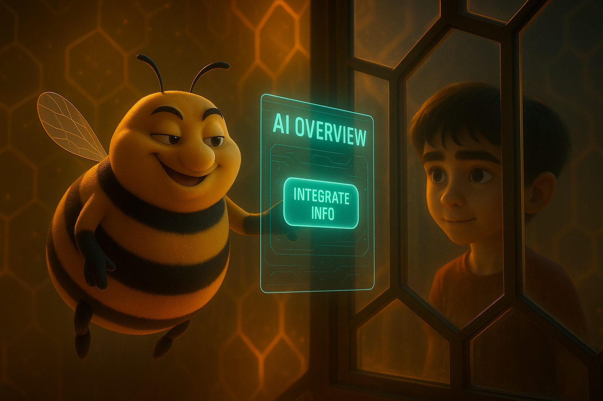
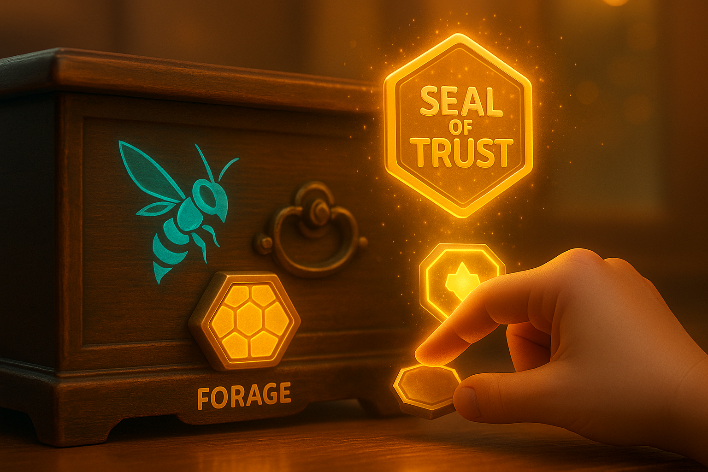
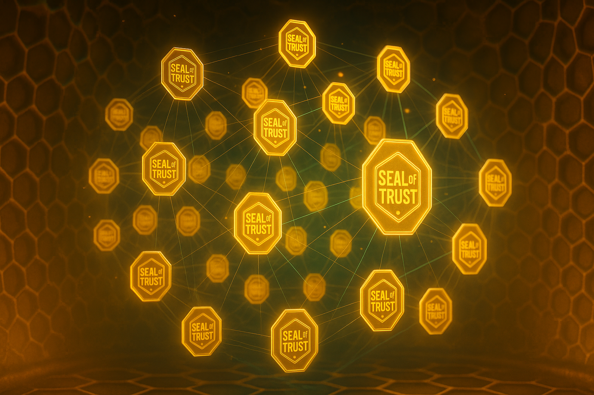
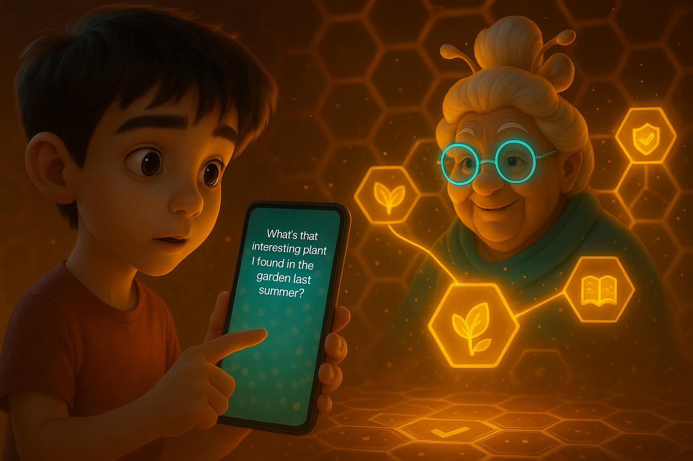
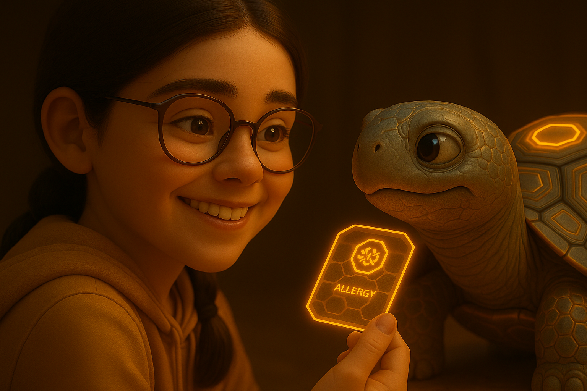

  

# Kikko's Saga Forge

  

**"Forge your knowledge. Grow your saga. Battle for truth."**

---

### **1. The Vision: Your Memory is a Living Saga**

We live in an ocean of information, facing a silent epidemic of **assisted digital amnesia**. Every day, fragments of our lives—an idea, a name, a place, an emotion—pass through our minds, only to fade away. `Kikko's Saga Forge` was born from a simple question: what if our most personal device could help us forge these fragments into an augmented memory that is not just a database, but a living, growing, and proactive companion?

With Kikko, you are not a user; you are a **Butineur**, entrusted with a **Kikkō Guardian**, a magical digital turtle. Your mission is to explore the world, gather "pollen" (raw information), and bring it to your **Kikko Hive**, your private on-device AI workshop. There, your AI companions will forge this pollen into "Informative Honey," the very food that nourishes your turtle, making it grow and evolve. Your saga is written on its shell.

* [**Document 01: The Personal Hive Manifesto**](./doc/doc01.md)

| Introduction | Action | Conclusion |
| :---: | :---: | :---: |
|  |  |  |
| **1.1 The Fading Echo:** Our hero, Hiro, experiences the universal frustration of a fleeting memory. | **1.2 The Beginning of a Saga:** He receives his personal Kikkō Guardian, the vessel for his future knowledge. | **1.3 The Forge Awakens:** His personal AI Hive and its proactive artisans awaken, ready to help him nourish his Guardian. |

---

### **2. The Gameplay: The Cycle of Knowledge**

The core gameplay is a virtuous and satisfying cycle: **Explorer -> Capturer -> Forger -> Nourrir -> Défier.**

* **Explorer le Monde (Analyse en Temps Réel):** Pointez la caméra de votre téléphone vers le monde. Votre Ruche est constamment active. Une multitude d'**Abeilles IA (toute la suite ML Kit)** analysent le flux vidéo en temps réel pour détecter des objets, reconnaître du texte, identifier la langue, etc. Des informations et des suggestions apparaissent en surimpression sur votre écran, enrichissant votre perception du monde.

* **Capturer le "Pollen":** Lorsqu'un élément identifié par la Ruche vous intéresse, vous le "capturez" d'un simple clic. C'est cet échantillon précis de la réalité – l'image et les premières analyses des Abeilles – qui constitue votre "pollen".

* **Forger le "Miel Informatif":** La véritable forge se met en marche sur le pollen capturé.
    1.  Une **Abeille Détective** affine la localisation de l'objet d'intérêt.
    2.  Le **Butineur** confirme la cible et peut la nommer pour plus de précision (le "Raffinement Humain").
    3.  L'image de l'objet est soumise à un conseil d'**Abeilles Spécialistes** (des modèles de classification experts pour chaque deck).
    4.  Enfin, la **Reine IA (Gemma)** reçoit tous ces avis, raisonne sur ces informations, et génère la carte de connaissance finale, riche et structurée.

* **Nourrir votre Gardien:** Le "miel" que vous créez est la nourriture de votre Gardien Kikkō. Un miel pur, forgé par votre Ruche – avec une histoire traçable – le rend plus fort et sa carapace plus belle. Le "junk food" des IA externes ("les Frelons") offre moins de nutrition.

* **Défier dans l'Arène:** Les motifs hexagonaux sur la carapace de votre tortue sont vos **decks de cartes de connaissance**. Défiez vos amis à proximité via Bluetooth dans un "Choc des Sagas" ! **Après 4 rounds, le gagnant marque plus de points, mais les deux joueurs conservent les 8 cartes jouées**, enrichissant ainsi la saga de chacun.

* [**Document 02: The World of Kikko**](./doc/doc02.md)
* [**Document 03: The Core Gameplay Loop**](./doc/doc03.md)

| Introduction | Action | Conclusion |
| :---: | :---: | :---: |
|  |  |  |
| **2.1 La Quête:** La Ruche émet une quête critique pour Léa : butiner les ingrédients du gâteau pour produire du miel. | **2.2 Nourrir & Grandir:** Son Gardien mange le "Miel Informatif" fraîchement forgé, assimilant la connaissance et devenant plus fort. | **2.3 Le Choc des Sagas:** Dans l'Arène, la connaissance des joueurs est mise à l'épreuve dans un combat de cartes amical et mutuellement bénéfique. |

---

### **3. The Architecture of Trust: Your Truth is the Rule of the Game**

Dans l'Arène, la triche est impossible. Les statistiques de vos cartes sont soutenues par un **"Fil de Provenance"** indestructible.

* **100% Embarqué:** Votre Ruche, votre Gardien, vos souvenirs—tout est privé et sécurisé sur votre appareil.

* **Reproduction d'Inférence & Transparence Radicale:** Le "Fil de Provenance" est le livre de règles ultime.
    * **Miel de la Ruche:** Créé via notre partenariat Homme-IA, son processus de création est entièrement journalisé dans un fichier de provenance (`provenance.json`). Ce fichier stocke les modèles spécialistes utilisés, leurs scores de confiance, les prompts exacts envoyés à la Reine et ses réponses brutes. N'importe quelle autre Ruche Kikko peut utiliser ce journal pour **reproduire l'inférence** et vérifier cryptographiquement l'authenticité de la carte. Ce sont les cartes les plus fiables.
    * **Miel du Frelon:** Les informations provenant d'IA externes (via une recherche web) sont clairement identifiées. Leur "provenance" est la source HTML sauvegardée. Elles sont traçables, mais leur création n'est pas reproductible, ce qui en fait des "jokers" moins fiables durant les combats.

* **Arène P2P:** En utilisant des technologies comme **WebTorrent**, les joueurs peuvent s'affronter et échanger des cartes de manière décentralisée, complètement hors ligne et sans serveur central.

* [**Document 04: The Role of the AIs**](./doc/doc04.md)
* [**Document 05: The Hornet's Dilemma**](./doc/doc05.md)
* [**Document 06: The Thread of Provenance**](./doc/doc06.md)

| Introduction | Action | Conclusion |
| :---: | :---: | :---: |
|  |  |  |
| **3.1 La Tentation:** Le Frelon offre une statistique rapide et non vérifiée, une friandise "junk food" pour votre Gardien. | **3.2 Transparence de la Provenance:** La carte qui en résulte distingue clairement les stats de la Ruche, fiables et reproductibles, et celles du Frelon, traçables mais moins fiables. | **3.3 L'Arbitre Ultime:** La **Reproduction d'Inférence** agit comme un juge infaillible, assurant un jeu équitable et une confiance totale. |

---

### **4. A New Category: The Verifiable Knowledge RPG**

`Kikko's Saga Forge` crée un genre entièrement nouveau. C'est un **"RPG de Connaissance Vérifiable"** et un **"Tamagotchi de Life-Logging"**. Le but n'est pas seulement de gagner, mais de construire le Gardien le plus beau et le plus savant, un véritable reflet de la saga de votre propre vie. C'est un jeu où l'apprentissage, la curiosité et l'honnêteté sont les ultimes power-ups, et où la récompense finale est un compagnon IA proactif en qui vous pouvez vraiment avoir confiance.

* [**Document 07: The Augmented Memory**](./doc/doc07.md)
* [**Document 08: The Global Swarm**](./doc/doc08.md)
* [**Document 09: The Philosophy of Gifting**](./doc/doc09.md)
* [**Document 10: The Google Competition Synopsis**](./doc/doc10.md)

| Introduction | Action | Conclusion |
| :---: | :---: | :---: |
|  |  |  |
| **4.1 La Saga Vivante:** Avec le temps, le Gardien Kikkō devient une extension puissante et magnifique de la connaissance personnelle de l'utilisateur. | **4.2 L'Étincelle d'Intelligence:** Le Gardien n'est pas une simple collection ; sa connaissance assimilée et fiable permet à la Ruche de fournir une assistance proactive qui peut sauver des vies. | **4.3 Le Soi Augmenté:** L'état de "victoire" ultime du jeu est un compagnon qui vous comprend et vous protège, un témoignage de votre propre voyage de découverte. |