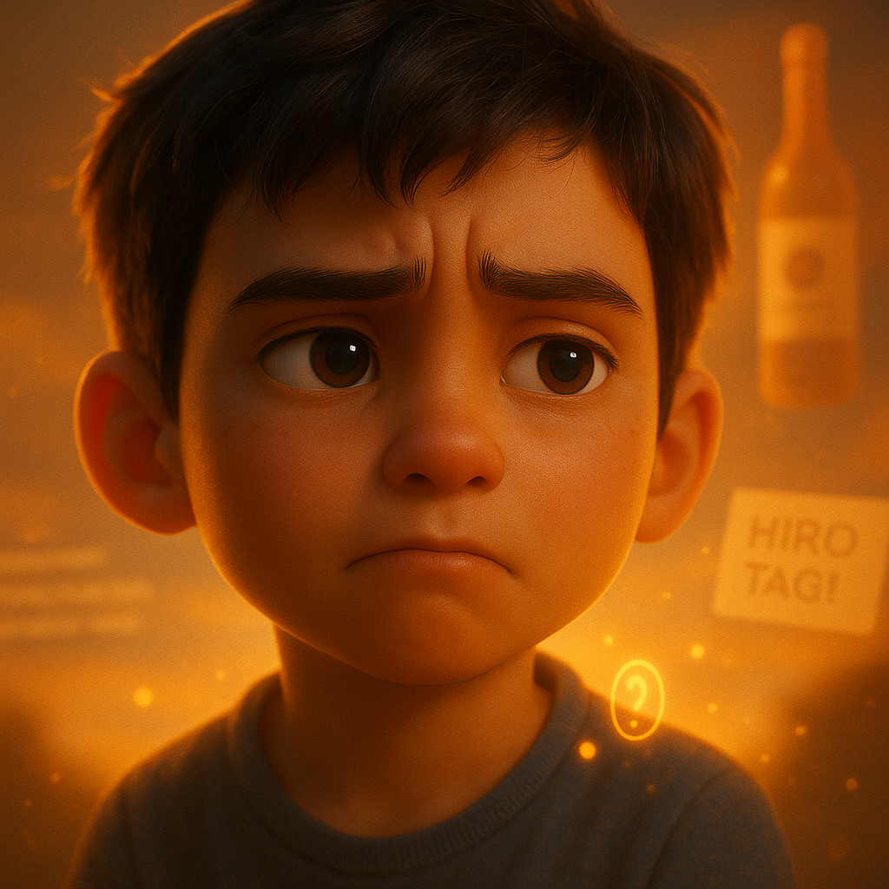
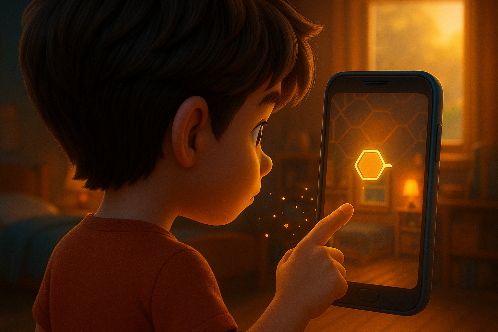
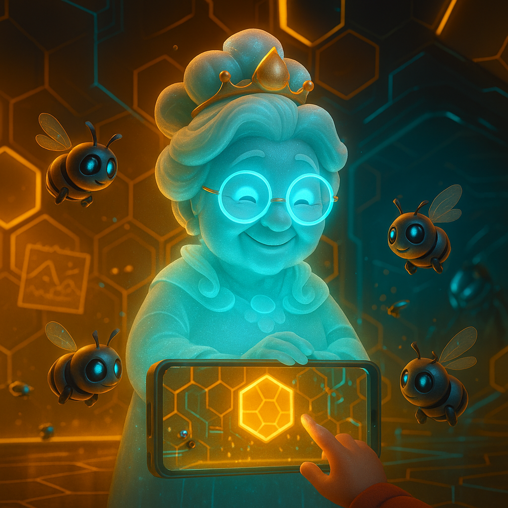
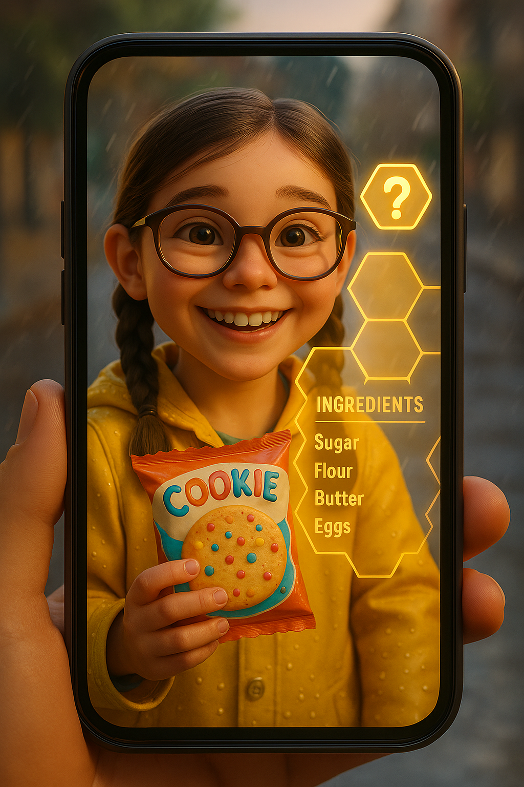
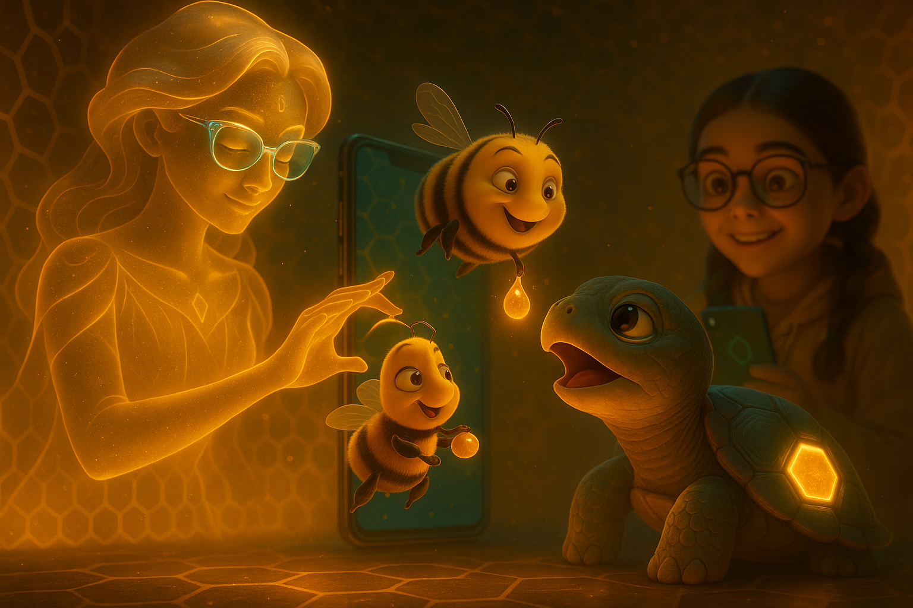
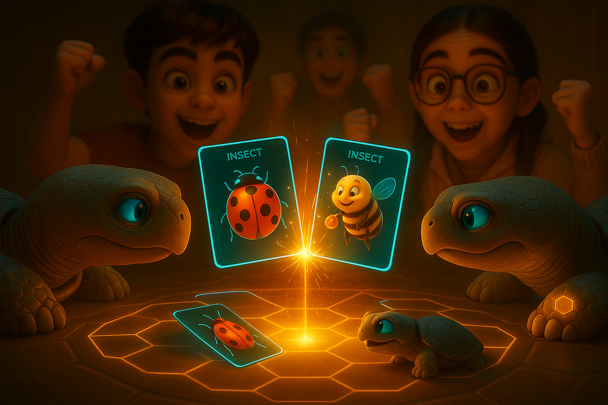

  

# Kikko's Saga Forge

  

**"Forgez votre savoir. Bâtissez votre saga. Luttez pour la vérité."**

---

### **1. La Vision : Une Réponse à la Crise de Confiance de l'IA**

Nous faisons face à une double crise numérique : **l'amnésie digitale assistée** et la **méfiance envers les IA "boîtes noires"**. `Kikko's Saga Forge` est notre réponse. Nous ne proposons pas une simple application, mais une nouvelle catégorie d'expérience conçue pour gagner le "Google - The Gemma 3n Impact Challenge" : le **"Jeu de Connaissance Vérifiable"**.

Avec Kikko, vous n'êtes pas un utilisateur ; vous êtes un **Butineur**. Votre mission : transformer des fragments du monde réel en une mémoire augmentée, privée et entièrement vérifiable. Pour cela, vous disposez d'une **Forge Locale** (votre "Ruche Kikko"), un atelier d'IA 100% embarqué sur votre appareil qui forge un "Miel Informatif" pour nourrir votre Gardien Kikkō, une tortue numérique dont la carapace est la toile de votre saga personnelle.

* [**Document 01: Le Manifeste de la Ruche Personnelle**](./doc/doc01.md)

| Introduction | Action | Conclusion |
| :---: | :---: | :---: |
|  |  |  |
| **1.1 L'Écho Fugace :** Notre héros, Hiro, fait l'expérience de la frustration universelle d'un souvenir qui s'efface. | **1.2 Le Début d'une Saga :** Il reçoit son Gardien Kikkō personnel, le réceptacle de son futur savoir. | **1.3 L'Éveil de la Forge :** Sa Ruche IA personnelle et ses artisans proactifs s'éveillent, prêts à l'aider à nourrir son Gardien. |

---

### **2. Le Gameplay : Forger un Savoir de Qualité Compétition**

Le cœur du jeu est un cycle vertueux qui met en valeur notre architecture unique : **Explorer -> Capturer -> Forger -> Nourrir -> Défier.**

* **Explorer (Analyse Spécialiste en Direct) :** Pointez votre caméra sur le monde. Nos **Abeilles Spécialistes** (des modèles TFLite optimisés et embarqués pour les Plantes, Animaux, etc.) analysent le flux en temps réel, transformant votre appareil en une lentille de connaissance instantanée.
* **Capturer le "Pollen" :** D'un simple clic, vous capturez un paquet de données riche : l'image et, surtout, l'**avis de l'expert** (`label: 'pissenlit', confidence: 0.89`). Ce "pollen" de haute qualité est la matière première idéale pour le fine-tuning de modèles futurs.
* **Forger le "Miel Informatif" :** Le pollen est envoyé à la **Reine IA (Gemma)**. C'est un véritable **partenariat Homme-IA** : la Reine peut vous demander de raffiner l'identification (ex: "Est-ce une pomme *Golden Delicious* ?"), transformant votre validation en "ground truth" pour la forge. Elle génère ensuite la carte de connaissance finale (description, stats, quiz).
* **Nourrir votre Gardien :** Le Miel que vous créez est la nourriture de votre Gardien Kikkō. Un Miel pur, forgé dans votre Ruche, avec une histoire reproductible, le fait grandir.
* **Défier dans l'Arène :** Les motifs sur la carapace de votre tortue sont vos jeux de cartes. Défiez vos amis en local (Bluetooth) dans un "Choc des Sagas" ! À la fin, les deux joueurs gardent toutes les cartes jouées, enrichissant la saga de chacun dans un esprit de partage.

* [**Document 02: Le Monde de Kikko**](./doc/doc02.md)
* [**Document 03: La Boucle de Gameplay Principale**](./doc/doc03.md)

| Introduction | Action | Conclusion |
| :---: | :---: | :---: |
|  |  |  |
| **2.1 La Quête :** La Ruche assigne une quête critique à Léa : butiner les ingrédients d'un biscuit pour produire du Miel. | **2.2 Nourrir & Grandir :** Son Gardien mange le "Miel Informatif" fraîchement forgé, assimilant le savoir et devenant plus fort. | **2.3 Le Choc des Sagas :** Dans l'Arène, le savoir des joueurs est mis à l'épreuve dans un combat de cartes amical et mutuellement bénéfique. |

---

### **3. L'Architecture de la Confiance : Notre Avantage Compétitif**

Notre projet est une démonstration technique conçue pour impressionner : **chaque inférence est reproductible**.

* **100% Embarqué :** Votre Ruche, votre Gardien, vos souvenirs — tout est privé et sécurisé sur votre appareil.
* **Reproduction d'Inférence & Transparence Radicale :** C'est notre innovation