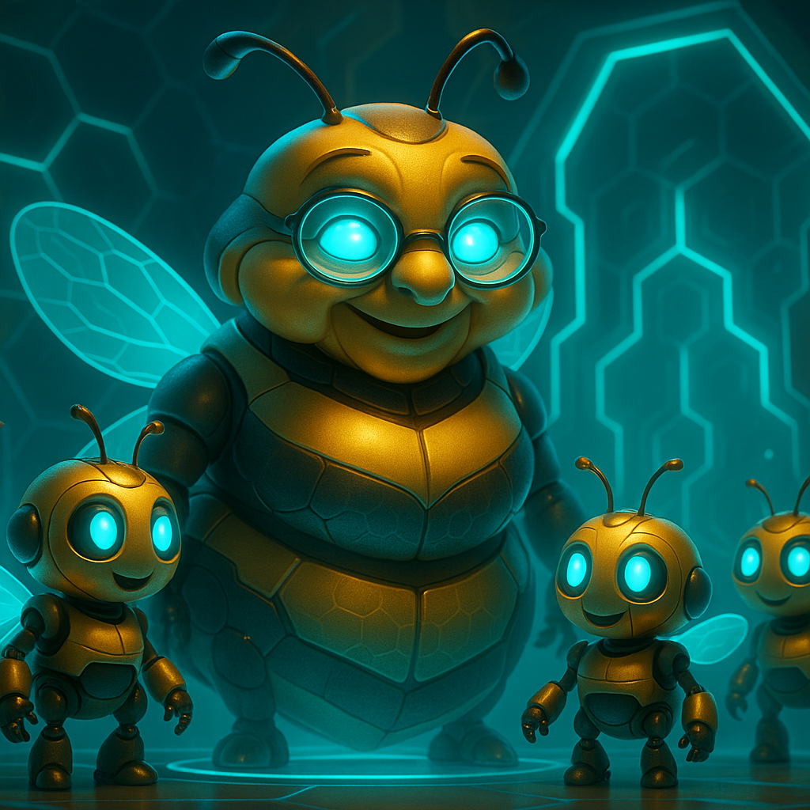
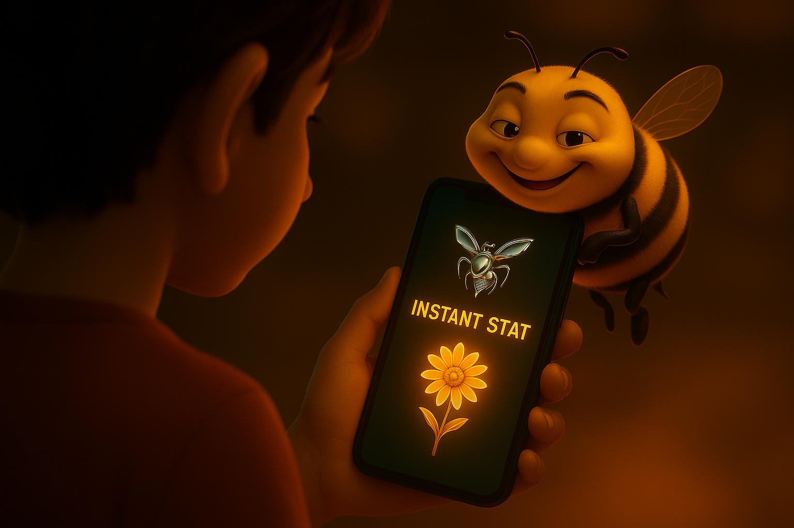

# Kikko's Saga Forge

  

**"Forge your knowledge. Grow your saga. Battle for truth."**

---

### **1. The Vision: Your Memory is a Living Saga**

We live in an ocean of information. Every day, fragments of our lives—an idea, a name, a place, an emotion—pass through our minds, only to often fade away. `Kikko's Saga Forge` was born from a simple question: what if our most personal device could help us forge these fragments into an augmented memory that is not just a database, but a living, growing, and playful companion?

With Kikko, you are not a user; you are a **Forager**, and you are entrusted with a **Kikkō Guardian**, a magical digital turtle. Your mission is to explore the world, gather "pollen" (information), and bring it to your **Kikko Hive**, an on-device AI workshop. There, your AI companions will forge this pollen into "Informative Honey," the very food that nourishes your turtle, making it grow and evolve. Your saga is written on its shell.

*   [**Document 01: The Personal Hive Manifesto**](./doc/doc01.md)

| Introduction | Action | Conclusion |
| :---: | :---: | :---: |
|  |  |  |
| **1.1 The Fading Echo:** Our hero, Hiro, experiences the universal frustration of a fleeting memory. | **1.2 The Beginning of a Saga:** He receives his personal Kikkō Guardian, the vessel for his future knowledge. | **1.3 The Forge Awakens:** His personal AI Hive and its artisans awaken, ready to help him nourish his Guardian. |

---

### **2. The Gameplay: The Cycle of Knowledge**

The core gameplay is a virtuous and satisfying cycle: **Forage -> Forge -> Feed -> Battle.**

*   **Forage for "Pollen":** Explore your world and capture raw information. For **Hiro**, it's a photo of a ladybug. For **Léa**, who has allergies, it's a scan of a cookie's ingredients.
*   **Forge "Informative Honey":** Your on-device **AI Queen (Gemma)** and **Worker Bees (ML Kit)** process this pollen. Through a fun, interactive dialogue managed by the **Bourdon**, they forge structured, verifiable "Informative Honey."
*   **Feed your Guardian:** The "honey" you create is the food for your Kikkō Guardian. Pure, Hive-forged honey makes it grow strong and its shell more beautiful. "Junk food" honey from external AIs (the "Hornets") offers less nutrition, stunting its growth.
*   **Battle in the "Arena":** The hexagonal patterns on your turtle's shell are your **decks of knowledge cards**. Challenge friends nearby via Bluetooth to a "Saga Clash"! Your turtles' shells transform into a battle arena where you compare stats. **After 4 rounds, the winner gets more points, but both players get to keep all 8 cards played**, enriching everyone's saga.

*   [**Document 02: The World of Kikko**](./doc/doc02.md)
*   [**Document 03: The Core Gameplay Loop**](./doc/doc03.md)

| Introduction | Action | Conclusion |
| :---: | :---: | :---: |
|  |  |  |
| **2.1 The Quest:** The Hive issues a critical quest for Léa: foraging the cookie's ingredients to produce honey. | **2.2 Feed & Grow:** Her Guardian eats the freshly forged "Informative Honey," assimilating the knowledge and growing stronger. | **2.3 The Saga Clash:** In the Arena, players' knowledge is put to the test in a friendly, mutually beneficial battle of cards. |

---

### **3. The Architecture of Trust: Your Truth is the Rule of the Game**

In the Arena, you can't cheat. The stats on your cards are backed by an unbreakable **"Thread of Provenance"**.

*   **100% On-Device:** Your Hive, your Guardian, your memories—everything is private and secure on your device.
*   **Dual Provenance & Inference Reproduction:** The "Thread of Provenance" is the ultimate rulebook.
    *   **Hive-Forged Stats:** These are created by your Hive and validated by you. Any other player's Hive can **reproduce the inference** to verify their authenticity. These are the strongest stats for battle.
    *   **Hornet-Sourced Stats:** Information from external AIs is clearly tagged. Its "provenance" is the saved HTML source. It's traceable, but not reproducible, making it a "wild card" in battles.
*   **P2P Arena:** Using **Google's Nearby Connections API**, players can discover each other and launch a battle via Bluetooth, completely offline and without a central server.

*   [**Document 04: The Role of the AIs**](./doc/doc04.md)
*   [**Document 05: The Hornet's Dilemma**](./doc/doc05.md)
*   [**Document 06: The Thread of Provenance**](./doc/doc06.md)

| Introduction | Action | Conclusion |
| :---: | :---: | :---: |
|  |  |  |
| **3.1 The Temptation:** The Hornet offers a quick, unverified stat, a "junk food" treat for your Guardian. | **3.2 Transparent Provenance:** The resulting card clearly distinguishes between trusted, reproducible Hive stats and traceable, but less reliable, Hornet stats. | **3.3 The Ultimate Referee:** Inference Reproduction acts as the infallible judge, ensuring fair play and complete trust in the game. |

---

### **4. A New Category: The Verifiable Knowledge RPG**

`Kikko's Saga Forge` creates an entirely new genre. It's a **"Verifiable Knowledge RPG"** and a **"Life-Logging Tamagotchi."** The goal isn't just to win, but to build the most beautiful and knowledgeable Guardian, a true reflection of your own life's saga. It's a game where learning, curiosity, and honesty are the ultimate power-ups.

*   [**Document 07: The Augmented Memory**](./doc/doc07.md)
*   [**Document 08: The Global Swarm**](./doc/doc08.md)
*   [**Document 09: The Philosophy of Gifting**](./doc/doc09.md)
*   [**Document 10: The Google Competition Synopsis**](./doc/doc10.md)

| Introduction | Action | Conclusion |
| :---: | :---: | :---: |
|  |  |  |
| **4.1 The Living Saga:** Over time, the Kikkō Guardian becomes a powerful and beautiful extension of the user's personal knowledge. | **4.2 The Spark of Insight:** The Guardian is not just a collection; its assimilated knowledge allows the Hive to provide proactive, life-saving assistance. | **4.3 The Augmented Self:** The ultimate "win state" of the game is a companion that understands and protects you, a testament to your own journey of discovery. |