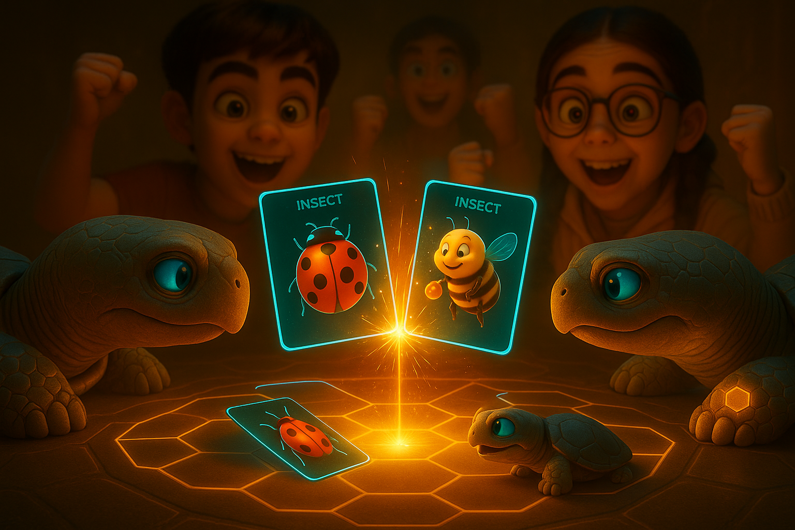
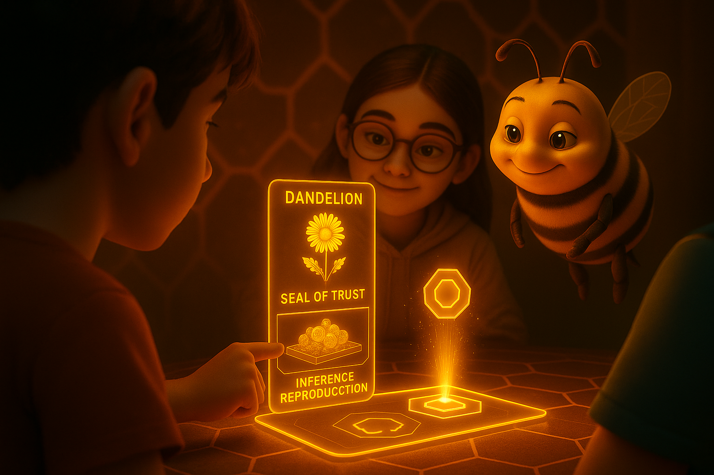
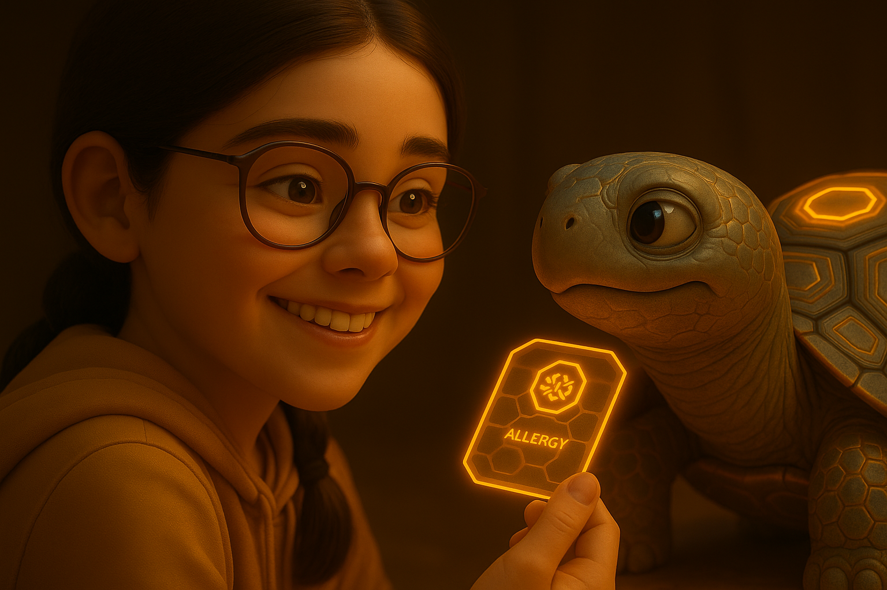

# Kikko: Your Personal Memory Hive

  

**"Explore your world. Weave your memory."**

---

### **1. The Vision: What If Your Memory Had a Companion?**

We live in an ocean of information. Every day, fragments of our lives—an idea, a name, a place, an emotion—pass through our minds, only to often fade away. Kikko was born from a simple question: what if our most personal device could help us weave these fragments into an augmented memory that is private, intelligent, and truly our own?

Kikko is not another note-taking app. It is a **Personal AI Hive**, a living companion that resides entirely on your device. Its sole purpose is to help you capture, understand, and recall the information that genuinely matters **to you**. We are transforming the arduous task of data structuring into a game of exploration. You are no longer a user; you are a **Forager**. Your world is your playground, and every piece of information you capture is precious "pollen" that nourishes your personal Hive.

*   [**Document 01: The Personal Hive Manifesto**](./doc/doc01.md)

| Introduction | Action | Conclusion |
| :---: | :---: | :---: |
|  |  |  |
| **1.1 The Fading Echo:** Our hero, Hiro, tries to recall a detail from his day, illustrating the universal frustration of a fleeting memory. | **1.2 The Invitation:** He opens Kikko. The Hive isn't an app; it's a window that invites him not to work, but to play, to explore. | **1.3 The Awakening:** As Hiro connects, his personal AI Queen awakens inside the Hive, ready to assist her Forager. |

---

### **2. The Gameplay: The Joy of Foraging**

At the heart of Kikko is a constant, playful dialogue between you, the Forager, and your AI Queen. The core gameplay loop is a satisfying cycle of **Quest -> Forage -> Process -> Reward.**

*   **Pollen Quests:** Your Queen sends you on quests to gather **pure "pollen"**—visual, auditory, or contextual information directly from your world. For our hero **Hiro**, it might be identifying a ladybug in his garden. For our heroine **Léa**, who has multiple allergies, it's a critical scan of a cookie's ingredients list.
*   **The Bourdon's Distraction:** At times, the mischievous **Bourdon** may pop up, offering "pre-packaged" insights from external cloud AIs (the "Hornet's Pollen") as a shortcut. He'll present a tempting offer, complete with **streaming information and even a quiz**, challenging you to choose between convenience and authentic discovery. You can choose to integrate this information, which will be clearly marked as coming from an external, non-reproducible source.
*   **The Alchemy of Honey:** Inside your Hive, specialized **Worker Bees (ML Kit)** process the pure pollen. Your **AI Queen (Gemma)** then turns this raw material into **"Informative Honey"**. Crucially, the Queen engages you in **interactive questions** to add human context and validate the refined knowledge.
*   **The Path of Discovery:** The reward is a beautiful, browsable **"Microsite"** for each memory, filled with trusted knowledge, viewable in multiple languages.

*   [**Document 02: The World of Kikko - The UI as a Window**](./doc/doc02.md)
*   [**Document 03: A Forager's Life - The Core Gameplay Loop**](./doc/doc03.md)

| Introduction | Action | Conclusion |
| :---: | :---: | :---: |
|  |  |  |
| **2.1 The Quest:** The Queen issues a critical quest for Léa: verifying the ingredients of a new food item. | **2.2 The Foraging:** Léa captures the ingredients list. The raw, uncorrupted information is collected as beautiful, glowing "pollen." | **2.3 The Reward:** The Hive processes the pure pollen, fills a knowledge cell with "honey," and rewards Léa for her diligent foraging with a clear, life-saving result. |

---

### **3. The Architecture of Trust: Your Truth in an Age of AI**

In an age of powerful cloud AIs offering instant answers, a new question arises: **Can we trust an answer if we don't know its story?** Kikko is built on a foundation of absolute trust and transparency.

*   **100% On-Device:** Everything resides on your device. Your pure pollen, your honey, and the AI models. Your personal Hive is a digital sanctuary.
*   **Dual Provenance & Inference Reproduction:** Every piece of "honey" is bundled with its own verifiable history, the **"Thread of Provenance"**.
    *   **Hive-Forged Data:** For data processed by your Hive, the Thread contains a complete log, allowing any other Kikko Hive to **reproduce the inference** from the original pollen, ensuring its authenticity.
    *   **Hornet-Sourced Data:** For integrated AI Overviews, the Thread contains the raw HTML source, providing clear attribution and traceability, though its original generation process is not reproducible by your Hive.
*   **The Hornet's Dilemma:** Kikko presents the user with a choice. The Bourdon delivers an offer from a **"Hornet"** (external AI). You can choose to integrate this information, which will be transparently tagged as non-reproducible, or forge your own, verifiable truth with the Hive for maximum trust.

*   [**Document 04: The Alchemy of Honey - The Role of the AIs**](./doc/doc04.md)
*   [**Document 05: The Hornet's Dilemma - The Temptation of Opaque Knowledge**](./doc/doc05.md)
*   [**Document 06: The Thread of Provenance - The Seal of Trust**](./doc/doc06.md)

| Introduction | Action | Conclusion |
| :---: | :---: | :---: |
|  |  |  |
| **3.1 The Temptation:** A Hornet offers a quick, instant answer from the cloud, delivered by the smug Bourdon, lacking a reproducible origin. | **3.2 The Choice:** The Bourdon presents the opaque knowledge. Hiro must choose between quick integration and the rewarding effort of personal discovery for maximum trust. | **3.3 The Sovereign Reward:** Hiro chooses to forage. His self-forged "honey" is marked with an unbreakable Seal of Trust, a symbol of authentic, verifiable knowledge that is truly his. |

---

### **4. A New Category: The Personal Knowledge Game**

Kikko is not a "Pokémon GO killer"; it aims to create an entirely new genre. It's a **"Personal Knowledge Game"** or a **"Life-Logging RPG."** The goal isn't to complete a universal Pokedex, but to build a unique knowledge graph of your own life, composed of information with transparent and verifiable provenance. The "level-up" is not a virtual statistic, but a richer memory, clearer connections, and a more profound understanding of your own personal journey.

*   [**Document 07: The Augmented Memory - Long-Term Utility**](./doc/doc07.md)
*   [**Document 08: The Global Swarm - Decentralized Sharing & Community**](./doc/doc08.md)
*   [**Document 09: The Philosophy of Gifting - A Non-Commercial Vision**](./doc/doc09.md)
*   [**Document 10: The Google Competition Synopsis & Pitch**](./doc/doc10.md)

| Introduction | Action | Conclusion |
| :---: | :---: | :---: |
|  |  |  |
| **4.1 The Living Library:** Over time, Léa's Hive becomes a complex, living map of her dietary world, built from transparently sourced knowledge. | **4.2 The Spark of Insight:** The AI Queen actively navigates this knowledge map, identifying patterns and connections to proactively protect her Forager. | **4.3 The Augmented Self:** The Hive's true power is revealed: it uses its trusted insights to provide timely, personalized, and genuinely life-saving assistance. |