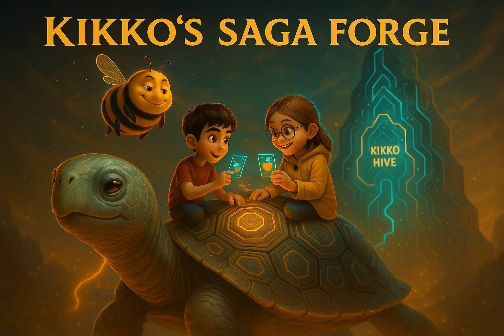
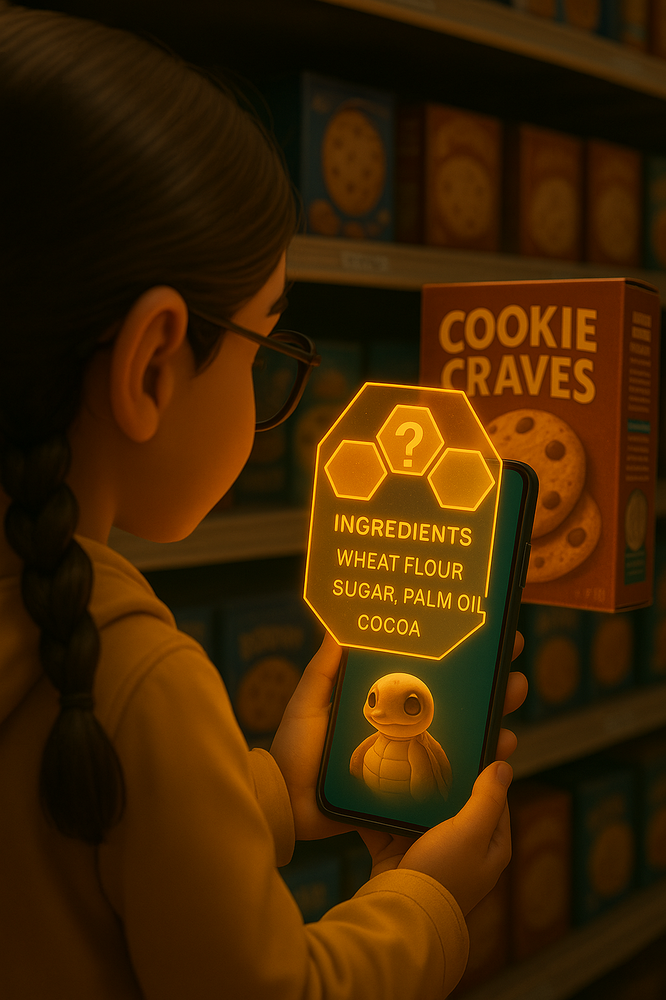

# Kikko: Your Personal Memory Hive

  

**"Explore your world. Weave your memory."**

---

### **1. The Vision: What If Your Memory Had a Companion?**

We live in an ocean of information. Every day, fragments of our lives—an idea, a name, a place, an emotion—pass through our minds, only to often fade away. Kikko was born from a simple question: what if our most personal device could help us weave these fragments into an augmented memory that is private, intelligent, and truly our own?

Kikko is not another note-taking app. It is a **Personal AI Hive**, a living companion that resides entirely on your device. Its sole purpose is to help you capture, understand, and recall the information that genuinely matters **to you**.

We are transforming the arduous task of data structuring into a game of exploration. You are no longer a user; you are a **Forager**. Your world is your playground, and every piece of information you capture is precious "pollen" that nourishes your personal Hive.

*   [**Document 01: The Personal Hive Manifesto**](./doc/doc01.md)

| Introduction | Action | Conclusion |
| :---: | :---: | :---: |
|  |  |  |
| **1.1 The Fading Echo:** Hiro, our hero, tries to recall a detail from his day, illustrating the universal frustration of a fleeting memory. | **1.2 The Invitation:** He opens Kikko. The Hive isn't an app; it's a window. It invites him not to work, but to play, to explore. | **1.3 The Awakening:** As Hiro connects, his personal AI Queen awakens inside the Hive, ready to assist her Forager. |

---

### **2. The Gameplay: The Joy of Foraging**

At the heart of Kikko is a constant, playful dialogue between you, the Forager, and your AI Queen.

*   **Pollen Quests:** Your Queen is driven by a "thirst for knowledge" to better understand your world. She sends you on quests to gather "pollen":
    *   **Visual Pollen:** Snap a photo of a book, a product label, a work of art.
    *   **Auditory Pollen:** Dictate a voice note, record a meaningful sound.
    *   **Contextual Pollen:** Scan a barcode, capture your location.
*   **The Alchemy of Honey:** Inside your Hive, specialized **Worker Bees (ML Kit)** process the pollen. Your **AI Queen (Gemma)** then performs her magic, turning this raw material into **"Informative Honey"**: perfectly structured, interconnected, and meaningful data.
*   **The Path of Discovery:** Fill your knowledge honeycombs, earn "Honey Points," and unlock badges that celebrate your journey of discovery.

*   [**Document 02: The World of Kikko - The UI as a Window**](./doc/doc02.md)
*   [**Document 03: A Forager's Life - The Core Gameplay Loop**](./doc/doc03.md)

| Introduction | Action | Conclusion |
| :---: | :---: | :---: |
|  |  |  |
| **2.1 The Quest:** The Queen issues a quest, visually highlighting an object in Hiro's world. | **2.2 The Foraging:** Hiro captures the object. The raw information is collected as beautiful, glowing "pollen." | **2.3 The Reward:** The Hive processes the pollen, fills a knowledge cell with "honey," and rewards Hiro, making learning feel like an achievement. |

---

### **3. The Architecture of Trust**

Trust is the foundation of Kikko. Your memory is precious, and it must remain yours.

*   **100% On-Device:** Everything resides on your device. Your pollen, your honey, and the AI models that process them. Your personal Hive is a digital sanctuary, never uploaded to a central cloud.
*   **The Thread of Provenance:** Every piece of "honey" is bundled with its own verifiable history. You can, at any time, see exactly which pollen was used and how your AI Queen reasoned to create the data. This is our seal of trust against opaque algorithms.
*   **Decentralized & Consensual Sharing:** If you choose to share knowledge, you share the entire "honey pot"—the structured data and its proof of origin. Sharing is peer-to-peer (via **WebTorrent**), from one Hive to another, fostering a sovereign and resilient community.

*   [**Document 04: The Alchemy of Honey - The Role of the AIs**](./doc/doc04.md)
*   [**Document 06: The Thread of Provenance - The Seal of Trust**](./doc/doc06.md)
*   [**Document 08: The Global Swarm - Decentralized Sharing & Community**](./doc/doc08.md)

| Introduction | Action | Conclusion |
| :---: | :---: | :---: |
|  |  |  |
| **3.1 The Seal:** Every piece of structured data created by the Hive is marked with a "Seal of Provenance." | **3.2 The Unveiling:** The user can inspect this seal at any time to see the "Thread of Provenance"—the complete, transparent history of how the data was generated. | **3.3 The Trusted Share:** When sharing, this entire trusted package is sent, ensuring the recipient can verify its authenticity. |

---

### **4. A New Category: The Personal Knowledge Game**

Kikko is not a "Pokémon GO killer"; it aims to create an entirely new genre. It's a **"Personal Knowledge Game"** or a **"Life-Logging RPG"**.

The goal isn't to complete a universal Pokedex, but to build a unique knowledge graph of your own life. The "level-up" is not a virtual statistic, but a richer memory, clearer connections, and a more profound understanding of your own personal journey.

*   [**Document 07: The Augmented Memory - Long-Term Utility**](./doc/doc07.md)
*   [**Document 09: The Economics of Trust - Ethical Monetization**](./doc/doc09.md)
*   [**Document 10: The Google Competition Synopsis & Pitch**](./doc/doc10.md)

This project leverages Google's on-device AI power (**Gemma** and **ML Kit**) to create a truly private, powerful, and personal experience, redefining the relationship between a user, their data, and their device.