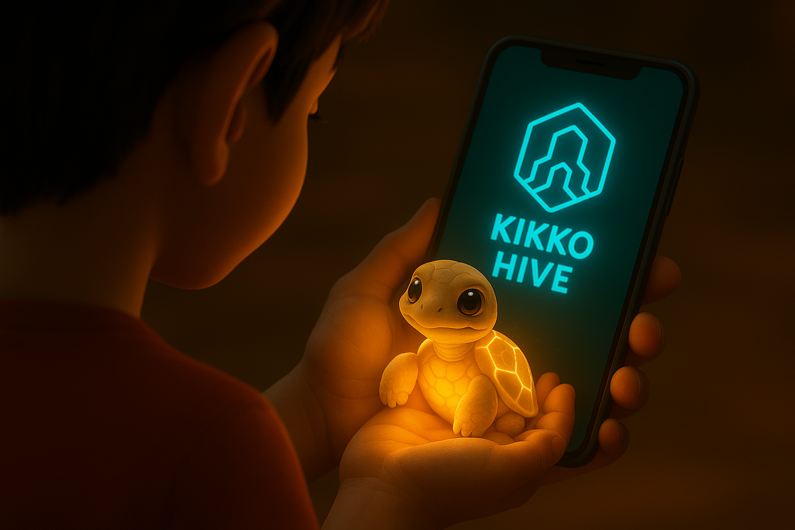
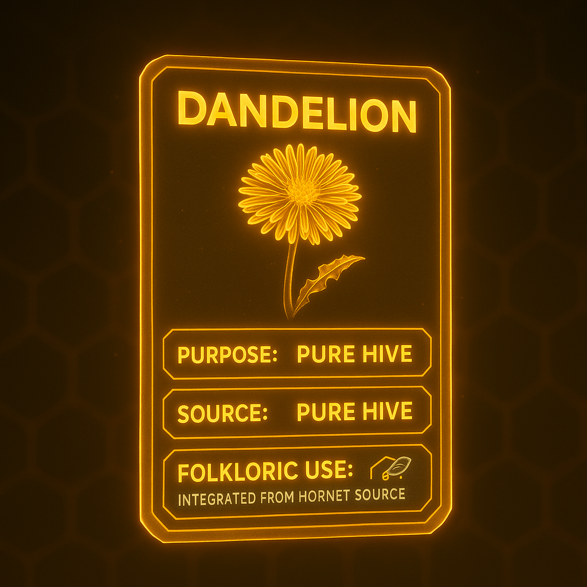
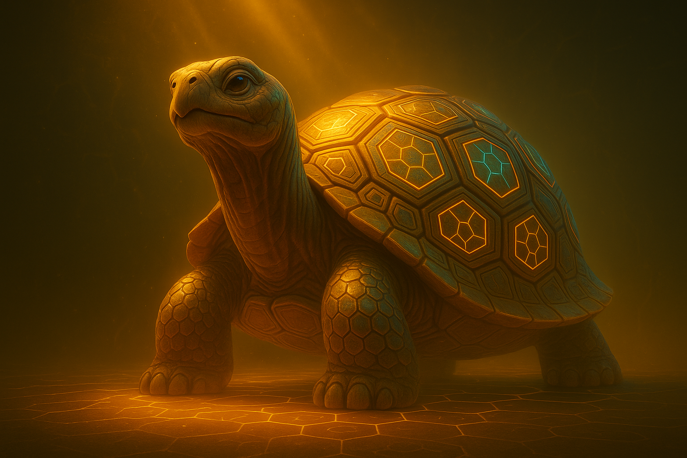

# Kikko: Your Personal Memory Hive

  

**"Explore your world. Weave your memory."**

---

### **1. The Vision: What If Your Memory Had a Companion?**

We live in an ocean of information. Every day, fragments of our lives—an idea, a name, a place, an emotion—pass through our minds, only to often fade away. Kikko was born from a simple question: what if our most personal device could help us weave these fragments into an augmented memory that is private, intelligent, and truly our own?

Kikko is not another note-taking app. It is a **Personal AI Hive**, a living companion that resides entirely on your device. Its sole purpose is to help you capture, understand, and recall the information that genuinely matters **to you**. We are transforming the arduous task of data structuring into a game of exploration. You are no longer a user; you are a **Forager**. Your world is your playground, and every piece of information you capture is precious "pollen" that nourishes your personal Hive.

*   [**Document 01: The Personal Hive Manifesto**](./doc/doc01.md)

| Introduction | Action | Conclusion |
| :---: | :---: | :---: |
|  |  |  |
| **1.1 The Fading Echo:** Our hero, Hiro, tries to recall a detail from his day, illustrating the universal frustration of a fleeting memory. | **1.2 The Invitation:** He opens Kikko. The Hive isn't an app; it's a window that invites him not to work, but to play, to explore. | **1.3 The Awakening:** As Hiro connects, his personal AI Queen awakens inside the Hive, ready to assist her Forager. |

---

### **2. The Gameplay: The Joy of Foraging**

At the heart of Kikko is a constant, playful dialogue between you, the Forager, and your AI Queen. The core gameplay loop is a satisfying cycle of **Quest -> Forage -> Process -> Reward.**

*   **Pollen Quests:** Your Queen sends you on quests to gather **pure "pollen"**—visual, auditory, or contextual information directly from your world.
*   **The Bourdon's Distraction:** At times, the mischievous **Bourdon** may pop up, offering "pre-packaged" insights from external cloud AIs (like Google's AI Overviews) as a shortcut. He'll offer quick answers to make you "wait" for the real work.
*   **The Alchemist's Discernment:** The AI Queen guides you to discern pure pollen from corrupted data, ensuring the integrity of your memory.
*   **The Alchemy of Honey:** Inside your Hive, specialized **Worker Bees (ML Kit)** process the pure pollen. Your **AI Queen (Gemma)** then turns this raw material into **"Informative Honey"**: perfectly structured, interconnected, and meaningful data.
*   **The Path of Discovery:** Fill your knowledge honeycombs, earn "Honey Points," and unlock badges that celebrate your journey of pure data collection and understanding.

*   [**Document 02: The World of Kikko - The UI as a Window**](./doc/doc02.md)
*   [**Document 03: A Forager's Life - The Core Gameplay Loop**](./doc/doc03.md)

| Introduction | Action | Conclusion |
| :---: | :---: | :---: |
|  |  |  |
| **2.1 The Quest:** The Queen issues a quest, visually highlighting an object in Hiro's world. | **2.2 The Foraging:** Hiro captures the object. The raw, uncorrupted information is collected as beautiful, glowing "pollen." | **2.3 The Reward:** The Hive processes the pure pollen, fills a knowledge cell with "honey," and rewards Hiro for his accurate foraging. |

---

### **3. The Architecture of Trust: Your Truth in an Age of AI**

In an age of powerful cloud AIs offering instant answers, a new question arises: **Can we trust an answer if we don't know its story?** Kikko is built on a foundation of absolute trust and transparency. Your memory is your truth, and you should always be able to verify it.

*   **100% On-Device:** Everything resides on your device. Your pure pollen, your honey, and the AI models. Your personal Hive is a digital sanctuary, never uploaded to a central cloud.
*   **The Thread of Provenance:** Every piece of "honey" is bundled with its own verifiable history, a "Seal of Trust" that tells the story of its creation—from your photo to the Queen's reasoning. This seal is only granted to pure honey.
*   **The Hornet's Dilemma:** Kikko presents the user with a choice. A **"Hornet"** (representing external, opaque cloud AI like Google's AI Overview) might offer a pre-packaged answer. The Bourdon will deliver this offer, asking Hiro if he prefers the quick, opaque answer or the effort of forging his own, verifiable truth.

*   [**Document 04: The Alchemy of Honey - The Role of the AIs**](./doc/doc04.md)
*   [**Document 05: The Hornet's Dilemma - The Temptation of Opaque Knowledge**](./doc/doc05.md)
*   [**Document 06: The Thread of Provenance - The Seal of Trust**](./doc/doc06.md)

| Introduction | Action | Conclusion |
| :---: | :---: | :---: |
|  |  |  |
| **3.1 The Temptation:** A Hornet offers a quick, instant answer from the cloud, delivered by the smug Bourdon, lacking a verifiable origin. | **3.2 The Choice:** The Bourdon presents the opaque knowledge. Hiro must choose between the easy path and the rewarding effort of personal discovery. | **3.3 The Sovereign Reward:** Hiro chooses to forage. His self-foraged "honey" is marked with an unbreakable Seal of Trust, a symbol of authentic, verifiable knowledge that is truly his. |

---

### **4. A New Category: The Personal Knowledge Game**

Kikko is not a "Pokémon GO killer"; it aims to create an entirely new genre. It's a **"Personal Knowledge Game"** or a **"Life-Logging RPG."** The goal isn't to complete a universal Pokedex, but to build a unique knowledge graph of your own life, composed entirely of verifiable information. The "level-up" is not a virtual statistic, but a richer memory, clearer connections, and a more profound understanding of your own personal journey.

This project leverages Google's on-device AI power (**Gemma** and **ML Kit**) to create a truly private, powerful, and personal experience, redefining the relationship between a user, their data, and their device.

*   [**Document 07: The Augmented Memory - Long-Term Utility**](./doc/doc07.md)
*   [**Document 08: The Global Swarm - Decentralized Sharing & Community**](./doc/doc08.md)
*   [**Document 09: The Philosophy of Gifting - A Non-Commercial Vision**](./doc/doc09.md)
*   [**Document 10: The Google Competition Synopsis & Pitch**](./doc/doc10.md)

| Introduction | Action | Conclusion |
| :---: | :---: | :---: |
|  |  |  |
| **4.1 The Living Library:** Over time, Hiro's Hive becomes a complex, living map of his life and interests, built from pure knowledge. | **4.2 The Spark of Insight:** The AI Queen actively navigates this pure knowledge map, identifying patterns and connections that Hiro himself may not have realized. | **4.3 The Augmented Self:** The Hive's true power is revealed: it uses these verifiable insights to provide timely, personalized, and genuinely useful assistance. |